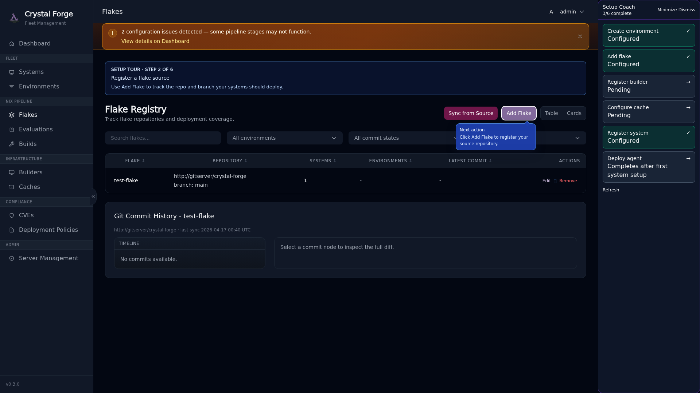
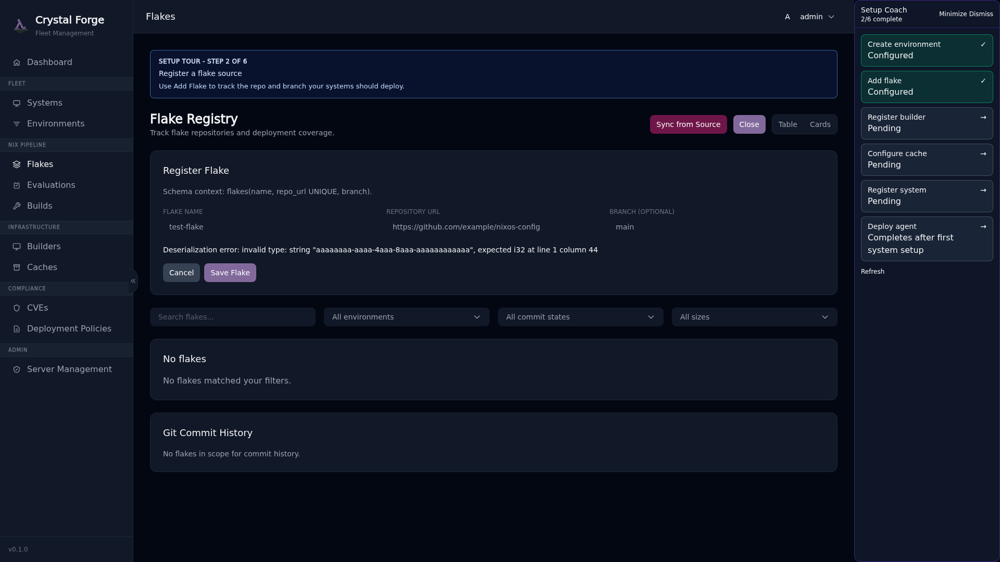

# Step 2: Add Flake

**Flakes** in Crystal Forge represent Git repositories containing NixOS configurations. Crystal Forge monitors these repositories, evaluates commits on the server, builds eligible derivations, and tracks what's deployed to your systems.

## Why Flakes Matter

- **Source of Truth**: Your NixOS configurations as code
- **Evaluation**: The server evaluates commits to determine which derivations need to be built
- **CVE Scanning**: Scanning follows scan policy; registering a flake does not mean every commit is scanned
- **Deployment Tracking**: Know which commit is deployed on which system

## Guided Tour: Flakes Page

Click the "Add flake" step in the coach panel to navigate to the Flakes page.



Click **Add Flake** to open the registration modal.

## Guided Tour: Add Flake Form

The form shows progressive field callouts guiding you through **Name → Repository → Branch**, plus **Build Scope** and **Credentials** for private repositories.


**Fill in:**

- **Name**: A friendly identifier for this flake (e.g., `infrastructure`, `web-servers`)
- **Repository URL**: Git URL in the format Crystal Forge expects
- **Branch**: Which branch to track (e.g., `main`, `production`)
- **Build Scope**: Choose whether to evaluate all `nixosConfigurations` or only Crystal Forge-managed systems
- **Credentials** (optional for public repos, required for private repos): Select auth type and provide secret material

### Repository URL Formats

Crystal Forge supports:

- **SSH**: `git+ssh://git@gitlab.com/yourorg/nixos-configs`
- **HTTPS**: `https://github.com/yourorg/nixos-configs`
- **Local paths** (for testing): `git+file:///path/to/repo`

**Important**: The Crystal Forge server must have SSH key access (if using SSH) or network access (if using HTTPS) to clone the repository.

### Branch Tracking Behavior

- **Auto-polling**: Crystal Forge periodically checks for new commits on the tracked branch
- **Evaluation**: New commits are evaluated automatically to determine derivations
- **Build Queue**: Derivations are queued for building based on your builder capacity

For private repositories, setting the branch explicitly (for example `main`) is recommended so onboarding is deterministic.

### Private Repository Authentication

Crystal Forge supports three repository authentication modes:

- **PAT (personal access token)**
  - Use for HTTPS-based private repos on GitHub/GitLab.
  - GitHub recommended values:
    - Auth type: `pat`
    - Username: `x-access-token`
    - Secret: your classic/fine-grained PAT with repo read access
  - GitLab common values:
    - Auth type: `pat`
    - Username: `oauth2` (or your service user)
    - Secret: PAT with read access to the target project

- **SSH private key**
  - Use for `git+ssh://` style repository URLs.
  - Provide the private key in the Credentials section and optional SSH username (`git` in most hosted providers).

- **Username/password**
  - Use only when PAT/SSH is unavailable.
  - Provide repository username and password (or app password/token-style secret if your provider requires it).

Security notes:

- Secrets are stored encrypted at rest.
- Plaintext secrets are not returned in API responses.
- You can leave the secret field blank during edits to keep the existing stored secret unchanged.



**Example flake configuration:**

```yaml
Name: infrastructure
Repository: git+ssh://git@gitlab.com/company/nixos-infrastructure
Branch: main
```

After adding your first flake, the coach marks **Step 2** complete.

## Related concepts

- [Onboarding guide: first-time server setup prerequisites](onboarding-first-time-setup-prerequisites.md)
- [Guided setup coach, POA&M dashboard notes, and security workflows track](../ui/guided-setup-coach.md)
- [Onboarding troubleshooting](onboarding-troubleshooting.md)
- [Step 1: Create Environment](onboarding-step-1-environment.md)
- [Step 3: Register Builder](onboarding-step-3-builder.md)
