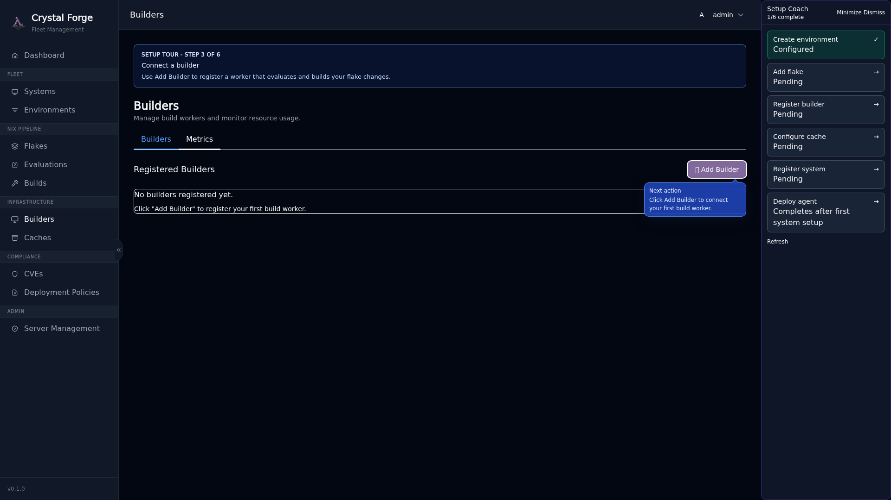
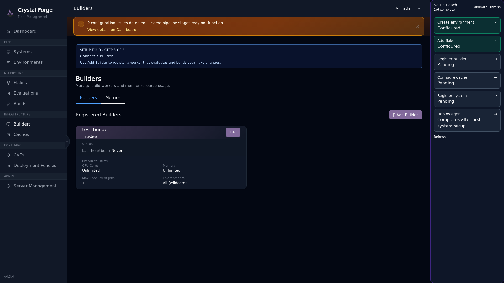
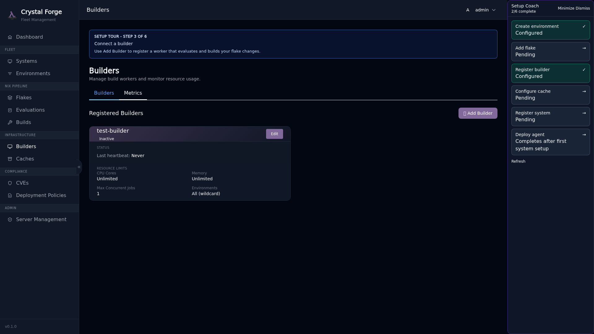

# Step 3: Register Builder

**Builders** are worker nodes that evaluate NixOS flakes, build derivations, scan for CVEs, and push artifacts to binary caches. Builders can run on the same server as Crystal Forge or on dedicated build machines.

## Why Builders Matter

- **Evaluation and build work**: The server evaluates registered flakes and creates build jobs. Builders build server-evaluated derivations and perform the build-side work Crystal Forge assigns.
- **Build Execution**: Builders build assigned derivations in systemd scopes with resource limits
- **CVE Scanning**: Crystal Forge scans according to the configured scan policy
- **Cache Population**: Successful builds are pushed to your binary cache destinations

## Guided Tour: Builders Page

Click the "Register builder" step in the coach panel.



Click **Add Builder** to open the registration modal.

## Guided Tour: Add Builder Form

The form shows progressive guidance: **Name → Public Key → Resource Limits → Environment Assignment**.



**Fill in:**

- **Name**: Identifier for this builder (e.g., `builder-1`, `build-prod`)
- **Public Key**: Ed25519 public key for cryptographic verification (the private key will be generated and shown once)
- **Max CPU Cores**: How many CPU cores this builder can use concurrently
- **Max Memory**: Memory limit for build processes (e.g., `8G`, `16G`)
- **Max Concurrent Derivations**: How many derivations to build in parallel
- **Environment Assignment**: Which environment(s) this builder serves

### Resource Allocation Recommendations

**For a first-time setup on a single server:**

```yaml
Max CPU Cores: 4
Max Memory: 8G
Max Concurrent Derivations: 2
```

**Why conservative defaults?**
- Nix builds can be memory-intensive (especially large packages)
- Concurrent derivations multiply resource usage
- Leaving headroom prevents server overload

**For a dedicated build server:**

```yaml
Max CPU Cores: 16
Max Memory: 32G
Max Concurrent Derivations: 4
```

### Resource Guidance Callout

The form includes an explicit warning callout about resource allocation:

> **Resource Configuration Guidance**
>
> Set conservative limits for first-time setup. Each concurrent derivation can consume significant CPU and memory. Start with `Max Concurrent Derivations: 2` and `Max Memory: 8G` and adjust based on observed build performance.



## Builder Activation Reminder

After creating your first builder, a modal appears with important next steps:

**"Builder Registered — Next Steps"**

To activate this builder, you need to:

1. **Enable the Crystal Forge builder module** in your NixOS configuration
2. **Apply the configuration** (`nixos-rebuild switch`)
3. **Verify the builder service is running** (`systemctl status crystal-forge-builder`)

The modal provides the exact NixOS configuration snippet you need.

## Enabling the Builder in NixOS Config

Add this to your server's NixOS configuration (or the dedicated builder server):

```nix
{
  services.crystal-forge = {
    enable = true;

    build = {
      enable = true;
      
      # Resource limits (match what you configured in the web UI)
      max_concurrent_derivations = 2;
      max_jobs = 4;
      cores_per_job = 4;
      systemd_memory_max = "8G";
      
      # Connect to the Crystal Forge server
      server_host = "crystal-forge.example.com";
      server_port = 3000;
      
      # Private key (generated by Crystal Forge, shown in the UI once)
      private_key = "/var/lib/crystal-forge/builder.key";
    };
  };
}
```

**Save the private key** shown in the web UI to `/var/lib/crystal-forge/builder.key` on the builder server:

```bash
sudo mkdir -p /var/lib/crystal-forge
sudo echo "YOUR_PRIVATE_KEY_HERE" > /var/lib/crystal-forge/builder.key
sudo chmod 600 /var/lib/crystal-forge/builder.key
sudo chown crystal-forge:crystal-forge /var/lib/crystal-forge/builder.key
```

Apply the configuration:

```bash
sudo nixos-rebuild switch
```

Verify the builder is running and connected:

```bash
sudo systemctl status crystal-forge-builder
```

After the builder service connects, the coach marks **Step 3** complete.

> **Status:** The NixOS snippet above sets `server_host`, `server_port`, and `private_key` under `services.crystal-forge.build`. In `modules/nixos/crystal-forge/default.nix` the `build` options include `max_concurrent_derivations`, `max_jobs`, `cores_per_job`, and `systemd_memory_max`, but `server_host`, `server_port`, and `private_key` are defined for `services.crystal-forge.client`. The module documents builder API key options (a builder API private key path that is auto-generated at `/var/lib/crystal-forge/builder-api.key` when unset, and a `server_url`) in a different option block. Not reconciled in this migration.

## Related concepts

- [Onboarding guide: first-time server setup prerequisites](onboarding-first-time-setup-prerequisites.md)
- [Guided setup coach, POA&M dashboard notes, and security workflows track](../ui/guided-setup-coach.md)
- [Onboarding troubleshooting](onboarding-troubleshooting.md)
- [Step 2: Add Flake](onboarding-step-2-flake.md)
- [Step 4: Configure Cache](onboarding-step-4-cache-destinations.md)
