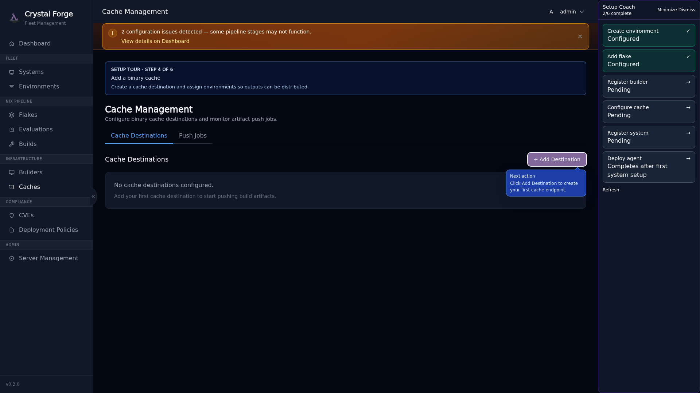
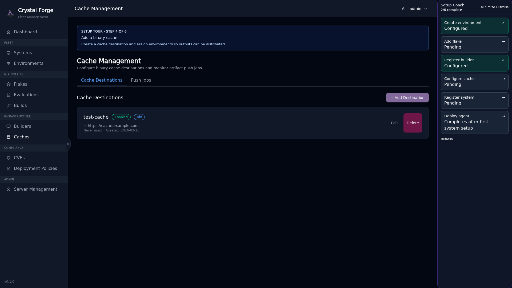
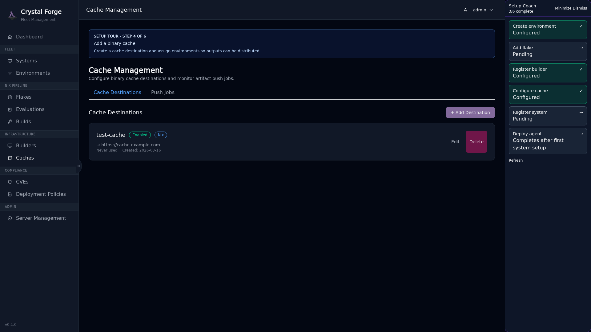

# Step 4: Configure Cache

**Cache Destinations** are binary caches where Crystal Forge pushes build artifacts. This speeds up deployments by allowing systems to download pre-built packages instead of building them locally.

## Why Cache Destinations Matter

- **Faster Deployments**: Systems pull from cache instead of rebuilding
- **Reduced Load**: Avoid redundant builds across your fleet
- **Compliance Artifacts**: Store verified builds with CVE scan results
- **Multi-Environment Support**: Route builds to different caches based on environment

## Guided Tour: Caches Page

Click the "Configure cache" step in the coach panel.



Click **Add Destination** to open the cache configuration modal.

## Guided Tour: Add Cache Destination Form

The form shows progressive guidance: **Name → Type → Endpoint → Environment Assignment**.



**Fill in:**

- **Name**: Identifier for this cache (e.g., `prod-cache`, `s3-cache`)
- **Type**: Backend type (`Nix`, `Http`, `S3`, `Attic`)
- **Endpoint**: URL or configuration for the cache backend
- **Environment Assignment**: Which environment(s) use this cache (optional; can be global)

### Cache Type Guidance

The form includes a callout explaining each cache backend option:

> **Cache Type Options**
>
> - **Nix**: Standard Nix binary cache (local or SSH)
> - **Http**: HTTP-based binary cache (e.g., Cachix, custom nginx)
> - **S3**: Amazon S3 or S3-compatible storage (MinIO, Backblaze B2)
> - **Attic**: High-performance binary cache with chunking and deduplication

### Recommended Cache Backend: Attic

**For production deployments, Attic is the recommended choice** due to its superior performance and reliability:

- **Chunk-based deduplication**: More efficient storage and transfer
- **No caching issues**: Unlike S3, Nix clients immediately see new artifacts
- **Better performance**: Optimized for Nix workloads
- **Self-hosted**: Full control over your infrastructure

**Why not S3 for production?**

While S3 works, it has nuanced issues that can cause problems in production:

- **Nix client caching**: Nix caches S3 responses aggressively and won't reinterrogate the S3 cache for updates by default
- **Cache invalidation**: Manual TTL configuration or cache clearing may be required to see new builds
- **Latency**: S3 API overhead compared to dedicated binary cache servers
- **Cost**: Frequent GET/LIST operations can add up at scale

S3 can still be used for archival or backup purposes, but **Attic is strongly recommended for active caching**.

### Common Cache Configurations

**Attic (recommended for production):**

```yaml
Name: production-cache
Type: Attic
Endpoint: http://attic.example.com:8080/production
Environments: production
```

**Attic (staging/development):**

```yaml
Name: staging-cache
Type: Attic
Endpoint: http://attic.example.com:8080/staging
Environments: staging, development
```

**S3 (archival/backup use case):**

```yaml
Name: archive-cache
Type: S3
Endpoint: s3://my-archive-bucket?region=us-east-1
Environments: (none - global)
# Note: May experience Nix client caching issues for active use
```

**HTTP binary cache (third-party service):**

```yaml
Name: cachix-cache
Type: Http
Endpoint: https://mycache.cachix.org
Environments: (none - global)
```

**Local Nix cache (testing only):**

```yaml
Name: local-cache
Type: Nix
Endpoint: file:///var/cache/nix
Environments: development
```



After creating your first cache destination, the coach marks **Step 4** complete.

## Related concepts

- [Onboarding guide: first-time server setup prerequisites](onboarding-first-time-setup-prerequisites.md)
- [Guided setup coach, POA&M dashboard notes, and security workflows track](../ui/guided-setup-coach.md)
- [Onboarding troubleshooting](onboarding-troubleshooting.md)
- [Step 3: Register Builder](onboarding-step-3-builder.md)
- [Step 5: Register System](onboarding-step-5-system.md)
