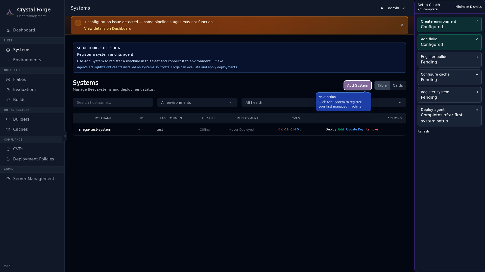
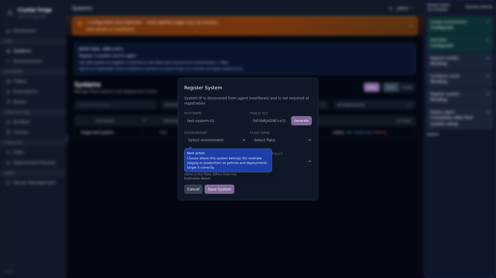
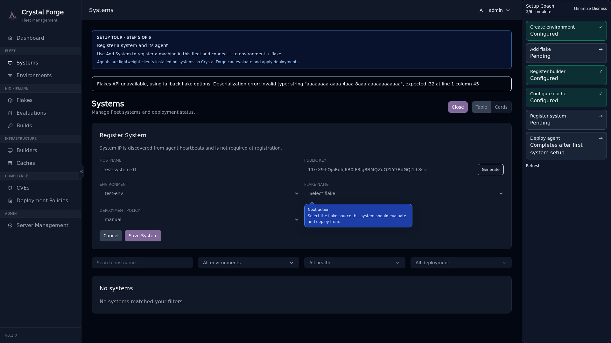
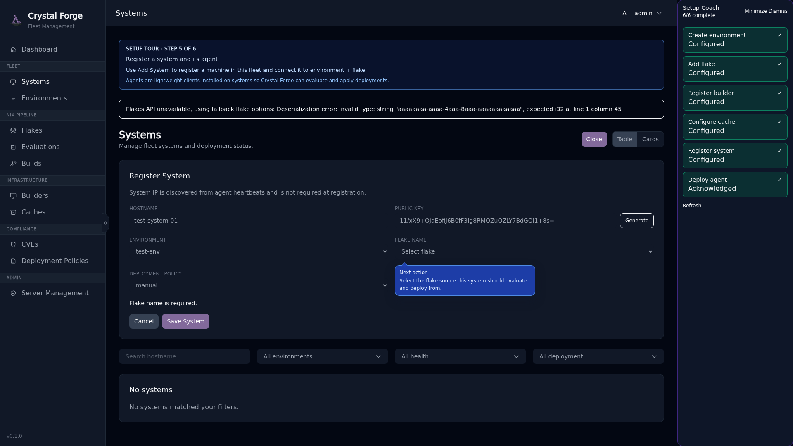

# Step 5: Register System

**Systems** are the NixOS hosts you want to manage with Crystal Forge. Each system is cryptographically identified by an Ed25519 key pair and associated with an environment, flake, and deployment policy.

## Why Systems Matter

- **Fleet Tracking**: Monitor which configurations are deployed where
- **Deployment Control**: Apply updates based on policy (manual, auto, pinned)
- **Compliance Monitoring**: Track STIG controls and CVE exposure per system
- **Agent Telemetry**: Receive system fingerprints, heartbeats, and state changes

## Guided Tour: Systems Page

Click the "Register system" step in the coach panel.

The callout explains what systems are and how the agent works:

> **Register Your First System**
>
> Systems represent NixOS hosts you want to manage with Crystal Forge. Each system runs the Crystal Forge agent, which:
> - Reports system state (hardware, software, network)
> - Receives deployment instructions
> - Executes NixOS activations
>
> Click **Add System** to begin.

Click **Add System** to open the registration modal.

## Guided Tour: Add System Form

The form shows progressive guidance: **Hostname → Public Key → Environment → Flake**.

**Fill in:**

- **Hostname**: The system's hostname (e.g., `web-server-1`, `db-primary`)
- **Public Key**: Ed25519 public key for this system (you can generate a key pair in the UI)
- **Environment**: Which environment this system belongs to
- **Flake**: Which flake defines this system's configuration
- **Deployment Policy**: Optionally override the environment default

### Generating a Key Pair

If you don't have an Ed25519 key pair for this system yet, click **Generate Key Pair** in the form. Crystal Forge will generate both keys and display them in a modal.

**Save the private key** — you'll need it on the target system. The public key is automatically filled into the form.

### How Deployment Policies Work

Systems inherit the deployment policy from their environment, but you can override it per system:

- **manual**: An admin must explicitly approve deployments (safest for production)
- **auto_latest**: Automatically deploy the newest eligible cached derivation for this system configuration across commits of its registered flake. Newer failed or pending commits do not make the deployed system behind; a newer deployable derivation does.
- **pinned**: Deploy a specific commit/derivation (useful for canary deployments)

## System Creation Success

After creating your first system, the server reports **Step 5** complete. The agent step remains incomplete until the first signed report arrives and an Administrator acknowledges it.

## Related concepts

- [Onboarding guide: first-time server setup prerequisites](onboarding-first-time-setup-prerequisites.md)
- [Guided setup coach, POA&M dashboard notes, and security workflows track](../ui/guided-setup-coach.md)
- [Onboarding troubleshooting](onboarding-troubleshooting.md)
- [Step 4: Configure Cache](onboarding-step-4-cache-destinations.md)
- [Step 6: Deploy Agent](onboarding-step-6-agent-deployment.md)
