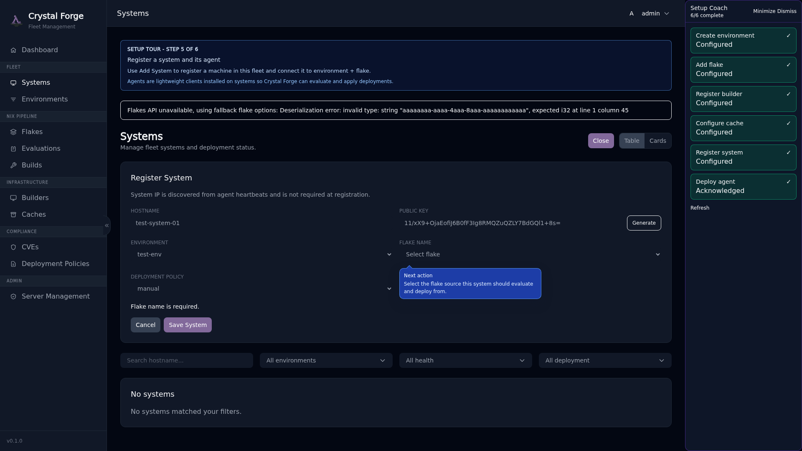

# Step 6: Deploy Agent

The **Crystal Forge Agent** runs on each managed NixOS system. It reports system state, receives deployment instructions, and executes NixOS activations. Without the agent running, Crystal Forge cannot monitor or deploy to the system.

## Agent Deployment Reminder

After creating your first system, a modal appears with explicit instructions:

**"System Registered — Enable the Agent"**

To start tracking this system, you must:

1. **Enable the Crystal Forge agent module** in the system's NixOS configuration
2. **Apply the configuration** on the target system (`nixos-rebuild switch`)
3. **Verify the agent service is running** (`systemctl status crystal-forge-agent`)



## Enabling the Agent in NixOS Config

On the **target system** (the NixOS host you want to manage), add this to its configuration:

```nix
{
  services.crystal-forge.client = {
    enable = true;
    
    # Crystal Forge server connection
    server_host = "crystal-forge.example.com";
    server_port = 3000;
    
    # Private key (the one you generated/saved during system registration)
    private_key = "/var/lib/crystal-forge/host.key";
  };
}
```

**Save the private key** to the target system:

```bash
# On the target system (e.g., web-server-1)
sudo mkdir -p /var/lib/crystal-forge
sudo echo "YOUR_PRIVATE_KEY_HERE" > /var/lib/crystal-forge/host.key
sudo chmod 600 /var/lib/crystal-forge/host.key
sudo chown crystal-forge:crystal-forge /var/lib/crystal-forge/host.key
```

## Apply and Rebuild the Target System

On the target system:

```bash
sudo nixos-rebuild switch
```

This will:
- Install the Crystal Forge agent service
- Start the agent
- Connect to the Crystal Forge server
- Begin sending telemetry (system fingerprints, heartbeats)

## Verify the Agent is Running

On the target system:

```bash
sudo systemctl status crystal-forge-agent
```

You should see:

```
● crystal-forge-agent.service - Crystal Forge Agent
   Active: active (running)
```

Check the logs for successful connection:

```bash
sudo journalctl -u crystal-forge-agent -f
```

Look for log entries indicating:
- Successful Ed25519 signature verification
- System fingerprint reported
- Heartbeat acknowledged by server

## What to Expect After Agent Connects

Once the agent connects, Crystal Forge will:

1. **Record System Fingerprint**: Hardware, OS version, network interfaces, security status
2. **Track Heartbeats**: Liveness signals every 60 seconds (configurable)
3. **Monitor State Changes**: Configuration drift, software updates, deployments
4. **Enable Deployments**: The system is now eligible to receive deployment instructions

In the Crystal Forge web UI:

- The **Dashboard** will show the system in the Fleet Health panel
- The **Systems** page will show connection status, deployed configuration, and health
- The **Builds** page will show which derivations are available for deployment

## Onboarding Complete!

After the agent sends its first signed report, an Administrator can select **Acknowledge agent setup** in the Setup track. A heartbeat alone does not complete the step. The acknowledgement is saved through the existing setup-progress API.


When all nine setup steps are complete, the Coach shows the setup-complete card and offers **Explore security workflows**. The top-bar **Guide** remains available. Administrators can relaunch Setup from Server Management.

## Related concepts

- [Onboarding guide: first-time server setup prerequisites](onboarding-first-time-setup-prerequisites.md)
- [Guided setup coach, POA&M dashboard notes, and security workflows track](../ui/guided-setup-coach.md)
- [Onboarding troubleshooting](onboarding-troubleshooting.md)
- [Step 5: Register System](onboarding-step-5-system.md)
