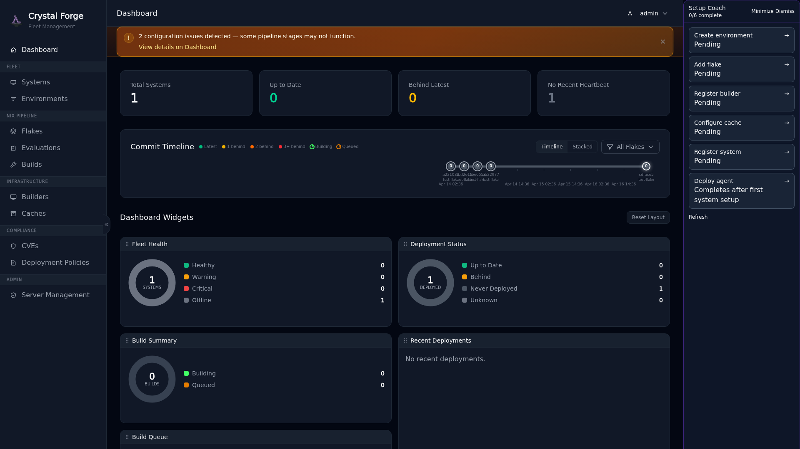

# What's New in v0.3.0

> **Status:** historical. This is the "What's New in v0.3.0" section of the repository `README.md` at commit 3b23d36f. It is a dated snapshot of one release and is not kept current. The `Authentication Modes` part of the same README section is in [Authentication modes and OIDC configuration examples](../operations/authentication-modes-and-oidc-configuration.md). The server crate version is still `0.3.0` (`packages/default/crates/cf-server/Cargo.toml`). Every statement below is a verification candidate.

Crystal Forge now has a **web-based dashboard** built with Dioxus. The UI is functional and covers the core workflows, but it's still being polished — expect rough edges. This release is aimed at homelabbers and NixOS enthusiasts who want to kick the tires, not regulated production deployments.

## Web UI Views

| View              | Screenshot                                                  | Description                                              |
| ----------------- | ----------------------------------------------------------- | -------------------------------------------------------- |
| **Login**         | [01-login](../../screenshots/01-login-page.png)            | Unified login supporting OIDC, Local auth, or Dev mode   |
| **Registration**  | [02-register](../../screenshots/02-registration.png)       | First-time admin setup flow                              |
| **Dashboard**     | [06-dashboard](../../screenshots/06-dashboard.png)         | Fleet health, build queue, deployments, CVE summary      |
| **Systems**       | [12-systems](../../screenshots/12-systems.png)             | Table/card toggle, filtering, status badges, CVE chips   |
| **Flakes**        | [13-flakes](../../screenshots/13-flakes.png)               | Git commit timeline, add/remove management               |
| **Environments**  | [14-environments](../../screenshots/14-environments.png)   | Color-coded environments with policies                   |
| **Builds**        | [15-builds](../../screenshots/15-builds.png)               | Build queue, worker status, history, cancel/force-cancel |
| **Evaluations**   | [26-evaluations](../../screenshots/26-evaluations.png)     | Eval queue with cancel buttons, history tab with filters |
| **CVEs**          | [16-cves](../../screenshots/16-cves.png)                   | Vulnerability scanning results, severity filters         |
| **Style Guide**   | [17-style-guide](../../screenshots/17-style-guide.png)     | Design system reference                                  |

> **Status:** The screenshot files above exist under `docs/screenshots/`. The screenshots are refreshed from the `web-ui` check output (see [Development environment commands](../operations/development-environment-commands.md)), so their content can differ from the descriptions. See [Dashboard and systems views](../ui/dashboard-and-systems-views.md) for the current view designs.

## Guided Onboarding Coach

First-time admins are greeted with a **non-blocking guided setup coach** that walks through nine configuration steps:

- **9-Step Guided Tour**: Environment → Flake → Builder → Cache → System → Agent → Policy → Compliance Bundle → POA&M
- **Progressive Field Callouts**: In-context guidance as you fill in each form
- **Progress Tracking**: Live completion status with checkmarks
- **Non-Blocking**: Navigate freely while the coach remains available
- **Minimize/Dismiss**: Collapsible panel with relaunch from Server Management

See the **[Onboarding Guide](../operations/onboarding-first-time-setup-prerequisites.md)** for a complete walkthrough.

> **Status:** The onboarding guide was split into several concepts. The first one is linked above. The coach design is in [Guided setup coach](../ui/guided-setup-coach.md). The nine-step count and the step order are verification candidates (suspected code path: `packages/web-ui/src/views/setup.rs`).

The dashboard includes a server-derived POA&M summary and an ordered watchlist.
Watchlist rows open the exact POA&M in Compliance. Overdue and
awaiting-verification events also appear in the durable notification inbox.
These events use the **Policy violations** notification preference and retain
their read or dismissed state across page reloads.

## Role-Based Access Control

- **Admin**: Full access to all features and settings
- **Operator**: Can manage systems, deployments, and view all data
- **Viewer**: Read-only access to dashboards and reports

> **Status:** The role names match `packages/default/crates/cf-server/src/auth/models.rs`. The permission summaries are verification candidates. See [Authentication and authorization overview](../security/authentication-and-authorization-overview.md).

## Evaluation Cancellation & History

Cancel stuck or unwanted evaluations without restarting the server:

- **Cancel pending evals**: Immediately remove from the queue
- **Cancel in-progress evals**: Cooperative cancellation — flags the running subprocess which terminates within ~2s
- **Force-cancel**: For evals stuck in the cancelling state
- **Eval history tab**: Paginated view of all completed, failed, and cancelled evaluations with duration, status chips, error details, and re-evaluate action

> **Status:** The `~2s` termination time and the force-cancel behavior are verification candidates (suspected code paths: `packages/default/crates/cf-server/src/handlers/api/commits.rs`, `packages/default/crates/cf-server/src/models/evaluate_with_policies.rs`).

## CVE Count Accuracy

Evaluation CVE counts in system list, system detail, and all dashboard surfaces now reflect unique CVE IDs per system, preventing inflation from package-derivation fanout where the same CVE appeared across multiple package paths.

## Testing Infrastructure

- **Web UI Integration Tests**: Playwright-based with automated screenshots
- **OIDC VM Tests**: Real Keycloak integration in NixOS VMs
- **Code Metrics**: Complexity and coverage CI jobs

> **Status:** The Web UI check is described in [Web UI check](../testing/web-ui-check.md). The Playwright, Keycloak, and CI job statements are verification candidates (suspected code paths: `checks/web-ui/`, `checks/`).

## Related concepts

- [Project introduction and key features](project-introduction-and-key-features.md)
- [Release roadmap and milestones](release-roadmap-and-milestones.md)
- [Crystal Forge roadmap](roadmap.md)
