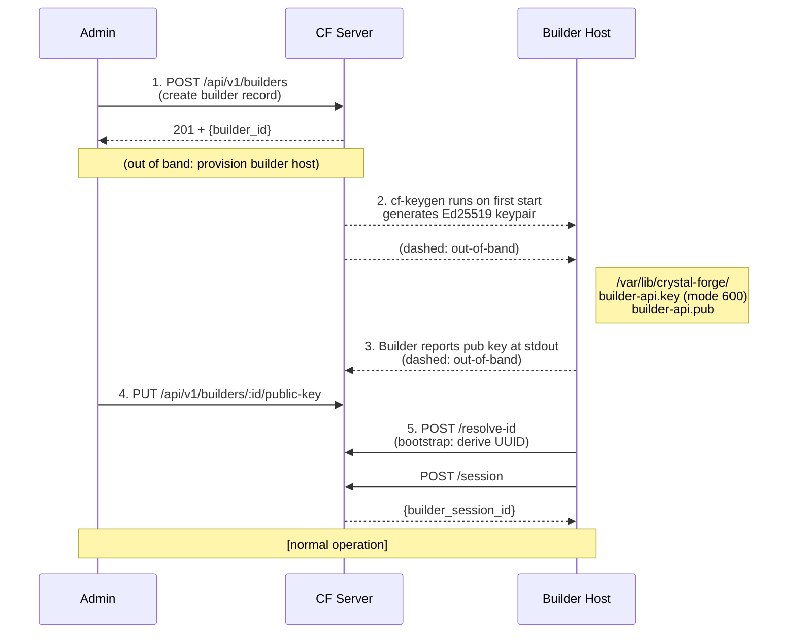

# Builder credential boundary, key management, and audit logging

## Security

> For the complete trust model, threat analysis, data-in-transit classification,
> and per-strategy firewall rules, see
> [`builder-security-architecture.md`](../builders/builder-trust-boundaries-and-components.md).

### Authentication

- **Ed25519 signatures**: Per-request, stateless, replay-protected (±5 min timestamp window)
- **Session scoping**: `X-Builder-Session-ID` scopes job operations to the current process lifetime; job ownership is double-checked on every API call
- **Public key storage**: Stored in database, used for signature verification

### Authorization

- **Admin endpoints**: Require authenticated user with admin role
- **Builder endpoints**: Require valid builder signature (active status)
- **Job ownership**: Builders can only operate on jobs they hold in `building` state with a matching session ID

### Network Boundaries

Builders only need outbound access to:
1. The Crystal Forge server (HTTPS, typically 443)
2. Configured Nix binary cache substituters (HTTPS)

Builders never need access to:
- The PostgreSQL database
- Git remotes (when `server_bundled_archive` delivery is configured)
- Other builder hosts
- Managed NixOS hosts (agents and builders are completely separate)

### Builder Credential Boundary

- Database credentials
- Git repository SSH keys or netrc tokens (server holds these)
- OIDC client secrets
- Deployment authorization or keys for managed hosts

Builders may receive narrowly scoped Attic, S3, or Niks3 push credentials only
for jobs that require builder-side cache publication. The signed next-job
response includes private material only when the opt-in, direct-peer CIDR, and
single exact `X-Forwarded-Proto: https` checks all pass. A failed credential gate
records a post-claim transient `[dispatch:cache_config]` failure and returns
HTTP 404 before sending credentials. Operators must protect the
proxy-to-backend path and prevent untrusted direct access. See the
[cache publication boundary](../builders/remote-build-execution-strategies.md#recommended-default)
for exact checks and recovery, and the
[operator upgrade procedure](../caches/niks3-cache.md#proxy-upgrade-repair-and-loaded-configuration)
for loaded-configuration inspection and denial diagnostics. Diagnostics must
not log tokens, private keys, signed URLs, raw headers, or request bodies.

### Key Management

**Builder Private Keys**:
- Auto-generated by `cf-keygen` on first start at `/var/lib/crystal-forge/builder-api.key`
- File permissions: 600, owned by the `crystal-forge` service user
- Never committed to version control
- Rotate by generating a new keypair and updating via `PUT /api/v1/builders/:id/public-key`

**Public Keys**:
- Stored in database (updatable via API)
- Used only to verify Ed25519 request signatures
- Registering a new public key immediately invalidates requests signed with the old key

## 12. Key Management Lifecycle

**Key rotation:** `PUT /api/v1/builders/:id/public-key` with new public key. Old sessions automatically invalidated on next heartbeat verification. Builder private key replaced on host (service restart required).

---

## 13. Logging and Auditability

| Event | Logged Where | Log Content |
|---|---|---|
| Builder registration | Server / DB | builder_id, public_key hash, admin user |
| Job claimed | Server / DB | job_id, builder_id, session_id, timestamp |
| Source archive generated | Server log | job_id, mirror_id, commit_hash, sha256 |
| Source archive downloaded | Server log | job_id, builder_id, HTTP response status |
| `.drvPath` mismatch | Server log | job_id, expected, actual |
| Derivation manifest served | Server log (debug) | job_id, path_count |
| Derivation delta archive requested | Server log (debug) | job_id, builder_id, requested_path_count, validated_path_count |
| Derivation delta path rejected (403) | Server log (warn) | job_id, builder_id, logged count only (paths not logged) |
| Delta fallback to full archive | Builder log (info) | job_id, reason (always "Unsupported" — never on 403) |
| Build complete | Server / DB | job_id, output_path, cache_reference |
| Build failure | Server / DB | job_id, failure_phase, error message |
| Session ID mismatch | Server log (warn) | builder_id, presented session vs. stored |
| Timestamp replay | Server log | builder_id, timestamp diff |
| Source archive cleanup | Server log (debug) | job_id, archive_path |

## Related concepts

* [Builder request authentication and data in transit](builder-request-authentication-and-data-in-transit.md) - Specifies the per-request Ed25519 signing protocol, replay protection, session scoping, the exact permissions of the builder private key, and the classification of every data flow between builder, server, Git, and cache.
* [Builder threat model](builder-threat-model.md) - Analyzes what an attacker obtains from a compromised builder, a malicious job claim, source archive tampering, and request replay, and which defenses (digest check, derivation_mismatch, timestamp window) apply.
* [Builder API: authentication and admin endpoints](../api/builder-api-authentication-and-admin-endpoints.md) - Documents the builder API signature authentication headers and replay window, and the admin endpoints that create, list, update, deactivate, re-key, assign environments to, and read metrics for builders.
* [Builder deployment, configuration, and troubleshooting](../operations/builder-deployment-and-troubleshooting.md) - Explains how to register and deploy a builder (prerequisites, keypair generation, builder configuration, polling loop pseudocode) and how to troubleshoot missing jobs, authentication failures, and jobs that do not retry.
