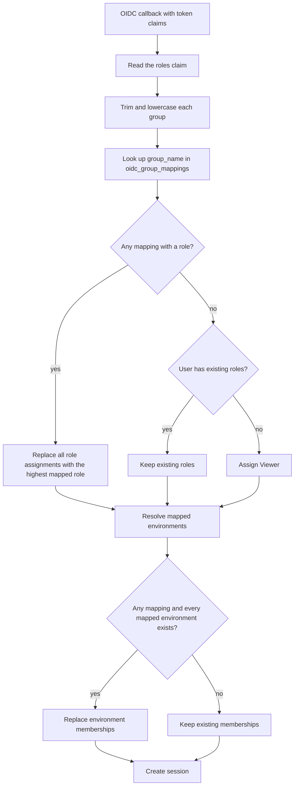

# OIDC Role Mapping Configuration

Crystal Forge maps the groups in an OIDC token to a local role and to environment memberships on every OIDC login. The mapping lives in the **database table `oidc_group_mappings`**. An Admin edits it through the Web UI or the admin API.

> **Not used:** The environment variables `CRYSTAL_FORGE_ROLE_MAPPING` and `CRYSTAL_FORGE_DEFAULT_ROLE`, and any "safe-deny" behavior that they describe, do not affect login. The file `auth/role_mapping.rs` exists in the source tree, but `auth/mod.rs` does not declare it as a module, so the build does not compile it. Do not set those variables.

## Roles

Three roles exist:

- **Admin**: full system access.
- **Operator**: can manage deployments, builds, and systems.
- **Viewer**: read-only access, limited to the user's environment memberships.

## What happens at login



1. **Read groups.** The server reads the claim named by the OIDC `roles_claim` setting (default `groups`). It accepts an array of strings, a single string, or a comma-separated string. A dotted claim name such as `realm_access.roles` reads a nested value.
2. **Normalize.** The server trims each group and converts it to lower case. It drops empty values.
3. **Match.** The server selects the rows of `oidc_group_mappings` whose `group_name` equals a normalized group.
4. **Assign the role.**
   - If at least one matching row has a role, the server deletes **all** of the user's role assignments and assigns the highest mapped role. The order is Admin, then Operator, then Viewer.
   - If no matching row has a role and the user has no roles, the server assigns **Viewer**.
   - If no matching row has a role and the user has roles, the server keeps them unchanged.
5. **Assign environments.** See [Environment memberships](#environment-memberships).
6. **Create the session.** The server **never rejects** a login because no group matches. It rejects a login only for token or account errors, for example an invalid ID token (HTTP 401) or an email that the provider did not verify (HTTP 403).

**Consequence:** A user whose groups match nothing signs in as Viewer with no environment membership. A Viewer with no membership sees no environment-scoped data. This is access control by scope, not a login denial.

**Removed groups.** Roles change only when a mapping matches. A user who loses every mapped group keeps the last assigned role. To remove access, an Admin changes the user's roles directly.

## Mapping records

Each row of `oidc_group_mappings` has:

| Column | Meaning |
| --- | --- |
| `group_name` | Normalized group name. Unique. |
| `role` | `admin`, `operator`, `viewer`, or empty. An empty role leaves the role unchanged and may still map environments. |
| `environments` | Environment names for membership. May be empty. |

A group name has at most 128 characters. It may contain only letters, numbers, `-`, `_`, `.`, `:`, and `/`. **A group name with a space is invalid.** The server stores the name in lower case.

### Manage mappings

An Admin uses these routes (see [Builders, queues, environments, dashboard, and admin APIs](../api/builders-queues-environments-dashboard-admin-api.md)):

- `GET /api/v1/admin/oidc-mappings` lists mappings.
- `POST /api/v1/admin/oidc-mappings` creates or updates a mapping by `group_name`. The body is `{"group_name": "...", "role": "operator", "environments": ["staging"]}`. Every environment name must exist.
- `DELETE /api/v1/admin/oidc-mappings/:id` deletes a mapping.

Each change writes an audit event.

### Bootstrap admin group

The NixOS option `services.crystal-forge.server.oidc.bootstrapAdminGroup` sets `CRYSTAL_FORGE_OIDC_BOOTSTRAP_ADMIN_GROUP`. When `auth_mode` is `oidc`, the server creates a mapping from that group to Admin at start, with no environments. The server trims and lowercases the name. If a mapping for the group exists, the server leaves it unchanged. Use this setting to get the first administrator without editing the database.

## Environment memberships

A mapping can list environment names. The server replaces the user's environment memberships only when **all** these conditions hold:

- At least one mapping matched.
- The matched mappings list at least one environment.
- Every listed environment name exists.

If a listed environment does not exist, the server logs a warning and keeps the existing memberships. If no mapping matched, or none lists an environment, the server also keeps them.

## Configuration

Configure the OIDC client with the NixOS options under `services.crystal-forge.server.oidc`. The claim that holds groups has this option:

- `rolesClaim`: sets `CRYSTAL_FORGE_OIDC_ROLES_CLAIM`. The default is `groups`.

Microsoft Entra ID commonly sends app roles in the `roles` claim, so set `rolesClaim = "roles"` for Entra. Keycloak can send nested realm roles in `realm_access.roles`.

## Role synchronization

The server applies mappings **on every login**. A group change takes effect at the user's next login, not in real time. The user must sign out and sign in again.

## Examples

### Keycloak with top-level groups

```nix
services.crystal-forge.server.oidc = {
  rolesClaim = "groups";
  bootstrapAdminGroup = "cf-admins";
};
```

Then add mappings through the admin API (the group names are lower case):

```bash
curl -X POST "$CF_URL/api/v1/admin/oidc-mappings" \
  -H "Content-Type: application/json" \
  -H "x-csrf-token: $CSRF" \
  --cookie "__Host-cf-session=$SESSION; __Host-cf-csrf=$CSRF" \
  -d '{"group_name": "cf-operators", "role": "operator", "environments": ["staging"]}'
```

### Microsoft Entra ID

```nix
services.crystal-forge.server.oidc = {
  rolesClaim = "roles";
  bootstrapAdminGroup = "CrystalForge.Admins";  # stored as crystalforge.admins
};
```

### Authentik

A group named `authentik Admins` contains a space and cannot be a mapping name. Rename the group in the identity provider, for example to `authentik-admins`, or send a different claim value.

## Testing role mapping

1. Log in with OIDC.
2. Check the server log. The server logs the number of groups, the number of matched mappings, and the assigned role. It logs group names at debug level only.
3. Check the database:

   ```sql
   SELECT u.email, r.role
   FROM users u
   JOIN user_role_assignments r ON u.id = r.user_id;
   ```

## Troubleshooting

**The user signs in as Viewer and sees nothing**
- The token carries no groups, or no group matches a mapping. The server logs `No groups found in OIDC token claims` or `no matching group-to-role mappings found`.
- Check that the provider sends the claim, and that `rolesClaim` names it.
- Check that `oidc_group_mappings.group_name` equals the lower-case group value.

**The role does not update after a group change**
- Roles update on login. The user must sign out and sign in.
- A removed group does not lower a role (see [Removed groups](#what-happens-at-login)).

**Environment access does not change**
- Every environment name in the mapping must exist. One unknown name keeps the old memberships.

## Related concepts

- [Session cookies and CSRF](session-cookies-and-csrf.md): the session created after a successful login.
- [OIDC provider compatibility validation](oidc-provider-compatibility-validation.md): provider claim shapes tested against role extraction.
- [API authentication, sessions, and role-based authorization](api-authentication-and-authorization.md): roles and environment scoping.
