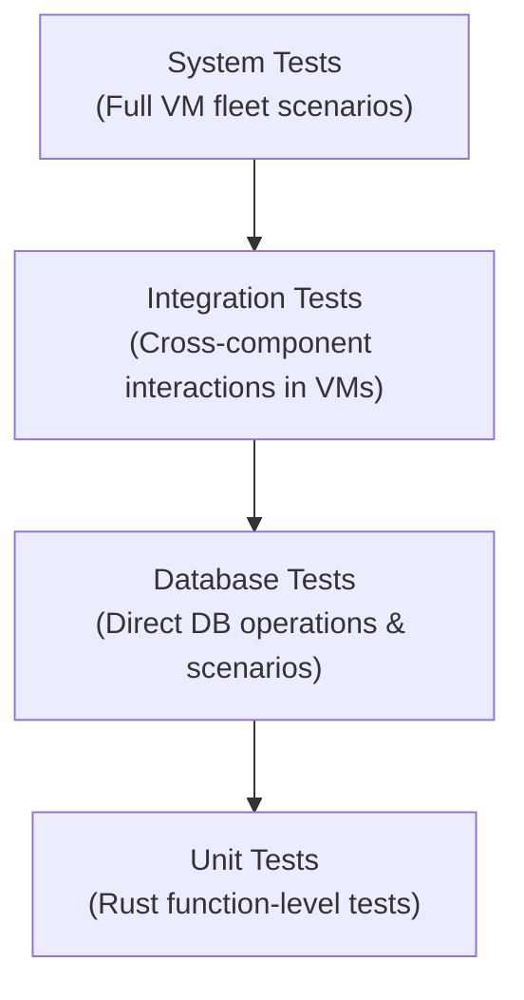
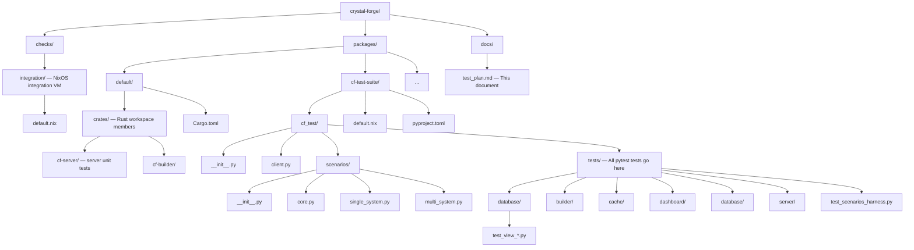

# Crystal Forge Testing Plan

## Executive Summary

Crystal Forge requires comprehensive testing to ensure reliability, security, and compliance capabilities in regulated environments. This plan defines our testing strategy across unit, integration, database, and system levels using Rust's built-in testing, pytest, and NixOS VM tests.

## Testing Philosophy

- **Prove functionality**: Tests demonstrate Crystal Forge delivers on its compliance monitoring promises
- **Prevent regressions**: Comprehensive test coverage catches breaking changes before deployment
- **Document behavior**: Tests serve as executable specifications of system behavior
- **Enable confident changes**: Strong test suite allows rapid, safe development

## Testing Architecture

### Test Levels



### Test Infrastructure

- **cf-test package**: Centralized pytest framework avoiding VM test script bloat
- **Scenario builders**: Reusable database state generators for consistent test data
- **NixOS VMs**: Isolated test environments matching production deployments
- **Test markers**: pytest markers for test categorization (smoke, database, views, integration)

## File Structure & Organization

### Test Locations



## Test Categories

### 1. Unit Tests (Rust)

**Location**: Inline with Rust source code under `packages/default/crates/` using `#[cfg(test)]` modules

**Scope**: Individual functions and modules

**Examples**:

- Vulnix parser JSON handling (`vulnix_parser.rs`)
- Ed25519 signature verification
- Configuration parsing
- State fingerprint generation

**Execution**:

```bash
# Automatically run during Nix build
nix build

# Or manually with Cargo
cargo test --manifest-path packages/default/Cargo.toml
```

### 2. Database Tests

**Location**: `packages/cf-test-suite/cf_test/tests/database/`

**Scope**: Database views, queries, and data integrity

**Key Areas**:

- View correctness (deployment status, heartbeat status, commit timelines)
- Scenario validation (behind, offline, unknown states)
- Performance benchmarks (query execution time)
- Data consistency across related tables

**Execution**: Direct database connection from server node

```bash
# Run all database tests in DevShell with DB running.
nix run .#cf-test-suite.runTests -- -vvv -m database
```

### 3. Integration Tests

**Locations**: NixOS checks under `checks/` and server/API tests under
`packages/cf-test-suite/cf_test/tests/server/`. Each NixOS check has its own
VM definition and README. See [Crystal Forge flake checks](flake-checks.md) for
the checks that currently run in CI.

**Key Areas**:

- Agent → Server communication
- Git webhook processing
- Builder coordination
- CVE scanning pipeline

### 4. Scenario Harness

**Location**: `packages/cf-test-suite/cf_test/tests/test_scenarios_harness.py`

**Scope**: Verify that reusable server-side database scenarios create the
expected records.

The current harness imports scenarios for:

- a system that is behind;
- a failed evaluation;
- a system that has never been seen;
- an offline system;
- a system that is up to date.

## Test Data Management

### Scenario System

**Location**: `packages/cf-test-suite/cf_test/scenarios/`

**Purpose**: Generate consistent, realistic test data

**Core Functions**:

- `_create_base_scenario()`: Standard flake→commit→derivation→system chain
- `scenario_*()`: Specific test conditions (behind, offline, failed builds)
- `_cleanup_fn()`: Automatic test data removal

**Usage Example**:

```python
def test_deployment_behind(cf_client, clean_test_data):
    scenario = scenario_behind(cf_client)

    rows = cf_client.execute_sql(
        "SELECT * FROM view_system_deployment_status WHERE hostname = %s",
        (scenario["hostname"],)
    )

    assert rows[0]["deployment_status"] == "behind"
```

## Test Execution Strategy

### Local Development

```bash
# PostgreSQL-backed Rust regression tests
nix build .#checks.x86_64-linux.server-regressions

# Database tests only
nix develop
db-only up
run-db-test -vvv -m database

# Full test suite
nix flake check

```

### CI Pipeline

CI runs the `flake-check` matrix for merge requests and the configured
integration branch. It also defines a separate `web-ui-check` job with
`allow_failure: true`. See [Crystal Forge flake checks](flake-checks.md) and
[Web UI check runbook](web-ui-check.md) for the current matrix and browser test
workflow. CI job configuration is not a test level: the matrix combines
package builds and NixOS VM checks.

### Test Markers

`packages/cf-test-suite/pyproject.toml` declares the markers `database`,
`views`, `integration`, `agent`, `smoke`, `slow`, `vm_only`, `vm_internal`,
`driver`, and `harness`. The integration check also invokes `dashboard` and
`server` markers; those two are not declared in the package marker list.

- `@pytest.mark.smoke`: Critical path tests, run first
- `@pytest.mark.database`: Direct database operations
- `@pytest.mark.views`: Database view validation
- `@pytest.mark.integration`: Multi-component tests
- `@pytest.mark.vm_only`: Requires full VM environment
- `@pytest.mark.vm_internal`: Tests that run inside VMs
- `@pytest.mark.driver`: VM driver/control tests

## Coverage Requirements

> **Status:** proposed. The targets in this section and the sections on
> performance benchmarks, load testing, and security testing are goals. The
> migration found a `coverage-report` script in `packages/coverage/default.nix`
> but no gate that enforces these numeric targets, and no benchmark or load
> test framework, at the migration base commit.

### Minimum Coverage Targets

- **Unit tests**: 80% line coverage for core logic
- **Database views**: 100% view coverage with scenario tests
- **API endpoints**: 100% endpoint coverage
- **Critical paths**: 100% coverage for security/compliance features

### Coverage Verification

**Current workflow.** The repository owns one coverage command. It runs `cargo tarpaulin` over the `packages/default` workspace and writes HTML and JSON reports plus a summary:

```bash
nix run .#coverage.coverage-report
```

The GitLab job `coverage-check` runs this command on merge requests, keeps `coverage-report/` as an artifact, and posts the summary to the merge request. The command reports coverage. It does not enforce the numeric targets above.

**Proposed.** A gate that fails when coverage falls below the targets does not exist. A way to prove that the integration tests cover everything they should is also an open item.

## Test Documentation

### Test Naming Conventions

- **Unit tests**: `test_<function>_<condition>_<expected>`
- **Database tests**: `test_<view>_<scenario>`
- **Integration tests**: `test_<component>_<interaction>`
- **System tests**: `test_fleet_<behavior>`

### Test Documentation Requirements

Each test should include:

- Purpose statement
- Setup requirements
- Expected behavior
- Cleanup verification

Example (an illustration of the documentation style, not an existing test):

```python
def test_deployment_rollback_scenario(cf_client):
    """
    Verify systems show as 'behind' after rolling back to older commit.

    Setup: System deployed with newer commit, then rolled back
    Expected: deployment_status='behind', commits_behind=1
    """
```

## Performance Testing

### Benchmarks

> **Proposed.** No benchmark framework measures these figures.

- View query execution: < 10 seconds
- Agent heartbeat processing: < 100ms
- Webhook processing: < 5 seconds
- Build evaluation trigger: < 30 seconds

### Load Testing

> **Proposed.** The example below is an illustration. No such test exists.

```python
def test_concurrent_heartbeats(server_vm, num_agents=100):
    """Test server handles concurrent agent heartbeats"""
    # Implementation using pytest-xdist for parallel execution
```

## Security Testing

### Areas of Focus

- Ed25519 signature validation
- SQL injection prevention
- API authentication/authorization
- Network isolation in VMs
- Privilege escalation prevention

### Security Test Examples

> **Proposed.** The examples below are illustrations. No tests with these names exist.

```python
def test_unsigned_heartbeat_rejected(server_vm, agent_vm):
    """Verify server rejects heartbeats without valid signatures"""

def test_sql_injection_prevention(cf_client):
    """Verify views are safe from SQL injection"""
```

## Test Output & Reporting

### Test Results Location

- **HTML Reports**: `test-results/report.html`
- **Coverage Reports**: `test-results/coverage/`
- **VM Test Logs**: `.nixos-test-history`

## Test Maintenance

### Regular Tasks

- **Weekly**: Review and update failing tests
- **Monthly**: Audit test coverage metrics
- **Quarterly**: Scenario data refresh
- **Per release**: Full regression suite

### Test Debt Management

- Track flaky tests in issues
- Prioritize test stability over new tests
- Regular test refactoring sprints

## Development Workflow

### Adding New Tests

1. **Database view tests**: Add `packages/cf-test-suite/cf_test/tests/database/test_view_<name>.py`.
2. **Scenarios**: Extend `packages/cf-test-suite/cf_test/scenarios/`.
3. **Server, builder, cache, and dashboard tests**: Add the test to the matching folder under `packages/cf-test-suite/cf_test/tests/` (`server/`, `builder/`, `cache/`, or `dashboard/`). Name the file `test_<area>_<feature>.py`.
4. **Unit tests**: Add `#[test]` functions in a `#[cfg(test)]` module of the relevant Rust source file.

### Running Tests During Development

```bash
# Quick feedback loop
nix develop
server-stack up
run-db-test -vvv -m database

```

## Questions for Clarification

> **Status:** open. These questions were unresolved when the plan was written.
> The migration did not resolve them.

Before finalizing this test plan, please clarify:

1. **Performance baselines**: What are acceptable response times for critical operations?
2. **Failure scenarios**: Which failure modes are most critical to test (network partitions, database failures, etc.)?
3. **Compliance frameworks**: Which specific compliance checks (STIG, NIST) need dedicated test scenarios?
4. **Scale testing**: What's the expected maximum fleet size we should test?
5. **CVE scanning**: Should we test with real CVE data or synthetic vulnerabilities?
6. **Deployment testing**: Do we need tests for agent deployment/updates?
7. **Monitoring integration**: Which external monitoring consumers, if any, need query tests? The optional `dashboards` module configuration is a legacy surface.

## Success Metrics

> **Status:** proposed. No tooling measures these metrics at the migration base
> commit.

- **Test reliability**: < 1% flaky test rate
- **Execution speed**: Full suite < 10 minutes
- **Coverage growth**: +5% coverage per sprint
- **Bug detection**: > 80% bugs caught in testing
- **Documentation**: 100% of tests documented

## Next Steps

> **Status:** proposed. These items were the plan's open work list. The
> migration did not verify which items were completed afterwards.

1. Implement missing scenario builders for complex fleet behaviors
2. Add performance benchmarking framework
3. Create security-focused test scenarios
4. Develop load testing harness
5. Set up continuous coverage reporting
6. Document test patterns for common scenarios
7. Create test data fixtures for reproducible testing
