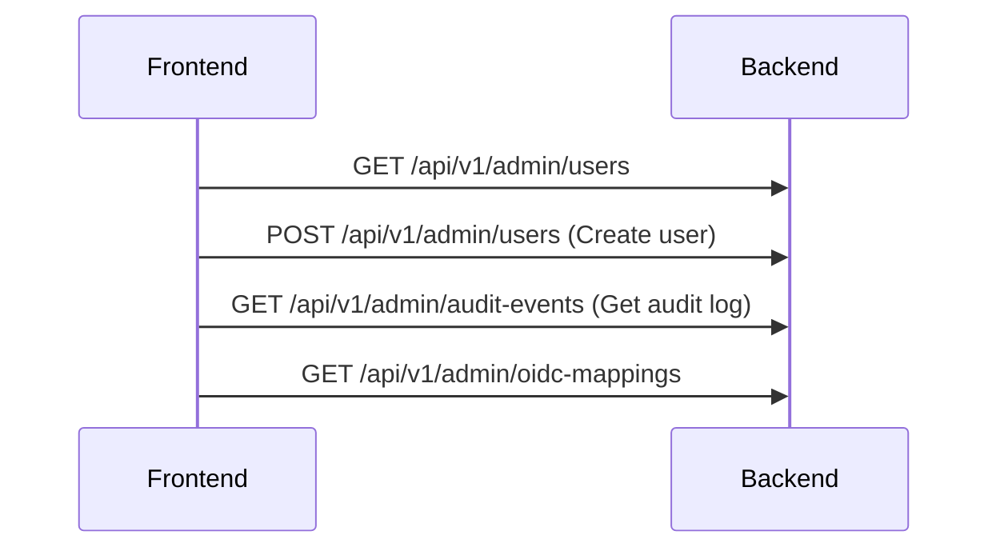

# Admin console and login views

## Admin Console (`/admin`)

**Route:** `/admin`

**Purpose:** Server administration - users, audit, OIDC mappings.

**Note:** Only accessible to users with **Admin** role.

### Tab 1: Users (within `/admin`)

**Purpose:** Manage user accounts.

**Shows:**
- Table of users
- Columns: Email, Role, Status (enabled/disabled), Environments, Last Login

**Actions:**
- **Create User** - Add local user (email + password)
- **Edit User** - Change role, enable/disable
- **Assign Environments** - Add user to environments
- **Delete User** - Remove user

**User Types:**
1. **Local** - Created in CF with email/password
2. **IdP** - Created automatically from OIDC login

### Tab 2: Audit Log (within `/admin`)

**Purpose:** See who did what.

**Shows:**
- Table of audit events
- Columns: Timestamp, Actor (who), Action (what), Target (on what), IP Address

**Actions Logged:**
- User login/logout
- User create/update/delete
- Role changes
- Deployment triggered
- System registered
- Flake added/removed

**Filters:**
- Date range
- Actor (user)
- Action type

### Tab 3: OIDC Mappings (within `/admin`)

**Purpose:** Map Identity Provider groups to CF roles.

**Shows:**
- List of mappings
- Columns: Group Name → Role, Group Name → Environments

**Example:**
| OIDC Group | CF Role | Environments |
|------------|---------|--------------|
| engineers | Operator | dev, staging |
| admins | Admin | all |
| execs | Viewer | prod |

### Data Flow

### Authorization

All admin endpoints require `role = Admin`.

### How to Modify

- **Backend:** `handlers/api/admin.rs`
- **Frontend:** `views/admin.rs`

The Admin tabs are views inside `/admin`; they are not separate UI routes.
The API requests shown above are separate server routes.

## Login Views

### Production Login (`/login`)

**Route:** `/login`

**Purpose:** Authenticate users via OIDC.

**Flow:**
1. User visits `/login` and selects **Sign in with OIDC**.
2. The UI follows `GET /api/auth/oidc/login`.
3. The server redirects to the configured identity provider.
4. The identity provider returns an authorization code to
   `GET /api/auth/oidc/callback`.
5. The server exchanges the code, validates the identity, maps groups, and
   creates the session.
6. The callback redirects to `/`.

### Dev Mode Login (`/dev/login`)

**Route:** `/dev/login`

**Purpose:** Local development without OIDC.

**Flow:**
1. User visits `/dev/login`
2. Selects one of the configured development fixture users.
3. The UI submits that user's email to `POST /api/auth/dev/login`.
4. The server authenticates the persisted fixture user and creates the session.
5. The UI redirects to `/`.

**Warning Banner:** Shows "Development Mode Only - Do Not Use in Production"

## Related concepts

- [Web UI navigation, shared components, responsive behavior, and structure](frontend-navigation-and-shared-patterns.md)
- [API authentication, sessions, and role-based authorization](../security/api-authentication-and-authorization.md)
- [Builders, queues, environments, dashboard, and admin APIs](../api/builders-queues-environments-dashboard-admin-api.md)
