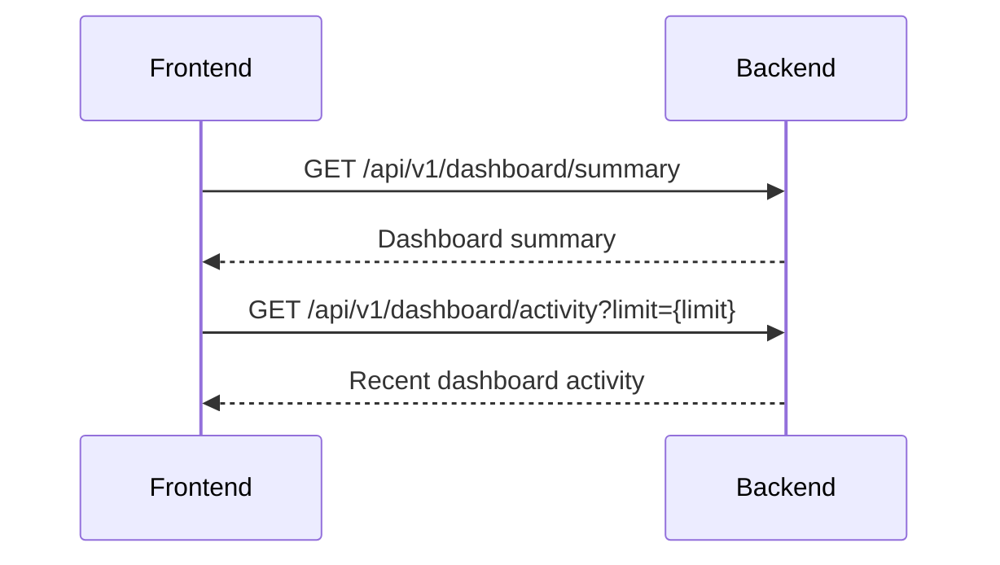
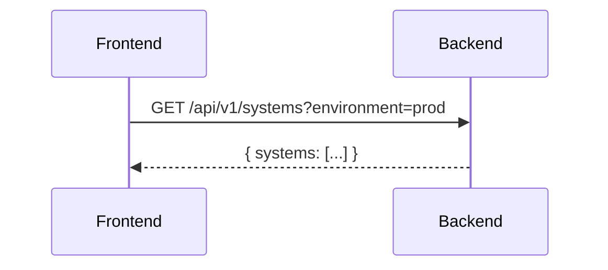
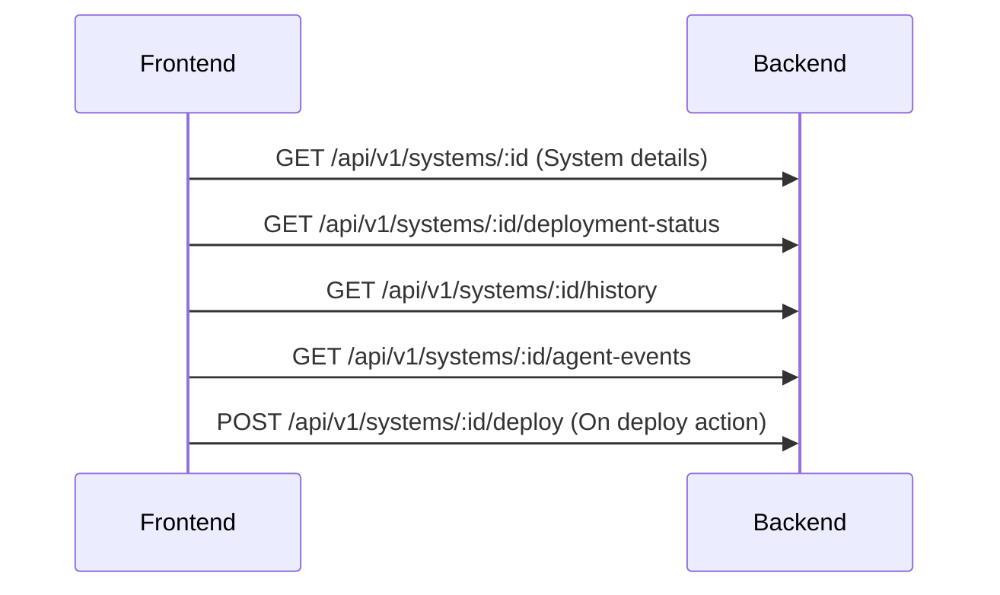

# Dashboard and systems views

## Dashboard (`/`)

**Route:** `/`

**Purpose:** Give users a quick overview of their fleet without having to click around.

### What It Shows

1. **Fleet Summary Card**
   - Total systems count
   - Online vs offline breakdown
   - Systems per environment (e.g., "Prod: 5, Dev: 3")

2. **Build Queue Widget**
   - How many builds are pending
   - How many are currently building
   - Recent build activity (last 5 builds)

3. **Flake Timeline Widget**
   - Recent commits across all tracked flakes
   - Shows commit message, author, time
   - Clicking a commit takes you to that flake

4. **Quick Actions**
   - "Deploy New System" button
   - "Sync All Flakes" button
   - Links to common tasks

### Data Flow

### How to Modify

- **Backend:** Modify `handlers/api/dashboard.rs`
- **Frontend:** Modify `views/dashboard.rs`

## Systems List (`/systems`)

**Route:** `/systems`

**Purpose:** See all registered systems at a glance, filter them, and navigate to specific systems.

### What It Shows

1. **View Toggle**
   - **Cards View:** Visual cards with system info (default)
   - **Table View:** Compact table for many systems

2. **Filter Controls**
   - **Environment Dropdown:** Filter by prod/staging/dev
   - **Status Dropdown:** All / Online / Offline
   - **Search Box:** Filter by name or hostname

3. **System Cards/Rows**
   Each card shows:
   - System name (bold)
   - Hostname (subtitle)
   - Environment badge (colored)
   - Status indicator (green dot = online, red = offline)
   - Last heartbeat time
   - Currently deployed flake name

### User Interactions

| Action | Result |
|--------|--------|
| Click card | Navigate to System Detail |
| Click environment badge | Filter list to that environment |
| Click "Deploy" | Open deployment modal |
| Click "Add System" | Open add system modal |

### Data Flow

**Query Parameters:**
- `?environment=prod` - Filter by environment
- `?status=online` - Filter by status
- `?search=web` - Search name/hostname

### How to Modify

- **Backend:** `handlers/api/systems.rs`, `queries/systems.rs`
- **Frontend:** `views/systems_list.rs`, `systems/adapter.rs`

## System Detail (`/systems/:id`)

**Route:** `/systems/:id` (e.g., `/systems/abc-123`)

**Purpose:** Manage a single system - deploy, rollback, view history.

### Layout (Tabs)

The view has **tabs** for different aspects:

#### Tab 1: Overview (`/systems/:id?tab=overview`)

**Purpose:** See current system state at a glance.

**Shows:**
- System name and hostname
- Environment badge
- Status (online/offline, last heartbeat)
- NixOS version
- Currently deployed flake + commit
- Currently activated generation number

#### Tab 2: Deploy (`/systems/:id?tab=deploy`)

**Purpose:** Deploy a new configuration to this system.

**Components:**
1. **Flake Selector** - Dropdown to pick a flake
2. **Branch Selector** - Pick branch (main, prod, etc.)
3. **Commit Selector** - Pick commit (shows commit message + date)
4. **Diff Viewer** - Shows what files changed (optional)
5. **Deploy Button** - Triggers deployment

**User Flow:**
1. User selects flake
2. User selects branch
3. User selects commit
4. (Optional) User clicks "Show Diff" to see changes
5. User clicks "Deploy"
6. Modal shows progress
7. Success/failure notification

#### Tab 3: History (`/systems/:id?tab=history`)

**Purpose:** See past deployments to this system.

**Shows:**
- Table of deployments
- Columns: Date, Commit, Status (success/failed), Triggered By
- Click row to see deployment details

#### Tab 4: Logs (`/systems/:id?tab=logs`)

**Purpose:** See deployment output logs.

**Shows:**
- Scrollable log output
- Timestamps
- Filter by deployment (select from dropdown)

### Data Flow

### How to Modify

- **Backend:** `handlers/api/systems.rs`
- **Frontend:** `views/system_detail.rs`, `components/system/`

The System Detail page has one UI route, `/systems/:id`. Its tabs use the
`tab` query parameter; the route also carries `poam`, `config_mode`, `revision`,
`generation`, `deploy_generation`, `cve_target`, and `cve_mode`. API paths in
the data flow are server routes, not UI routes.

## Related concepts

- [Web UI navigation, shared components, responsive behavior, and structure](frontend-navigation-and-shared-patterns.md)
- [Flakes, environments, builds, and evaluations views](flakes-environments-builds-and-evaluations-views.md)
- [Systems API](../api/systems-api.md)
- [Builders, queues, environments, dashboard, and admin APIs](../api/builders-queues-environments-dashboard-admin-api.md)
