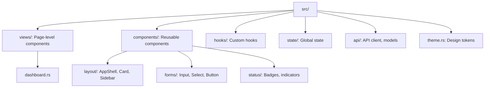

# Design System: Naming Conventions, Anti-Patterns and Decision Framework

This concept holds the Naming Conventions, Anti-Patterns, and Decision Framework sections of the [Crystal Forge UI/UX Design System](design-system-overview.md).

## Naming Conventions

### CSS Classes

| Type | Prefix | Example |
|------|--------|---------|
| Theme tokens | `cf-` | `cf-card-bg`, `cf-text-primary` |
| Component state | `cf-{component}-{state}` | `cf-eval-chip-pending` |
| Layout helpers | `cf-{pattern}-` | `cf-builds-split` |
| Modifiers | Standard Tailwind | `hover:`, `md:`, `focus:` |

### Rust Components

| Type | Convention | Example |
|------|------------|---------|
| View (page) | `{Name}View` | `DashboardView`, `SystemsView` |
| Component | `PascalCase` | `StatusBadge`, `ConfirmDialog` |
| Hook | `use_{name}` | `use_websocket`, `use_theme` |
| Props | `{Component}Props` | `StatusBadgeProps` |

> **Status:** Disagreement with code. `packages/web-ui/src/hooks/websocket.rs` defines `use_websocket_logs`, `use_websocket_eval_stream`, `use_websocket_metrics`, and `use_websocket_build_stream`. No `use_websocket` or `use_theme` function exists in `packages/web-ui/src`. Theme state lives in `packages/web-ui/src/state/theme.rs`. The hook examples in the table above illustrate the naming rule only.


### File Organization



---

## Anti-Patterns

### DO NOT Do These

#### 1. Hardcoded Tailwind Colors

```rust
// WRONG
div { class: "bg-gray-900 text-white border-gray-700" }

// CORRECT
div { class: "cf-card-bg cf-text-primary border cf-card-border" }
```

#### 2. Inline Styles for Static Values

```rust
// WRONG
div { style: "background: #111827; padding: 24px;" }

// CORRECT
div { class: "cf-card-bg p-6" }
```

#### 3. Inconsistent Spacing

```rust
// WRONG - mixing spacing scales
div { class: "p-5 mb-7 gap-3" }  // 5 and 7 are non-standard

// CORRECT - use 4px scale
div { class: "p-6 mb-8 gap-4" }
```

#### 4. Business Logic in Views

```rust
// WRONG - logic in view
if systems.iter().filter(|s| s.health == "healthy").count() > 5 {
    // render something
}

// CORRECT - compute in adapter/hook
let healthy_count = use_healthy_count(&systems);
```

#### 5. Decorative Colors

```rust
// WRONG - color for aesthetics
span { class: "text-purple-400" }  // Why purple?

// CORRECT - color has meaning
span { class: "{deployment::UP_TO_DATE_TEXT}" }  // Green = good
```

#### 6. Missing Focus States

```rust
// WRONG
button { class: "px-4 py-2 cf-primary-btn", "Click" }

// CORRECT
button { class: "px-4 py-2 cf-primary-btn cf-focus-ring", "Click" }
```

#### 7. Container Hierarchy Violations

```rust
// WRONG - card directly in page
div { class: "p-8",  // Page
    div { class: "cf-card-bg p-6" }  // Card with no grid/section
}

// CORRECT
div { class: "p-8",  // Page
    div { class: "grid grid-cols-2 gap-4",  // Grid
        div { class: "cf-card-bg p-6" }  // Card
    }
}
```

#### 8. Unbounded Content

```rust
// WRONG - text can overflow
p { "{potentially_very_long_path}" }

// CORRECT - truncate with title for full value
p { class: "truncate", title: "{full_path}", "{path}" }

// Or use monospace with overflow
code { class: "font-mono text-sm break-all", "{path}" }
```

---

## Decision Framework

When making UI decisions not explicitly covered by this document:

### 1. Check Existing Patterns First

Look at similar components in the codebase:
- Same domain (builds, systems, flakes)
- Same interaction type (list, detail, form)
- Same data type (status, metrics, logs)

### 2. Consult the Style Guide

Visit `/style-guide` in the running app to see all tokens and patterns visually.

### 3. Apply These Principles

In order of priority:
1. **Consistency** - Match existing patterns
2. **Clarity** - Users understand what they're seeing
3. **Accessibility** - Keyboard and screen reader friendly
4. **Performance** - Minimal DOM, efficient updates

### 4. Document New Patterns

If you create a new pattern:
1. Add it to the style guide view (`views/style_guide.rs`)
2. Add CSS tokens to `assets/app.css` if needed
3. Add Rust constants to `theme.rs` if needed
4. Note in MR that a new pattern was introduced

---

## Related concepts

- [Crystal Forge UI/UX Design System (overview)](design-system-overview.md)
- [Design System: Theming and Color System](design-system-theming-and-color.md)
- [Design System: Typography, Spacing and Layout](design-system-typography-and-layout.md)
- [Design System: Component and Interaction Patterns](design-system-components-and-interaction.md)
- [Design System: Accessibility, Responsive Design and Motion](design-system-accessibility-responsive-motion.md)
- [Design System: Naming Conventions, Anti-Patterns and Decision Framework](design-system-conventions-and-anti-patterns.md)
- [Web UI Coding Standards](web-ui-coding-standards.md)
- [Frontend Component Isolation Standards](component-isolation-standards.md)

## Migration verification notes

- Claim: Hook naming examples `use_websocket`, `use_theme`.
  Finding: Real hooks are `use_websocket_logs`, `use_websocket_eval_stream`, `use_websocket_metrics`, `use_websocket_build_stream`, `use_infinite_scroll`, `use_tour_runner`; no `use_theme`. Naming rule `use_{name}` holds.
  Evidence: hooks/websocket.rs; hooks/infinite_scroll.rs; state/theme.rs
  Case: documentation stale (examples; status note kept)
- Claim: File organization tree (`components/forms`, `components/status`).
  Finding: `components/` has `forms/`, `layout/` but no `status/` directory (`status_badge.rs`, `chips.rs` are files); many additional component directories exist (`builders`, `builds`, `system`, `onboarding`, ...). `adapter.rs` modules live under `dashboard/`, `environments/`, `systems/`.
  Evidence: packages/web-ui/src/components, src/*/adapter.rs
  Case: documentation stale
- Claim: Anti-patterns (hardcoded colors, inline static styles) are prohibited.
  Finding: Not enforced everywhere: sources still contain many static inline `style:` strings and Tailwind gray/white utilities with light-theme overrides in app.css.
  Evidence: src (about 2450 `style: "` literals); assets/app.css ~521-550
  Case: implementation incomplete (standard not fully met; no defect recorded)
- Claim: Naming conventions `cf-` prefix, `{Name}View`, `style_guide.rs` exists.
  Finding: Confirmed: views are `*View` components and `views/style_guide.rs` is routed at `/style-guide`.
  Evidence: src/routes.rs; src/views/style_guide.rs
  Case: none
