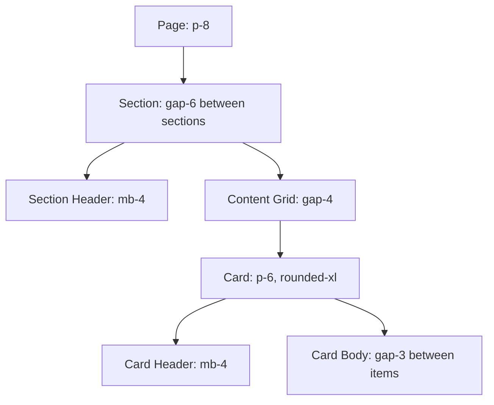

# Design System: Typography, Spacing and Layout

This concept holds the Typography and Spacing & Layout sections of the [Crystal Forge UI/UX Design System](design-system-overview.md).

## Typography

Typography uses Tailwind's default scale with the system font stack.

### Type Scale

| Token | Size | Weight | Usage |
|-------|------|--------|-------|
| `PAGE_TITLE` | `text-2xl` (24px) | `font-bold` | Page headings |
| `SECTION_TITLE` | `text-lg` (18px) | `font-semibold` | Card headers, section titles |
| `STAT_VALUE` | `text-3xl` (30px) | `font-bold` | Dashboard numbers |
| `LABEL` | `text-sm` (14px) | normal | Field labels, descriptions |
| `TABLE_HEADER` | `text-xs` (12px) | `font-medium` | Table column headers |
| `MONO` | `text-sm` (14px) | `font-mono` | Hashes, paths, code |
| `CAPTION` | `text-xs` (12px) | normal | Timestamps, metadata |

### Allowed Typography Classes

To maintain consistency, use ONLY these typography combinations:

```rust
use crate::theme::typography;

h1 { class: "{typography::PAGE_TITLE}" }    // Dashboard, Systems, Builds
h2 { class: "{typography::SECTION_TITLE}" } // Fleet Health, Build Queue
p  { class: "{typography::LABEL}" }         // Field labels
span { class: "{typography::MONO}" }        // /nix/store/abc123...
span { class: "{typography::CAPTION}" }     // 5 minutes ago
```

### Monospace Usage

Use `font-mono` for:
- Git commit SHAs
- Nix store paths
- IP addresses
- Version numbers
- Command output
- Log lines

---

## Spacing & Layout

### Spacing Scale

Crystal Forge uses Tailwind's 4px base unit. These are the approved spacing values:

| Token | Value | Usage |
|-------|-------|-------|
| `gap-1` | 4px | Icon-to-text |
| `gap-2` | 8px | Related items (badge groups) |
| `gap-3` | 12px | Form fields |
| `gap-4` | 16px | Card grid, sections |
| `gap-6` | 24px | Major sections |
| `p-4` | 16px | Small card padding |
| `p-6` | 24px | Standard card padding |
| `p-8` | 32px | Page content padding |

### Container Hierarchy

Layouts follow a strict nesting hierarchy:



**RULE:** Never skip levels. A Card must be inside a Section/Grid, never directly in Page.

### Grid System

| Breakpoint | Columns | Usage |
|------------|---------|-------|
| Default | 1 | Mobile |
| `md` (768px) | 2 | Tablets |
| `lg` (1024px) | 3-4 | Desktop |
| `xl` (1280px) | 4+ | Large monitors |

#### Standard Grid Patterns

```rust
// Dashboard widgets (4-column on xl)
div { class: "grid grid-cols-1 md:grid-cols-2 lg:grid-cols-4 gap-4" }

// System cards (3-column on lg)
div { class: "grid grid-cols-1 md:grid-cols-2 lg:grid-cols-3 gap-4" }

// Two-column content (e.g., form + preview)
div { class: "grid grid-cols-1 lg:grid-cols-2 gap-6" }
```

### Split-Pane Layouts

For master-detail patterns (e.g., Build Queue + Build Detail):

```css
.cf-builds-split {
  display: grid;
  grid-template-columns: minmax(0, 5fr) minmax(0, 7fr);
  gap: 1.5rem;
}

@media (max-width: 1024px) {
  .cf-builds-split {
    grid-template-columns: 1fr;  /* Stack on mobile */
  }
}
```

**Standard Split Ratios:**
- List + Detail: `5fr 7fr` (narrower list)
- Navigation + Content: `4fr 8fr` (sidebar style)
- Equal panels: `1fr 1fr`

### Card Density Guidelines

Cards should be dense but readable. Follow these rules:

| Card Type | Max Content | Structure |
|-----------|-------------|-----------|
| Stat Card | 1 number + 1 label | Large value, small label below |
| Summary Card | 3-5 metrics | Header + 2-column key-value grid |
| List Card | 5-10 items | Header + scrollable list |
| Detail Card | Unlimited | Header + sections with dividers |

**Card Structure Template:**
```rust
div { class: "cf-card-bg border cf-card-border rounded-xl p-6",
    // Header: always present
    div { class: "flex items-center justify-between mb-4",
        h2 { class: "{typography::SECTION_TITLE}", "Card Title" }
        // Optional: action buttons, badges
    }
    // Body: dense content
    div { class: "space-y-3",
        // Content rows
    }
}
```

### When to Use Modals vs Cards vs Inline Forms

| Pattern | Use When |
|---------|----------|
| **Modal** | Destructive actions, multi-step forms, confirmations, focused tasks |
| **Card** | Displaying data, summary information, dashboard widgets |
| **Inline Form** | Quick edits (1-2 fields), toggle settings, search/filter |
| **Side Panel** | Extended details without leaving context, secondary info |
| **Full Page** | Complex forms (5+ fields), wizards, onboarding |

**Decision Flow:**
1. Is it destructive? -> Modal with confirmation
2. Is it a quick toggle or 1-2 fields? -> Inline
3. Does it need context from the page? -> Side panel or inline
4. Is it a complex multi-field form? -> Modal or full page
5. Is it read-only data? -> Card

## Related concepts

- [Crystal Forge UI/UX Design System (overview)](design-system-overview.md)
- [Design System: Theming and Color System](design-system-theming-and-color.md)
- [Design System: Typography, Spacing and Layout](design-system-typography-and-layout.md)
- [Design System: Component and Interaction Patterns](design-system-components-and-interaction.md)
- [Design System: Accessibility, Responsive Design and Motion](design-system-accessibility-responsive-motion.md)
- [Design System: Naming Conventions, Anti-Patterns and Decision Framework](design-system-conventions-and-anti-patterns.md)
- [Web UI Coding Standards](web-ui-coding-standards.md)
- [Frontend Component Isolation Standards](component-isolation-standards.md)

## Migration verification notes

- Claim: Type scale tokens, spacing constants, `.cf-builds-split` 5fr/7fr split, card/table presets.
  Finding: `typography::*` and `spacing::*` in theme.rs match the table values (TABLE_HEADER additionally carries `text-secondary uppercase tracking-wider`). `.cf-builds-split` is `minmax(0,5fr) minmax(0,7fr)` gap 1.5rem and stacks to one column at max-width 1024px, as documented (app.css 731, 1292-1296). Layout rules, grid patterns, density guidance, and the modal/card/inline decision flow are normative guidance, not code-checkable.
  Evidence: src/theme.rs typography, spacing, presets; assets/app.css .cf-builds-split
  Case: none
