# Crystal Forge UI/UX Design Extraction for Figma


> **Status:** historical. The source document is dated April 19, 2026 and describes the web UI at that date. It is a point-in-time snapshot, not a current specification. The machine-readable palette that accompanies it is stored as the asset [figma-color-palette.json](figma-color-palette.json). The user workflows, design challenges, and redesign plan from the same source are in [Figma Extraction: User Workflows, Design Challenges and Redesign Plan](figma-extraction-workflows-and-redesign-plan.md).

**Purpose**: This document extracts the current Crystal Forge web-UI implementation to enable redesign in Figma with Claude's assistance.

**Date**: April 19, 2026

---

## Executive Summary

Crystal Forge currently has a **functional but improvable** web-UI built with Dioxus (Rust → WASM). The implementation includes:
- 80+ components across 14 domain areas
- 18 routes/pages
- Comprehensive dark/light theme system
- Tailwind CSS + custom design tokens
- Responsive mobile-first design

**Key UX Challenges** to address in Figma redesign:
1. Information density vs clarity balance
2. Navigation hierarchy and discoverability
3. Workflow optimization for common tasks
4. Visual hierarchy and scanning patterns
5. Mobile experience refinement
6. Accessibility and keyboard navigation

---

## Design System Tokens

### Brand Colors

```
Primary Brand Purple: #8B5CF6 (violet-500)
  Hover: #7C3AED (violet-600)
  
Danger/Berry Red: #E11D48 (rose-600)
  Hover: #BE123C (rose-700)
  
Success Green: #10B981 (emerald-500)
  Hover: #059669 (emerald-600)
```

### Theme Colors (Dark Mode - Default)

**Surfaces**:
- Page Background: `#0f0f0f` (zinc-950)
- Sidebar: `#1a1a1a` (zinc-900)
- Card Background: `#1f1f1f` (zinc-900/90)
- Card Border: `#27272a` (zinc-800)
- Divider: `#27272a` (zinc-800)
- Subtle Background: `#18181b` (zinc-900)
- Modal Backdrop: `rgba(0, 0, 0, 0.75)` with backdrop-blur

**Text**:
- Primary: `#fafafa` (zinc-50) - headings, important values
- Secondary: `#a1a1aa` (zinc-400) - labels, descriptions
- Muted: `#71717a` (zinc-500) - timestamps, version numbers
- Disabled: `#52525b` (zinc-600)

**Interactive**:
- Input Background: `#18181b` (zinc-900)
- Input Border: `#27272a` (zinc-800)
- Input Border Focus: `#3f3f46` (zinc-700)
- Hover Background: `#27272a80` (zinc-800/50)
- Focus Ring: `#8b5cf680` (violet-500/50)

### Theme Colors (Light Mode)

**Surfaces**:
- Page Background: `#fafafa` (zinc-50)
- Sidebar: `#f4f4f5` (zinc-100)
- Card Background: `#ffffff` (white)
- Card Border: `#e4e4e7` (zinc-200)
- Divider: `#e4e4e7` (zinc-200)
- Subtle Background: `#f4f4f5` (zinc-100)

**Text**:
- Primary: `#18181b` (zinc-900)
- Secondary: `#52525b` (zinc-600)
- Muted: `#71717a` (zinc-500)
- Disabled: `#a1a1aa` (zinc-400)

**Interactive**:
- Input Background: `#ffffff` (white)
- Input Border: `#d4d4d8` (zinc-300)
- Input Border Focus: `#a1a1aa` (zinc-400)
- Hover Background: `#f4f4f580` (zinc-100/50)

### Status Colors

**Health Status**:
- Healthy: `#34d399` (emerald-400) - text, bg: `#34d39920`, border: `#34d39940`
- Warning: `#fbbf24` (amber-400) - text, bg: `#fbbf2420`, border: `#fbbf2440`
- Critical: `#f87171` (red-400) - text, bg: `#f8717120`, border: `#f8717140`
- Offline: `#6b7280` (gray-500) - text, bg: `#6b728020`, border: `#6b728040`

**Deployment Status**:
- Up to Date: `#34d399` (emerald-400), bg: `#34d39920`
- Behind: `#fbbf24` (amber-400), bg: `#fbbf2420`
- Ahead: `#60a5fa` (blue-400), bg: `#60a5fa20`
- Never Deployed: `#6b7280` (gray-500), bg: `#6b728020`

**CVE Severity**:
- Critical: `#ef4444` (red-500), bg: `#ef444420`
- High: `#fb923c` (orange-400), bg: `#fb923c20`
- Medium: `#facc15` (yellow-400), bg: `#facc1520`
- Low: `#60a5fa` (blue-400), bg: `#60a5fa20`

**Pipeline Stages**:
- Dry Run: `#9ca3af` (gray-400)
- Ready for Build: `#60a5fa` (blue-400)
- Building: `#818cf8` (indigo-400)
- Build Complete: `#a78bfa` (violet-400)
- Ready for Deploy: `#34d399` (emerald-400)

### Typography Scale

**Headings**:
- Page Title: `24px / 2rem`, font-weight: 700
- Section Title: `18px / 1.125rem`, font-weight: 600
- Stat Value: `30px / 1.875rem`, font-weight: 700

**Body Text**:
- Base: `16px / 1rem`, font-weight: 400
- Label: `14px / 0.875rem`, secondary color
- Caption: `12px / 0.75rem`, muted color
- Monospace (code/hashes): `14px / 0.875rem`, font-family: monospace

**Table Headers**: `12px / 0.75rem`, font-weight: 500, uppercase, letter-spacing: 0.05em

### Spacing System

**Page Layout**:
- Page padding: `32px / 2rem` (all sides)
- Card padding: `24px / 1.5rem`
- Card gap: `16px / 1rem`
- Section gap: `24px / 1.5rem`

**Component Spacing**:
- Table cell: horizontal `24px`, vertical `12px`
- Button padding: horizontal `16px`, vertical `8px`
- Input padding: horizontal `12px`, vertical `8px`

**Gaps**:
- Tight: `8px / 0.5rem`
- Normal: `16px / 1rem`
- Relaxed: `24px / 1.5rem`

### Border Radius

- Small (badges, pills): `4px / 0.25rem`
- Medium (buttons, inputs, cards): `8px / 0.5rem`
- Large (modals, panels): `12px / 0.75rem`
- Full (dots, avatars): `9999px`

### Shadows

```css
Card: 0 1px 3px rgba(0, 0, 0, 0.1)
Modal: 0 10px 25px rgba(0, 0, 0, 0.3)
Dropdown: 0 4px 6px rgba(0, 0, 0, 0.1)
```

---

## Page Layouts & Navigation

### Application Shell Structure

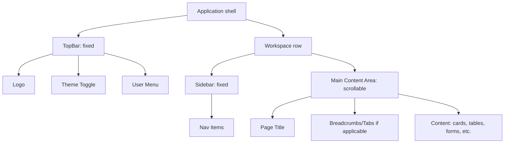

**Desktop**: 
- Sidebar width: `256px` (expanded) / `64px` (collapsed)
- TopBar height: `64px`
- Sidebar collapsible via edge toggle button
- Main content: `max-width: 1536px`, centered

**Mobile** (< 768px):
- Sidebar becomes overlay drawer
- Hamburger menu in TopBar
- Full-width content

### Navigation Hierarchy

**Primary Navigation** (Sidebar):
1. 🏠 Dashboard
2. 🖥️ Systems
3. 🌍 Environments
4. 📦 Flakes
5. 🔨 Builds
6. 📊 Evaluations
7. 🏗️ Builders
8. 💾 Caches
9. 🛡️ CVEs (admin only)
10. 📋 Deployment Policies
11. ⚙️ Admin (admin only)
12. 🎨 Style Guide (dev mode)

**Secondary Navigation**:
- Within pages: Tabs (e.g., System Detail: Info / Logs)
- Filters and view toggles (e.g., Systems: card view / table view)

---

## Page Inventory & Wireframes

### 1. Dashboard (`/`)

**Purpose**: Fleet-wide overview at a glance

**Layout**:
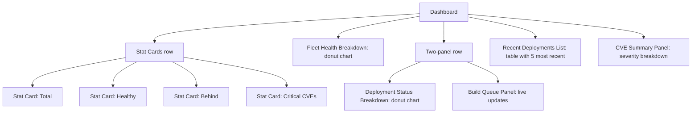

**Widgets**:
- 4 stat cards (grid-cols-1 sm:grid-cols-2 xl:grid-cols-4)
- Fleet Health donut chart
- Deployment Status donut chart
- Build Queue panel (real-time)
- Recent Deployments table
- CVE Summary panel

**Current UX Issues**:
- Information overload for first-time users
- No clear workflow guidance
- Static layout (not customizable)

---

### 2. Systems List (`/systems`)

**Purpose**: Browse and manage all NixOS systems

**Layout**:
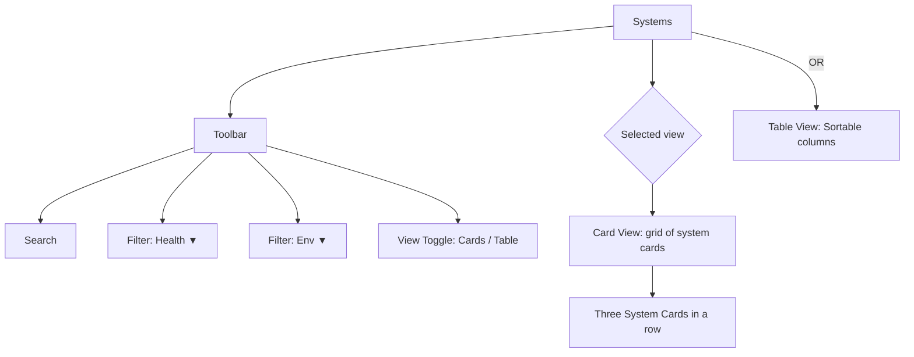

**Components**:
- Search input
- Multi-select filter dropdowns (health, environment, deployment status)
- View toggle (card/table)
- System cards (grid layout) or table
- Each card shows: hostname, environment, health, deployment status, IP, last deployed
- Actions: Edit, Deploy, Remove

**Current UX Issues**:
- Filters feel disconnected from results
- Card view wastes space on large screens
- Table view lacks quick actions
- No bulk operations

---

### 3. System Detail (`/systems/:id`)

**Purpose**: Deep dive into a single system

**Layout**:
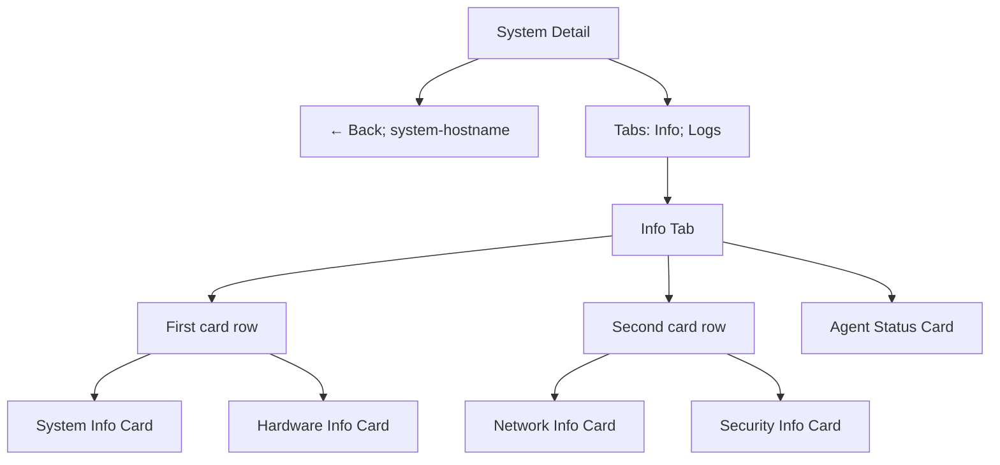

**Info Cards**:
- **System Info**: Environment, health, deployment status, IP, store path, current generation
- **Hardware**: Architecture, CPU cores, memory, disk usage
- **Network**: Hostname, IPv4, IPv6, MAC addresses
- **Security**: SSH public key, firewall status
- **Agent**: Connection status, last heartbeat, version

**Logs Tab**:
- Real-time agent logs
- Filterable by level (info, warn, error)

**Current UX Issues**:
- Cards all same size regardless of content
- No visual hierarchy (all equal weight)
- Hardware metrics lack context (is 80% disk usage bad?)
- No historical trends

---

### 4. Environments (`/environments`)

**Purpose**: Manage deployment environments (dev, staging, prod)

**Layout**:
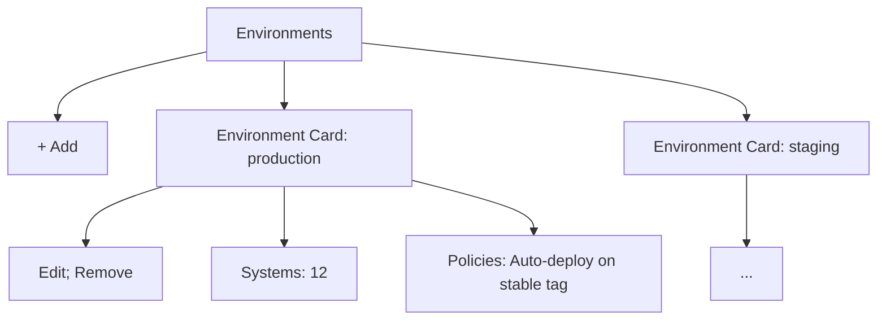

**Components**:
- List of environment cards
- Each card: name, system count, associated policies
- Actions: Edit, Remove, Add

**Current UX Issues**:
- Doesn't show what makes each environment different
- No visual indicator of environment criticality
- Policies are listed but not explained

---

### 5. Flakes (`/flakes`)

**Purpose**: Visualize flake repository commit timeline

**Layout**:
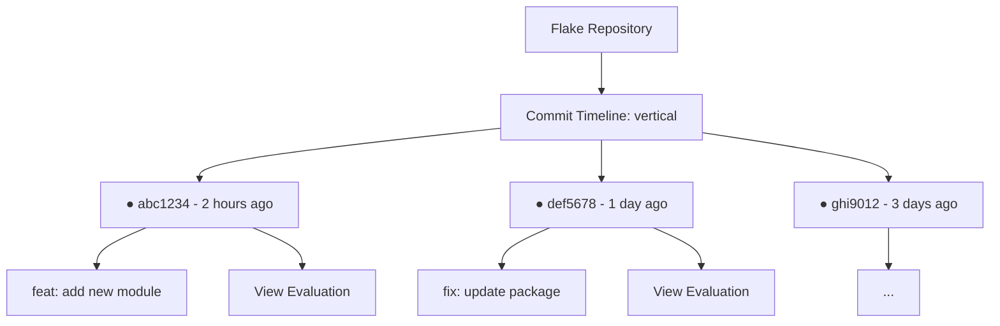

**Components**:
- Vertical timeline of commits
- Each commit: hash (short), message, timestamp, author
- Link to evaluation view for each commit

**Current UX Issues**:
- No branch visualization
- No indication of which commits are deployed where
- Timeline can be very long with no pagination

---

### 6. Builds (`/builds`)

**Purpose**: Build control center - monitor and manage builds

**Layout**:
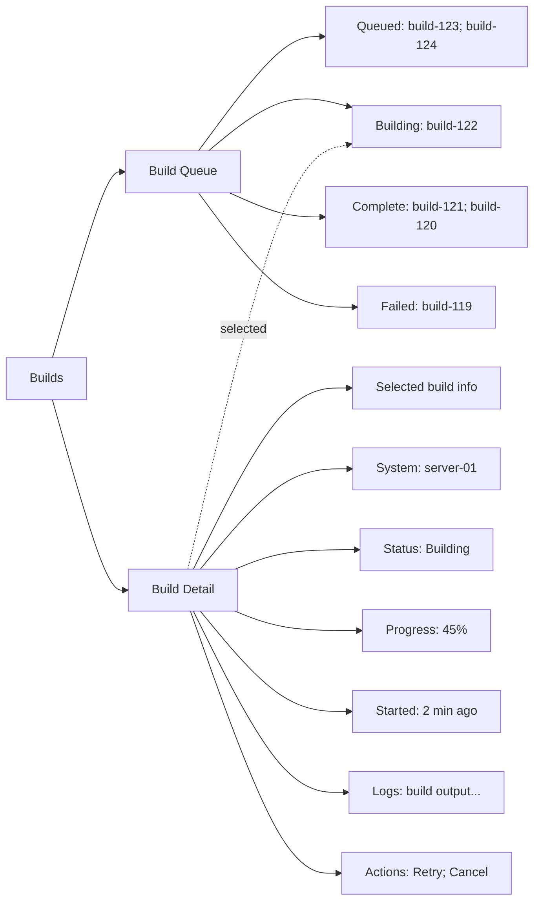

**Components**:
- Left pane: Build queue grouped by status (queued, building, complete, failed)
- Right pane: Selected build details with live logs
- Worker status strip at top
- Metrics row showing throughput

**Current UX Issues**:
- Queue can grow very long
- No filtering or search
- Build logs are raw and hard to parse
- No retention policy shown

---

### 7. Evaluations (`/evaluations`)

**Purpose**: View evaluation history and results

**Layout**:
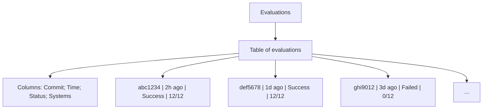

**Click row** → Navigate to `/evaluations/:commit_id`

**Evaluation Detail Page**:
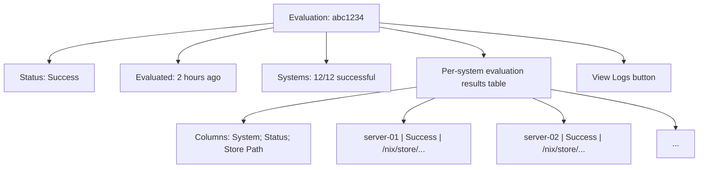

**Current UX Issues**:
- Table is dense and hard to scan
- No diff view between evaluations
- Failures don't show why they failed inline

---

### 8. Builders (`/builders`)

**Purpose**: Manage remote builders (build machines)

**Layout**:
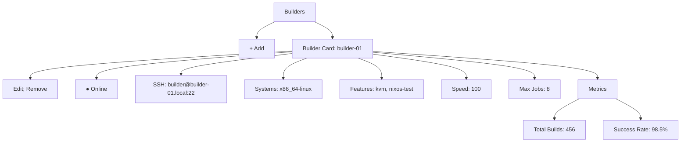

**Components**:
- Grid of builder cards
- Each card: name, status, SSH connection, supported systems, features, metrics
- Actions: Add, Edit, Remove

**Current UX Issues**:
- No way to test builder connectivity
- Metrics don't show trends
- Features are just tags with no explanation

---

### 9. Caches (`/caches`)

**Purpose**: Manage binary caches

**Layout**:
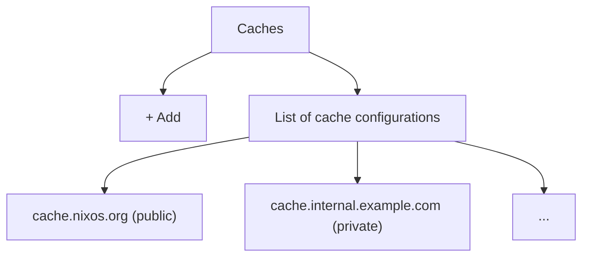

**Note**: This page is less developed in current implementation.

---

### 10. CVEs (`/cves`)

**Purpose**: Security vulnerability tracking (admin only)

**Layout**:
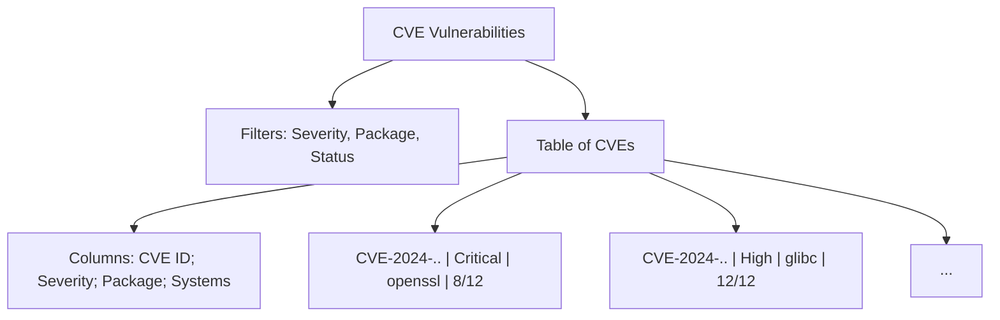

**Current UX Issues**:
- No remediation guidance
- Doesn't link to affected systems
- No timeline showing when CVE was introduced/fixed

---

### 11. Deployment Policies (`/deployment-policies`)

**Purpose**: Define automated deployment rules

**Layout**:
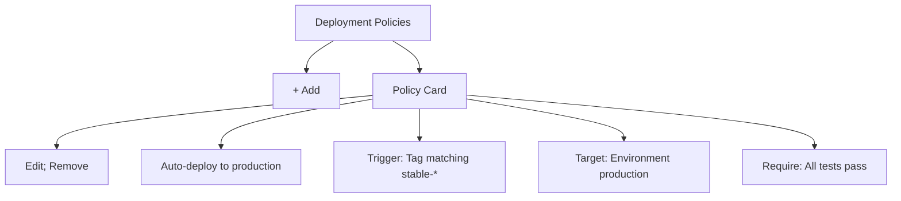

**Components**:
- List of policy cards
- Each policy: name, trigger conditions, target environment, requirements
- Actions: Add, Edit, Remove

**Current UX Issues**:
- Policy syntax is complex but shown as plain text
- No visual indication of policy flow
- Can't see policy execution history

---

### 12. Admin (`/admin`)

**Purpose**: Server management and configuration (admin only)

**Layout**:
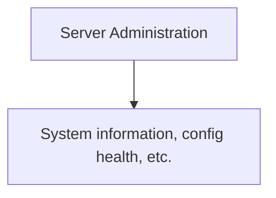

**Note**: Implementation details vary.

---

### 13. Login (`/login`)

**Purpose**: User authentication

**Layout**:
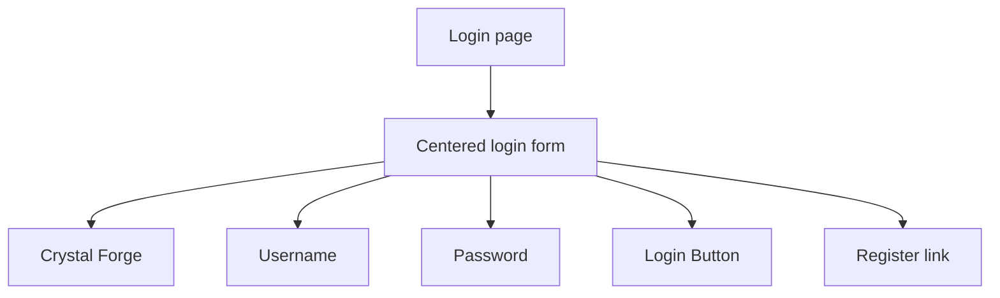

**Current UX Issues**:
- Plain, generic login form
- No branding or personality
- No "forgot password" flow

---

### 14. Register (`/register`)

**Purpose**: User registration

**Layout**: Similar to login with additional fields (email, confirm password)

**Current UX Issues**:
- No indication of password requirements
- No email verification flow shown

---

### 15. Setup (`/setup`)

**Purpose**: Initial setup wizard for first-time installation

**Layout**: Multi-step wizard (implementation details vary)

---

## Component Library

### Cards

**Standard Card**:
- Background: `--cf-card-bg`
- Border: `1px solid --cf-card-border`
- Border radius: `8px`
- Padding: `24px`
- Shadow: subtle

**Variants**:
- Stat Card (centered stat display)
- System Card (multi-row info grid)
- Builder Card (builder info + metrics)
- Environment Card (env info + policies)
- Policy Card (policy rules)

### Badges

**Status Badge** (pill-shaped):
- Border radius: `9999px`
- Padding: `4px 12px`
- Font: `12px`, medium weight
- Color-coded by status (health, deployment, CVE severity)

**Variants**:
- Health badge (healthy, warning, critical, offline)
- Deployment badge (up to date, behind, ahead, never deployed)
- CVE severity badge (critical, high, medium, low)

### Buttons

**Primary Button**:
- Background: `--cf-primary-btn` (violet)
- Text: white
- Padding: `8px 16px`
- Border radius: `8px`
- Hover: darker shade

**Variants**:
- Danger button (red)
- Success button (green)
- Ghost button (transparent with hover bg)
- Icon button (square, icon only)

### Modals

**Structure**:
- Backdrop: `rgba(0,0,0,0.75)` with backdrop-blur
- Modal: card styling, centered
- Max width: `600px` (forms) to `1200px` (complex modals)
- Padding: `24px`
- Header: title + close button
- Footer: action buttons (right-aligned)

**Types**:
- Confirmation dialog (small, centered message)
- Form modal (add/edit entities)
- Detail modal (view logs, diffs)

### Tables

**Sortable Table**:
- Header: `--cf-table-header` styling, uppercase
- Rows: hover effect
- Cell padding: `12px 24px`
- Borders: subtle dividers

**Features**:
- Sortable columns (click header)
- Row selection (checkboxes)
- Inline actions (edit, delete icons)

### Forms

**Input Fields**:
- Background: `--cf-input-bg`
- Border: `--cf-input-border`
- Focus: `--cf-input-border-focus` + focus ring
- Padding: `8px 12px`
- Border radius: `8px`

**Types**:
- Text input
- Textarea
- Select dropdown
- Checkbox
- Radio buttons

**Validation**:
- Error state: red border + error message below
- Success state: green border + checkmark icon

### Notifications

**Toast**:
- Bottom-right corner
- Auto-dismiss after 5s
- Variants: success, error, warning, info
- Icon + message + close button

**Alert Banner**:
- Top of page content
- Full-width, colored background
- Dismissible
- Variants: info, warning, error

### Loading States

**Spinner**:
- Animated rotating circle
- Sizes: small, medium, large
- Colors: primary (violet) or muted (gray)

**Skeleton Loaders**:
- Placeholder blocks with shimmer animation
- Match shape of content (cards, tables, text)

### Charts

**Donut Chart**:
- SVG-based
- Interactive legend
- Color-coded segments
- Center: total count

**Usage**:
- Fleet health breakdown
- Deployment status breakdown
- CVE severity distribution

---

## Responsive Breakpoints

```
Mobile: < 640px (sm)
Tablet: 640px - 1024px (sm to lg)
Desktop: > 1024px (lg+)
Wide: > 1280px (xl+)
```

**Responsive Behavior**:
- Sidebar → Drawer on mobile
- Card grids: 1 column → 2 columns → 3-4 columns
- Tables: horizontal scroll on mobile OR collapse to cards
- Modals: full-screen on mobile, centered on desktop

---

## Accessibility Considerations

**Current Implementation**:
- Semantic HTML (nav, main, header, article)
- Focus states on interactive elements
- Keyboard navigation (Tab, Enter, Esc)
- ARIA labels on icon buttons

**Gaps to Address in Redesign**:
- Screen reader announcements for dynamic updates
- High contrast mode support
- Reduced motion preferences
- Better focus indicators (more visible)
- Keyboard shortcuts documentation

## Related concepts

- [Figma Extraction: User Workflows, Design Challenges and Redesign Plan](figma-extraction-workflows-and-redesign-plan.md)
- [Claude + Figma Workflow for Crystal Forge Redesign](figma-claude-redesign-workflow.md)
- [Figma color palette (JSON asset)](figma-color-palette.json)
- [Crystal Forge UI/UX Design System](design-system-overview.md)
