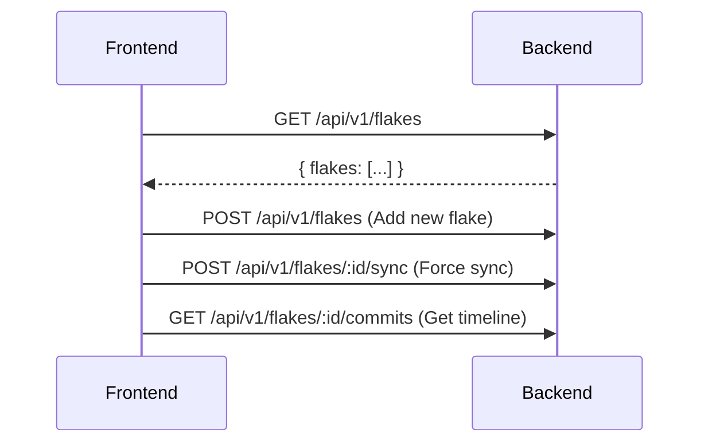
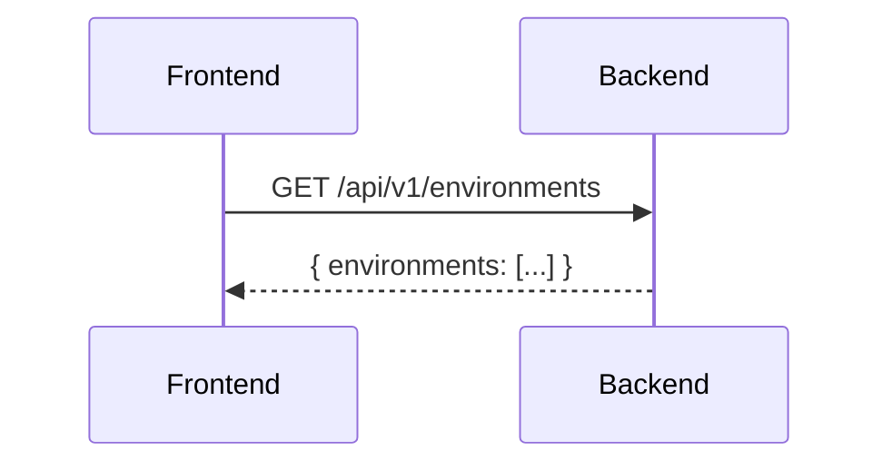
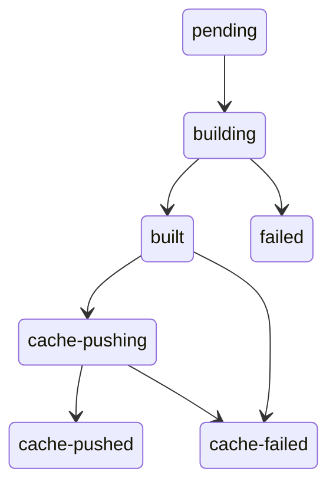
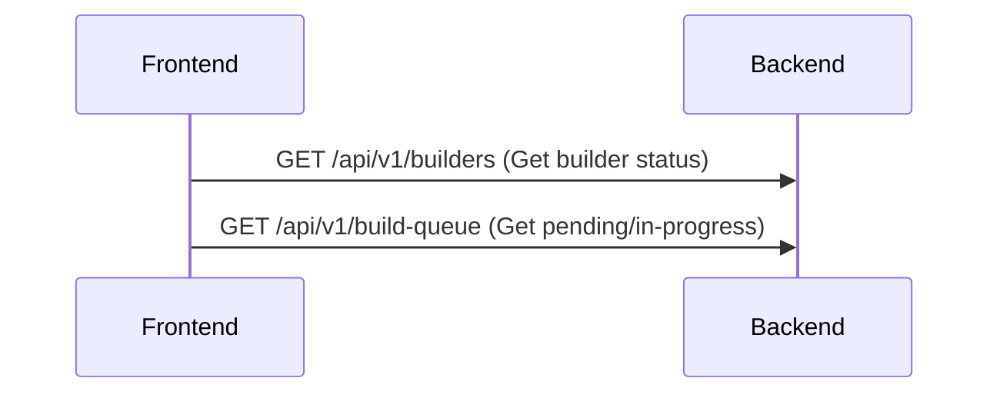

# Flakes, environments, builds, and evaluations views

## Flakes List (`/flakes`)

**Route:** `/flakes`

**Purpose:** Manage the flake repositories Crystal Forge tracks.

### What It Shows

1. **Flake Cards**
   - Repository name
   - Git URL
   - Branch (e.g., "main", "nixos-unstable")
   - Last sync time
   - Sync status badge (synced ✅, syncing 🔄, error ❌)

2. **Filter Controls**
   - Environment filter
   - Sync status filter

3. **Actions**
   - **Sync Now** - Force git pull
   - **View Timeline** - See commits
   - **Add Flake** - Register new flake

### Adding a Flake (Modal)

Clicking "Add Flake" opens a modal with:
- **Name:** Display name (e.g., "Production Configs")
- **Repository URL:** Git HTTPS or SSH URL
- **Branch:** Default branch to track
- **Description:** Optional

### Flake Timeline (Sub-view)

Clicking a flake shows its commit history:

**Shows:**
- List of commits (newest first)
- Each commit shows:
  - Short SHA (e.g., `abc1234`)
  - Commit message
  - Author
  - Date
  - Number of changed files

**Interactions:**
- Click commit → Show changed files
- Click "Deploy" on commit → Opens deploy modal for that commit

### Data Flow

### How to Modify

- **Backend:** `handlers/api/flakes.rs`, `queries/flakes.rs`
- **Frontend:** `views/flakes_list.rs`, `flake/adapter.rs`

## Environments List (`/environments`)

**Route:** `/environments`

**Purpose:** Group systems by environment (prod, staging, dev).

### What It Shows

1. **Environment Cards**
   - Environment name (e.g., "Production")
   - Color badge
   - System count
   - Assigned cache (future - TASK-141)

2. **Actions**
   - **Add Environment** - Create new environment
   - **Edit** - Change name/color

### What Is an Environment?

An environment is a **logical grouping** for systems:
- Production systems go in "prod" environment
- Staging systems go in "staging" environment
- Development systems go in "dev" environment

**Why?** Two reasons:
1. **Filtering:** See only prod systems in dashboard
2. **RBAC:** Users can be restricted to specific environments

### Data Flow

### How to Modify

- **Backend:** `handlers/api/environments.rs`, `queries/environments.rs`
- **Frontend:** `views/environments_list.rs`

## Builds Queue (`/builds`)

**Route:** `/builds`

**Purpose:** Monitor the build queue and builder workers (Stage 2 after evaluation).

### What It Shows

#### Builder Workers Panel
- List of registered builders
- Each builder shows:
  - Name
  - Status (idle 🟢, building 🟡, paused 🔴)
  - Current job (if building)
  - CPU/RAM allocated

#### Build Queue Sections

1. **Pending** - Builds waiting to be picked up
2. **In Progress** - Currently building
3. **Recently Completed** - Last 10 builds with status

### Build States

A derivation goes through these states:

### What Is a "Build"?

A build is a **Nix derivation** that needs to be built:
- Created after evaluation when system passes policy check
- Queued for an available builder
- Builder runs `nix build`
- On success: optionally push to cache
- Result reported back to server

### Data Flow

### How to Modify

- **Backend:** `handlers/api/builders.rs`, `builder/mod.rs`
- **Frontend:** `views/builds.rs`

> **Status:** The Builds data flow above reads `/api/v1/build-queue`; the server registers the build listing as `/api/v1/build-jobs`. Not reconciled in this migration.

## Evaluations (`/evaluations`)

**Route:** `/evaluations`, `/evaluations/:commit_id`

**Purpose:** Monitor the NixOS flake evaluation pipeline — see what's being evaluated, cancel stuck or unwanted evaluations, and review historical eval outcomes.

### Tabs

#### Active Queue Tab (default)

Shows commits currently in the evaluation pipeline, ordered by queue position. Each row displays:

- Flake name and 8-character commit hash
- Branch name
- Current status chip (`pending`, `in_progress`, `cancelling`, `cancelled`)
- Policy pass/fail counts and system count
- **Up / Down** buttons to reprioritize pending items
- **Cancel** button on `pending` and `in_progress` rows — disabled with spinner while request is in-flight
- **Force Cancel** button on `cancelling` rows — skips cooperative shutdown for truly stuck evals

Status transitions:
- `pending → cancelled` immediately on cancel
- `in_progress → cancelling` (async — eval loop detects within ~2s and kills subprocess)
- `cancelling → cancelled` via force-cancel

#### History Tab

Paginated list of all completed, failed, and cancelled evaluations. Columns:

| Column | Description |
|--------|-------------|
| Commit | 8-char hash |
| Flake | Flake name |
| Branch | Git branch |
| Status | Chip: `complete`, `failed`, `cancelled` |
| Completed | Relative time (e.g., "5m ago") |
| Duration | Total eval time (e.g., "1m 23s") |
| Systems | Count of NixOS configurations evaluated |
| Actions | **Re-evaluate** button for failed/cancelled rows |

**Filters:**
- Status chips: All / Complete / Failed / Cancelled
- Flake name text input (ILIKE match)
- Server-side pagination (50 per page)

### Evaluation Logs Panel

A live WebSocket log stream for the currently selected commit, shown above the queue. Supports:
- **Concise mode** (default): filters to high-signal lines (errors, policy results, start/finish)
- **Verbose mode**: all raw nix-eval-jobs output
- **Maximize**: full-screen modal for detailed inspection

### Auth

- Read access: viewer or above
- Cancel / Force-Cancel: operator or admin only

## Related concepts

- [Web UI navigation, shared components, responsive behavior, and structure](frontend-navigation-and-shared-patterns.md)
- [Dashboard and systems views](dashboard-and-systems-views.md)
- [Flakes API and Evaluation and Flake Snapshot API](../api/flakes-and-evaluation-snapshot-api.md)
- [Builders, queues, environments, dashboard, and admin APIs](../api/builders-queues-environments-dashboard-admin-api.md)
