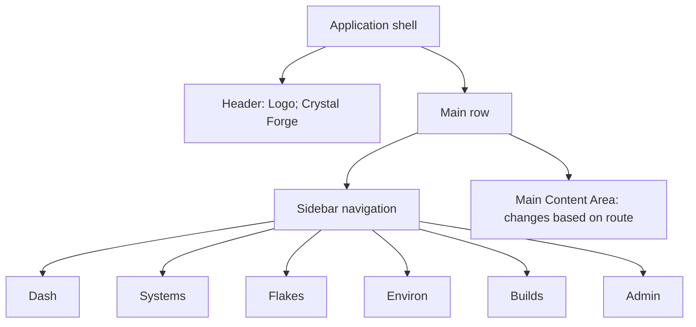

# Frontend Views Specification

This document describes each UI view in Crystal Forge. It's written for developers who need to understand what each view does, what data it shows, and how users interact with it.

**Assumption:** You have basic knowledge of React/Dioxus concepts (components, state, routing).

> **Related Documentation:**
> - **[Frontend Component Isolation Standards](component-isolation-standards.md)** - Component development workflow, state coverage, and isolation requirements
> - **[Web UI Coding Standards](web-ui-coding-standards.md)** - Styling and theme policies
> - **[UI/UX Design System](design-system-overview.md)** - Design philosophy and patterns

## Navigation Structure

The app uses a **sidebar navigation** pattern:

**Route Mapping:**
- `/` → Dashboard
- `/systems` → Systems List
- `/systems/:id` → System Detail
- `/flakes` → Flakes List
- `/environments` → Environments List
- `/builds` → Builds Queue
- `/evaluations` → Evaluations Queue & History
- `/evaluations/:commit_id` → Evaluations (pre-selected commit)
- `/cves` → CVE Dashboard
- `/deployment-policies` → Deployment Policies
- `/scanning` → Scanning
- `/poams` → POA&M
- `/compliance` → Compliance bundles
- `/profile` → Profile & Preferences
- `/style-guide` → Component Showcase
- `/builders` → Builder Management
- `/caches` → Cache Destinations
- `/admin` → Server Management

> **Status:** Reconciled in verification against `packages/web-ui/src/routes.rs`. The route list and summary table now use `/deployment-policies` (not `/policies`) and include `/scanning`, `/poams`, `/compliance`, `/profile`, `/style-guide`, `/register`, and `/setup`. The sidebar groups entries in sections Fleet, Pipeline, Compliance, System, and Dev Tools (`components/layout/sidebar.rs`); `/systems`, `/environments`, `/cves`, `/poams`, `/compliance`, `/flakes`, and `/builds` accept query parameters; `/systems/:id` accepts `tab`, `poam`, `config_mode`, `revision`, `generation`, `deploy_generation`, `cve_target`, and `cve_mode`.

## Common UI Components

### Loading States

- **Initial Load:** Skeleton loader (gray boxes)
- **Action in Progress:** Spinner + "Loading..." text
- **Optimistic Updates:** UI updates immediately, reverts on error

### Error States

- **API Error:** Red toast notification with message
- **Network Error:** "Unable to connect. Please check your connection."
- **Permission Error:** "You don't have permission to perform this action"

### Modals

Used for:
- Add/Edit forms
- Confirmations (delete, deploy)
- Viewing details

### Forms

- **Validation:** Real-time, inline errors
- **Submit:** Button disabled until valid
- **Success:** Modal closes, list refreshes

## Responsive Behavior

### Desktop (>1024px)
- Full sidebar with icons + labels
- All content visible

### Tablet (768-1024px)
- Icons-only sidebar (labels hidden)
- Hover to see labels

### Mobile (<768px)
- Hamburger menu in top bar
- Tap to open slide-out drawer
- Full navigation in drawer

## File Organization

```mermaid
%% diagram-id: ui-frontend-file-organization
flowchart TB
  root[web-ui/src/]
  root --> main[main.rs: App entry, routing]
  root --> shell[AppShell.rsx: Layout with sidebar]
  root --> api[api/]
  api --> client[client.rs: API fetch functions]
  api --> models[models.rs: TypeScript types]
  root --> views[views/]
  views --> dashboard[dashboard.rs]
  views --> systems[systems_list.rs]
  views --> detail[system_detail.rs]
  views --> flakes[flakes_list.rs]
  views --> environments[environments_list.rs]
  views --> builds[builds.rs]
  views --> admin[admin.rs]
  views --> login[login.rs]
  root --> components[components/]
  components --> systems_component[systems/]
  components --> flakes_component[flakes/]
  components --> builds_component[builds/]
  components --> admin_component[admin/]
  root --> adapters[adapters/: Data fetching + state]
  adapters --> systems_adapter[systems_adapter.rs]
  adapters --> flakes_adapter[flakes_adapter.rs]
  adapters --> more[...]
```

> **Status:** Documentation stale; the file organization above is the source text and does not match `packages/web-ui/src/`. Current layout: routes in `src/routes.rs` (not `main.rs`), shell in `components/layout/app_shell.rs` (not `AppShell.rsx`), no `adapters/` directory (adapters are `src/dashboard/adapter.rs`, `src/environments/adapter.rs`, `src/systems/adapter.rs`), `api/models.rs` holds Rust types (not TypeScript), plus `hooks/`, `state/`, `bootstrap/`, `alerts/`, `showcase/`, and many more views (`compliance.rs`, `poams.rs`, `scanning.rs`, `caches.rs`, `setup.rs`, `builders.rs`, and others). The `Adding a New View` steps should read: view in `views/`, route in `routes.rs`, nav item in `components/layout/sidebar.rs` (and its mobile drawer), API functions in `api/client.rs`.

## Adding a New View

1. **Create component** in `views/`
2. **Add route** in `main.rs`
3. **Add nav item** in `AppShell.rsx`
4. **Add API functions** in `api/client.rs`
5. **Add adapter** in `adapters/` (if needed)

## Summary Table

| Route | View | Purpose |
|-------|------|---------|
| `/` | Dashboard | Fleet overview |
| `/systems` | Systems List | Browse systems |
| `/systems/:id` | System Detail | Manage one system |
| `/flakes` | Flakes List | Manage flakes |
| `/environments` | Environments List | Manage environments |
| `/builds` | Builds | Monitor build queue, history, cancel |
| `/evaluations` | Evaluations | Monitor eval queue, cancel, history |
| `/cves` | CVE Dashboard | Vulnerability scan results |
| `/deployment-policies` | Deployment Policies | Manage deployment policy rules |
| `/scanning` | Scanning | Scan operations |
| `/poams` | POA&M | POA&M management |
| `/compliance` | Bundles | Compliance bundles |
| `/profile` | Profile & Preferences | User preferences |
| `/style-guide` | Component Showcase | Component isolation surface |
| `/builders` | Builders | Builder node status |
| `/caches` | Caches | Cache destination management |
| `/admin` | Server Management | Users, OIDC, audit logs |
| `/login` | Login | OIDC / local auth |
| `/register` | Register | Account registration |
| `/setup` | Setup Wizard | First-run setup |
| `/dev/login` | Dev Login | Local dev auth |

## Related concepts

- [Dashboard and systems views](dashboard-and-systems-views.md)
- [Flakes, environments, builds, and evaluations views](flakes-environments-builds-and-evaluations-views.md)
- [Admin console and login views](admin-console-and-login-views.md)
- [Backend API overview, error codes, and WebSocket streaming](../api/api-overview-errors-and-streaming.md)

## Migration verification notes

- Claim: Route mapping and summary table.
  Finding: Route enum has 23 variants (including the 404 catch-all); `/policies` is actually `/deployment-policies`; additional routes exist. Lists corrected.
  Evidence: src/routes.rs Route enum
  Case: documentation stale
- Claim: File organization and adding-a-view steps.
  Finding: Do not match tree (routes in routes.rs, nav in sidebar.rs, no adapters/ dir). Status note records the actual layout; source tree left as text.
  Evidence: src/ tree; components/layout/sidebar.rs
  Case: documentation stale
- Claim: Sidebar navigation with Dash/Systems/Flakes/Environ/Builds/Admin.
  Finding: Sidebar has sections Fleet (Dashboard, Systems, Flakes, Environments), Pipeline (Evaluations, Builds, Scanning), Compliance (CVEs, Policies, Bundles, POA&M), System (Builders, Caches, Server), Dev Tools (Component Showcase), and a profile link; Scanning and Server appear only when `show_admin` is true.
  Evidence: components/layout/sidebar.rs
  Case: documentation stale (ASCII diagram is schematic)
- Claim: Responsive behavior: desktop full sidebar; tablet icon-only; mobile hamburger drawer (<768px).
  Finding: Collapsible sidebar (16rem / 4rem) and mobile drawer with topbar hamburger exist. The icon-only tablet breakpoint was not verified.
  Evidence: sidebar.rs; topbar.rs line ~1253
  Case: partially checked
- Claim: Common loading/error/modal/form patterns.
  Finding: Not checked individually; generic guidance.
  Evidence: not checked
  Case: not checked
