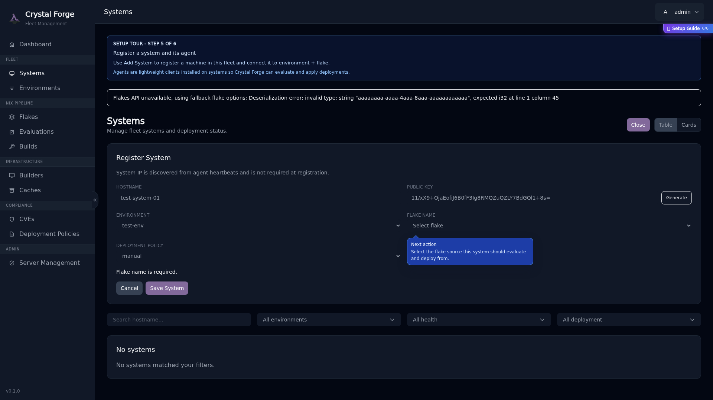

# Guided setup coach, POA&M dashboard notes, and security workflows track

## The Guided Setup Coach

After you register the first admin user and log in, you'll see the **Setup Coach** panel appear in the top-right corner of the screen.

### How the Coach Works

- **Setup progress**: Shows nine steps from server-reported resource state
- **Clickable Steps**: Click any step to navigate to the relevant page
- **Contextual Callouts**: Destination pages show blue callouts pointing to the actions you need to take
- **Progressive Guidance**: Form fields display hints as you fill them in, guiding you through each required field
- **Non-Blocking**: You can navigate anywhere in the app; the coach doesn't lock you into a specific flow
- **Security workflows**: Offers five independent modules with Start, Resume and Restart controls
- **Minimize/Close**: Minimize the Coach or close it. Use **Guide** to reopen it.
- **Relaunch Setup**: Administrators can reopen Setup from Server Management

### Coach States

**Expanded** (default): Shows the full checklist with progress

**Minimized**: Collapses to a small pill. The pill shows setup progress when setup is incomplete and security walkthroughs otherwise.

**Closed**: Hides the panel. **Guide** reopens it for every authenticated role.

The final three Setup steps use persisted production data. A policy step requires a
user-created or imported policy lineage. A compliance bundle step requires a
saved bundle. A POA&M step requires a persisted POA&M in any lifecycle state.
POA&Ms can originate from failing compliance evidence, scheduled CVE remediation,
or conversion of accepted risk.

## POA&M Dashboard and Notifications

The dashboard gets its POA&M Summary and Watchlist from server-computed APIs.
Select a watchlist row to open that exact POA&M in Compliance. The notification
inbox refreshes periodically and records one durable event for each overdue
episode and each transition to awaiting verification. Opening, reading, or
dismissing a notification does not create another event. Read and dismissed
states persist across reloads. The **Policy violations** notification preference
controls these POA&M events.

## Steps 7–9: Policies, compliance bundles and POA&Ms

Step 7 completes when the server reports a saved policy lineage. Platform policies govern pipeline mechanics; security controls carry framework criteria. Whether a failure can block deployment depends on enforcement, not on the policy existing.

Step 8 completes when the server reports a saved compliance bundle. Bundle versions can be assigned to environments or systems.

Step 9 completes when the server reports a POA&M in any lifecycle state. A POA&M may come from a failing compliance finding, a scheduled CVE patch, or conversion of accepted risk. Compliance is not the only source.

## Security Workflows track

The top-bar **Guide** opens Security Workflows for Admins, Operators and Viewers. The walkthroughs navigate to existing records and open read-only presentation surfaces. They do not submit decisions or mutations. Each module can be started, resumed or restarted:

1. **Review vulnerability posture** — scan lifecycle, scan evidence, scan schedule, fleet CVEs, Current/Scheduled/Historical evidence, and System Detail evidence tabs.
2. **Triage vulnerabilities** — exact finding detail, per-environment triage, schedule-patch POA&Ms, exact-pair selection and batch triage.
3. **Review compliance evidence** — policies, bundles, assignments, enforcement modes, system matrix, control evidence and finding-linked remediation.
4. **Manage remediation and accepted risk** — the register, queues, scope, plan detail, lifecycle, verification, risk acceptance identity, and renewal/conversion.
5. **Prepare audit evidence** — bundle baseline exports, register exports, and the difference between the human RA number and immutable source UUID.

The coach uses records the authenticated person can read. If no suitable record exists, it says what condition is needed. Operator-only or Admin-only actions stay explanatory for roles without permission.

Keep these distinctions in view: a failed scan is not “no CVEs”; no scan is not clean; only Current exact evidence authorizes CVE triage; Accepted risk is not remediation; a scheduled patch is not verified; POA&M status is not verification; report-only FAIL is still FAIL; and a POA&M does not turn FAIL into PASS. Verification needs authoritative current evidence.

## Related concepts

- [Onboarding guide: first-time server setup prerequisites](../operations/onboarding-first-time-setup-prerequisites.md)
- [Step 6: Deploy Agent](../operations/onboarding-step-6-agent-deployment.md)
- [Onboarding troubleshooting](../operations/onboarding-troubleshooting.md)
