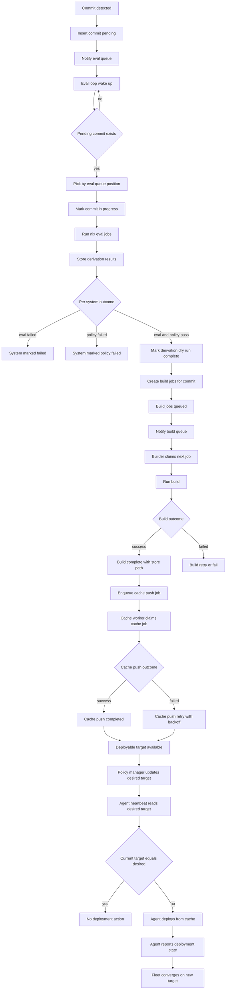

# Commit -> Eval -> Build -> Cache -> Deploy Flow

> **Status:** The Backlog.md document doc-2 held a content-identical copy. That document now points to this concept. The flow has not been compared in full with the implementation. `QueueNotifier` exists in `packages/default/crates/cf-server/src/queue/mod.rs`. The step "Notify build queue" sends a wakeup, but no build worker waits on it yet (see [Event-driven queue architecture](../architecture/event-driven-queues.md)).

This diagram explains how Crystal Forge processes a commit from discovery to deployment using the event-driven queue flow.

## Mermaid Flowchart

## Quick Explanation

- Commits enter the eval queue and trigger immediate processing through `QueueNotifier`.
- Evaluation is commit-level, but system evaluation happens in parallel via `nix-eval-jobs`.
- Only systems that pass evaluation and policy become buildable derivations.
- Build jobs are claimed atomically by builders to avoid race conditions.
- Successful builds create cache-push jobs; cache push has retries with backoff.
- Deployment is pull-based: agents receive `desired_target` on heartbeat and converge to it.

## Related concepts

- [Commit to deploy sequence](commit-eval-build-cache-deploy-sequence.md) - who talks to whom, in order
- [Store path flow](store-path-flow.md) - per-system store path tracking
- [Evaluation and build queue pipeline](evaluation-and-build-queue-pipeline.md) - queue behavior in detail
