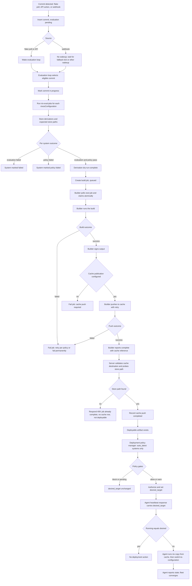

# Commit -> Eval -> Build -> Cache -> Deploy Flow

This page shows how Crystal Forge moves a commit from discovery to deployment.
An arrow means "then". A diamond is a decision. The
[sequence page](commit-eval-build-cache-deploy-sequence.md) shows which
component performs each step.

## How to read the flow

- **Evaluation wakeup.** The flake poller and API actions wake the evaluation
  loop. The webhook handler inserts the commit and returns `202 Accepted`
  without a wakeup. The commit then waits for the next wakeup or the fallback
  tick (`flakes.commit_evaluation_interval`, default 60 seconds). See
  [Wakeups and polling](../architecture/event-driven-queues.md).
- **Evaluation unit.** Evaluation is per commit. `nix-eval-jobs` evaluates the
  systems in parallel. Only a system that passes evaluation and policy gets a
  build job.
- **Build discovery.** Builders poll the server API. The server sends no push
  to a builder. The pickup delay is at most `builder.poll_interval` (default 5
  seconds) plus claim contention. Several builders can poll at once; the
  atomic claim gives each job to one builder.
- **Cache publication is part of the build.** The builder signs the output
  (a signing failure is logged and does not fail the job), then pushes it. If
  the builder has no usable cache configuration, the job fails. A push retries
  inside the builder (`max_retries`, `retry_delay_seconds`, and
  `push_timeout_seconds` of the cache configuration). A final push failure
  fails the job, and the retry policy then decides whether to queue another
  attempt.
- **Server verification.** The server rejects a reported push with `409` when
  the cache reference matches no active cache destination. This check runs
  before the job completes. After it, the server commits the job completion,
  then probes the store path with `nix path-info`. When the probe finds the
  path, the server records a completed `cache_push_jobs` row. When the probe
  fails, the server responds `409`. The job completion stays committed, but no
  completed cache row exists, so the artifact is not deployable. The completion
  call is idempotent for the same builder and session. The server does not run
  its own cache worker.
- **Deployable artifact.** An artifact is deployable only when it has a
  `store_path`, `cf_agent_enabled` and `policy_requirements_met`, no error, and
  a completed cache push row for the same store path.
- **Deployment is pull-based.** Deployment policy gates apply after an artifact
  is deployable. The agent only learns `desired_target` from the heartbeat
  response. The heartbeat interval comes from the server
  (`server.heartbeat_interval_secs`, default 600 seconds, allowed 15 to 900).
- **Manual and pinned systems.** The policy manager does not change a system
  that is not `auto_latest`.

## Related concepts

- [Commit to deploy sequence](commit-eval-build-cache-deploy-sequence.md) - who talks to whom, in order
- [Store path flow](store-path-flow.md) - per-system store path tracking
- [Evaluation and build queue pipeline](evaluation-and-build-queue-pipeline.md) - queue behavior in detail
- [Cache push process](../caches/cache-push-process.md) - cache publication and verification
