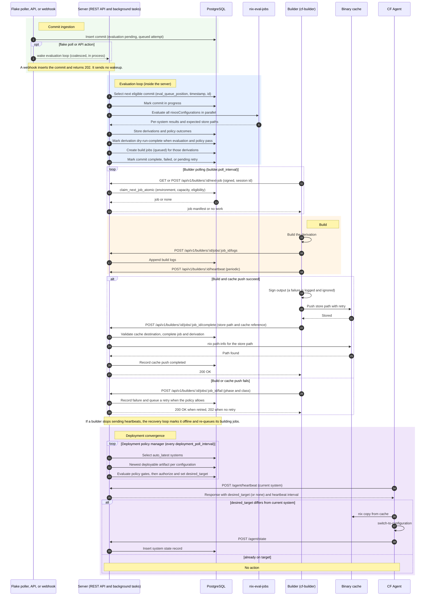

# Commit -> Eval -> Build -> Cache -> Deploy Sequence

This page shows who talks to whom and in what order. The
[flow chart](commit-eval-build-cache-deploy-flow.md) shows the same pipeline as
decisions and outcomes.

## Reading guide

### Key architectural decisions

1. **The server owns all database writes.** A builder never opens a database
   connection. It reads and writes state through signed API requests, and the
   server applies authorization and idempotency rules. The evaluation loop and
   the deployment policy manager run inside the server process.

2. **Builders pull work.** `claim_next_job_atomic` gives a job to one builder
   with `FOR UPDATE ... SKIP LOCKED`. It also enforces the builder session,
   the builder capacity, and the environment match. Build jobs have **no
   lease expiry**. When a builder stops sending heartbeats, the recovery loop
   marks it `offline` after `max(3 x heartbeat interval, 60 s)` and re-queues
   its `building` jobs. A builder must tolerate the same job reaching another
   builder. See [Builder architecture](../builders/builder-architecture-and-job-scheduling.md).

3. **Evaluation produces partial results.** A commit can be `complete` while
   only some systems have a `dry-run-complete` derivation. The server creates
   build jobs only for derivations that passed evaluation and policy.

4. **Evaluation policy and deployment policy differ.**
   - **Evaluation policy** decides whether a system may be built (for example,
     the CF agent must be enabled).
   - **Deployment policy** decides which build a host runs (`auto_latest`,
     `manual`, `pinned`). Policy gates (for example CVE checks, time windows,
     and canary rollout) run before the server sets `desired_target`.

5. **The builder publishes to the cache.** The server does not run a cache
   worker. A job fails when the builder cannot push. The server then verifies
   the reported path with `nix path-info` and records the completed push. See
   [Cache push process](../caches/cache-push-process.md).

6. **Deployable system artifact.** For a host's registered flake and effective
   configuration, an eligible artifact is a NixOS derivation with a nonblank
   `store_path`, `cf_agent_enabled IS TRUE`, `policy_requirements_met IS TRUE`,
   and no derivation error. A completed `cache_push_jobs` row must belong to
   that derivation and have `store_path = derivations.store_path`. Auto-latest
   considers retained built artifacts across commits, even if source archival
   prevents a new explicit manual commit request. Runtime deployment policies
   and final authorization are separate gates. An eligible artifact does not
   authorize delivery to a host by itself.

7. **GC roots.** After evaluation, the server creates a GC root for each
   evaluated `.drv` file so that a builder can download it before Nix garbage
   collection removes it. The server replaces such a root only when it creates
   the root again. The builder creates a GC root for its build output on the
   builder host (`nix-store --realise --add-root`). When the server records a
   completed cache push, it removes only the server-local output root
   (`derivation-<id>`). No step of this flow removes the builder-host root.

8. **`desired_target` is per host.** The policy manager sets it for each
   `auto_latest` system. Different hosts can run different commits. Manual and
   pinned policies keep a host on a chosen target.

## Earlier definition of deployable

> **Status:** historical. This text is item 6 of the reading guide in the
> Backlog.md copy doc-3. Item 6 above supersedes it. The earlier definition
> omitted the exact-store-path match and the artifact eligibility conditions.

A derivation is deployable when:

- build status is success;
- cache push status is completed (the artifact is in the binary cache);
- (implicit) policy allows deployment to that host.

## Related concepts

- [Commit to deploy flow](commit-eval-build-cache-deploy-flow.md) - flow chart of the same pipeline
- [Evaluation and build queue pipeline](evaluation-and-build-queue-pipeline.md) - database fields behind evaluation and build
- [Deployment flow](../deployment/deployment-flow.md) - agent side of the convergence step
- [Derivation status lifecycle](../concepts/derivation-status-lifecycle.md) - statuses the diagram refers to
