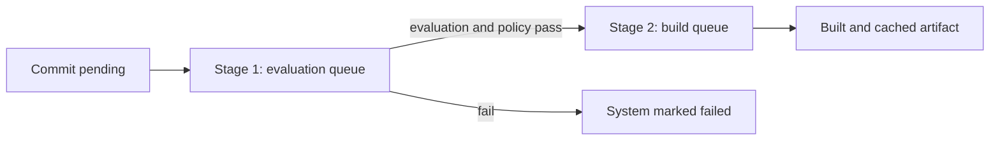

# 2. Evaluation and Build Queue Pipeline

Crystal Forge processes a flake commit in **two stages**: evaluation, then
build.

## Stage 1: Evaluation queue

When a commit arrives:

1. The server inserts the commit with `evaluation_status = 'pending'` and a
   queued evaluation attempt.
2. The evaluation loop picks the next eligible commit by queue position
   (operators can reorder it). The loop wakes from an in-process notification,
   a fallback tick, or a retry-due time. See
   [Wakeups and polling](../architecture/event-driven-queues.md).
3. **One commit evaluates at a time.** A database index enforces this.
4. The server marks the commit `in_progress`.
5. After the heavy-Nix locks, the server resolves one immutable
   [bulk evaluator resource plan](../evaluation/bulk-evaluator-resource-planning.md)
   before spawning `nix-eval-jobs`. Systems evaluate in parallel using its
   explicit worker count and per-worker memory threshold. The working boundary
   includes physical memory and finite visible-ancestor `memory.high` / `memory.max`.
   The [adaptive recovery monitor](../evaluation/bulk-evaluator-adaptive-recovery.md)
   samples pressure across collection awaits and can isolate only unresolved
   configurations. Idle expiry is a CPU-evidence assessment checkpoint; one
   overall deadline covers every child, fallback, preparation, and foreground
   cleanup. Cancellation polling remains cooperative at two-second eligible
   loop boundaries. A replacement requires confirmed cleanup; quarantine keeps
   heavy-Nix lock ownership when group absence is unknown.
6. For each system that completes:
   - The policy check runs (is Crystal Forge enabled for this system?).
   - If it **passes**, the derivation becomes `dry-run-complete` and gets a
     build job.
   - If it **fails**, the system is marked as policy failed.
7. When all systems finish, the commit is marked `complete` (or `failed`).

Bounded resource exhaustion marks the commit and attempt `failed`, never
`complete`. The failure transaction retains only validated exact-current-attempt
Pass/Fail, snapshot observations, and existing jobs. Unfinished selected work
receives policy Error with resource evidence; confirmed configuration failures
remain separate. Exact completed and eligible preparation may be reconciled
after resource-terminal failure. Cancellation and supersession still block
admission. Exhausted recovery does not automatically retry the whole flake.

### Database fields

- `commits.evaluation_status`: `pending`, `in_progress`, `cancelling`,
  `cancelled`, `complete`, `failed`. (`cancelling` and `cancelled` come from
  cooperative evaluation cancellation, migration `0113`.)
- `commits.eval_queue_position`: queue order. Nullable and reorderable.
- `evaluation_attempts`: one row per attempt, with `status` (`queued`,
  `in_progress`, and others) and `available_at` for retry timing.

### Startup behavior

When the evaluation loop starts, it runs these recovery steps in order:

1. **Evaluations.** `cancelling` commits become `cancelled`. `in_progress`
   commits return to `pending`, and their `in_progress` attempts return to
   `queued`. `cancelled` commits stay cancelled.
2. **Builds.** Derivations in `build-inprogress` (status 8) return to
   `build-pending` (status 7) and lose `started_at`. This step changes
   derivations only. It does not change `build_jobs`.
3. **Partial derivations.** The loop cleans up partial derivations that an
   interrupted evaluation left behind.
4. **Orphaned derivations.** The loop queues a build job for each
   `dry-run-complete` derivation that has none.

### Key APIs

- `GET /api/v1/commits/eval-queue` shows the evaluation queue.
- `POST /api/v1/commits/eval-queue/reorder` changes its order.
- `POST /api/v1/commits/:commit_id/re-evaluate` queues a commit again.
- `GET /api/v1/commits/:commit_id/eval/stream` streams evaluation logs.

## Stage 2: Build queue

After evaluation, each derivation that passed policy gets a row in
`build_jobs`:

1. The server creates the build job with status `queued`.
2. A builder polls the server API and claims the job atomically. See
   [Builder architecture](../builders/builder-architecture-and-job-scheduling.md).
3. The builder runs `nix build`.
4. On success, the builder signs the output, pushes it to the cache, and
   reports completion. A builder without a usable cache configuration fails the
   job. See [Cache push process](../caches/cache-push-process.md).
5. On failure, the builder reports the failure phase and class. The retry
   policy decides whether the server queues another attempt.

### Derivation statuses used by the pipeline

| `status_id` | Name |
| --- | --- |
| 3 | dry-run-pending |
| 4 | dry-run-inprogress |
| 5 | dry-run-complete |
| 6 | dry-run-failed |
| 7 | build-pending |
| 8 | build-inprogress |
| 10 | build-complete |
| 12 | build-failed |

The full list is in [Derivation status lifecycle](../concepts/derivation-status-lifecycle.md).

### Build queue behavior

- The queue is claimed continuously. Builders poll every
  `builder.poll_interval` (default 5 seconds). A builder at its
  `max_concurrent_jobs` limit claims nothing.
- A queued job whose `available_at` is in the future waits. A builder cannot
  claim it before that time.
- If a builder stops, the recovery loop re-queues its jobs.

### Key APIs

- `GET /api/v1/build-jobs` lists the build queue.
- `POST /api/v1/build-queue/reorder` changes the order.
- `POST /api/v1/build-jobs/:id/{prioritize,move-up,move-down}` adjust one job.
- `POST /api/v1/build-jobs/:id/{cancel,requeue,force-cancel}` act on one job.
- `GET /api/v1/build-jobs/:job_id/logs/stream` streams build logs.

The server has no route to pause a builder. An operator updates or deactivates
the builder through the
[builder admin endpoints](../api/builder-api-authentication-and-admin-endpoints.md).

## Critical invariant: single active evaluation

**Why:** `nix-eval-jobs` is resource intensive. An evaluation must finish
before the next one starts.

**How it is enforced:**

- The unique index `idx_commits_single_in_progress` is
  `ON commits ((1)) WHERE evaluation_status IN ('in_progress', 'cancelling')`
  (migration `0113_add_eval_cancellation_support.sql`). At most one row in
  either state can exist. A cancelling evaluation therefore still blocks the
  next one until it becomes `cancelled`.
- A second attempt to mark a commit `in_progress` fails with a constraint
  violation.
- The evaluation loop processes pending commits serially.

**Status alignment:** The Flakes view and the Evaluations view use
`commits.evaluation_status` as the single source of truth, not derivation
status.

## Related concepts

- [Event-driven queue architecture](../architecture/event-driven-queues.md) - how the queues are woken
- [Derivation status lifecycle](../concepts/derivation-status-lifecycle.md) - status IDs used by the build queue
- [Commit to deploy flow](commit-eval-build-cache-deploy-flow.md) - end-to-end flow chart
- [Commit to deploy sequence](commit-eval-build-cache-deploy-sequence.md) - end-to-end sequence diagram
- [Deployment flow](../deployment/deployment-flow.md) - what happens after the build
