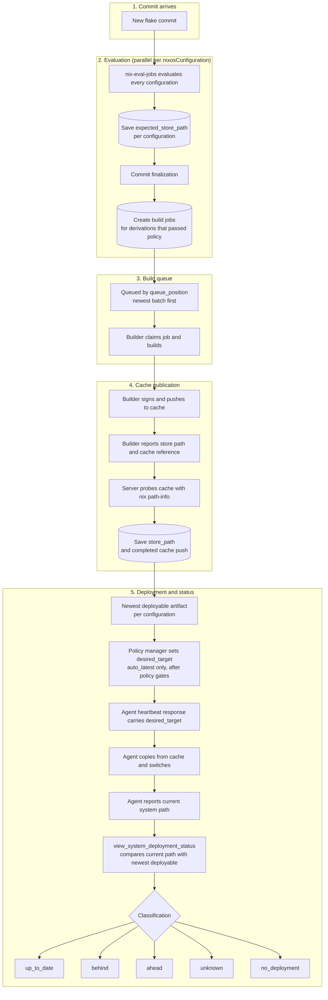

# Crystal Forge Store Path Flow

This page shows how Crystal Forge tracks the store path of each system from
evaluation to deployment. An arrow means "then". A cylinder is a database
write.

## Two store path columns

A `derivations` row has two store path columns:

| Column | Written when | Meaning |
| --- | --- | --- |
| `expected_store_path` | Evaluation (from the `nix-eval-jobs` outputs) | The path the system will have when built |
| `store_path` | Build completion (`POST .../jobs/:job_id/complete`) | The path a builder reported as built |

A system is deployable only when `store_path` is set **and** a completed cache
push row exists for that exact path.

## The complete flow

## Key points

### Evaluation is parallel, and builds start after finalization

- `nix-eval-jobs` evaluates the configurations of one commit in parallel. The
  server persists each system as its result arrives and stores its
  `expected_store_path`.
- The server creates the build jobs when it **finalizes** the commit
  (`EvaluationFinalizeOutcome::Completed` in `server/mod.rs`). A build does
  not start while another system of the same commit is still evaluating.
- After the build jobs exist, each system builds and publishes independently.
  One builder can build `hostname1` while another publishes `hostname3`.

### Build order is newest batch first

The claim query sorts by `queue_position DESC`. New jobs receive a position
higher than every queued or building job. The newest batch is therefore claimed
first unless an operator reorders the queue. Within a batch the later
derivation id has the higher position. This order is not a FIFO. It is also
not a strict LIFO per commit. See
[Wakeups and polling](../architecture/event-driven-queues.md#claim-eligibility-and-ordering).

### Deployable artifact

The newest deployable artifact for a configuration is the first row, by commit
timestamp, completion time, and id, of a NixOS derivation that has:

- a nonblank `store_path`;
- `cf_agent_enabled` and `policy_requirements_met` set;
- no error message;
- a completed `cache_push_jobs` row with the same `store_path`.

### System states

The server computes the state in `view_system_deployment_status` (migration
`0291`). The agent does not classify itself. The agent only sends its current
system path and receives `desired_target`.

| State | Meaning |
| --- | --- |
| `no_deployment` | The system is registered, but no system state record exists for its hostname. |
| `up_to_date` | The current path equals the newest deployable artifact of the system. |
| `behind` | The current path belongs to the system's own configuration but not to the newest deployable artifact. A newer deployable build is available. |
| `ahead` | The current path belongs to a newer commit than the newest deployable artifact. |
| `unknown` | The server cannot relate the current path to the system's flake and configuration, or the configuration has no deployable artifact yet. |

A path that appears in no `derivations` row (neither `store_path` nor
`expected_store_path`) falls into `unknown`.

### The loop

1. **Commit arrives.** The server evaluates each configuration.
2. **Evaluation persists.** Each system's expected store path is saved as the
   system completes.
3. **Finalization queues builds.** Systems that passed policy get build jobs.
4. **Build and publish.** A builder builds, pushes to the cache, and reports.
5. **Server verifies.** The server probes the cache and records the completed
   push and the built `store_path`.
6. **Policy manager sets the target.** For an `auto_latest` system, after the
   policy gates pass.
7. **Agent heartbeats.** The heartbeat response carries `desired_target`. The
   agent copies the path from the cache and switches.
8. **Agent reports.** The next state report carries the new path. The view
   then shows `up_to_date`.

### Why this design

- **Parallel evaluation** gives fast feedback on which configurations change.
- **The cache requirement** prevents the server from pointing an agent at a
  path that no cache can serve.
- **Pull-based deployment** keeps the agent in control of when it switches. The
  server never pushes to an agent.
- **A server-computed state** gives one definition of "up to date" for every
  view.

## Related concepts

- [Commit to deploy flow](commit-eval-build-cache-deploy-flow.md) - flow chart with decisions
- [Commit to deploy sequence](commit-eval-build-cache-deploy-sequence.md) - sequence diagram
- [Evaluation and build queue pipeline](evaluation-and-build-queue-pipeline.md) - queue and invariant details
- [System Deployment Status View](../data-model/views/view-system-deployment-status.md) - the view that classifies systems
