# Crystal Forge Onboarding Guide

Welcome to Crystal Forge! This guide will walk you through your first-time setup using the built-in guided onboarding coach. By the end of this guide, you'll have a fully configured Crystal Forge instance ready to monitor and manage your NixOS fleet.

## Introduction

This guide covers the complete initial setup process for Crystal Forge, mirroring the 6-step guided tour built into the web interface. If you're a sysadmin with basic-to-intermediate NixOS knowledge, this guide will help you understand what Crystal Forge is doing and why each configuration step matters.

### What This Guide Covers

- Setting up your Crystal Forge server and database
- Configuring the 6 core components via the web UI:
  1. Environments (organize your fleet)
  2. Flakes (define what to build)
  3. Builders (evaluation and build workers)
  4. Caches (binary cache destinations)
  5. Systems (NixOS hosts to manage)
  6. Agents (connect managed systems)

### Prerequisites

Before you begin, you should have:

- **NixOS knowledge**: Familiarity with NixOS modules, flakes, and basic system administration
- **A NixOS server**: Where you'll run the Crystal Forge server, database, and builders
- **Git repository**: Containing your NixOS configurations as a flake
- **Network access**: Ability to reach your managed systems over SSH/HTTP
- **Basic understanding of**:
  - NixOS flakes and how they work
  - Ed25519 cryptographic keys
  - Binary caches (Nix, S3, Attic)

### Overview of the 6-Step Guided Tour

Crystal Forge's web UI includes a **Setup Coach** panel that appears automatically when you first log in as an admin. This non-blocking, floating panel guides you through the essential configuration steps in the correct order.

The coach tracks your progress and provides contextual callouts on each page, showing you exactly where to click and what information to provide. You can minimize or dismiss the coach at any time and reopen it from Server Management.

---

## Before You Begin

### Server Requirements

**Minimum recommended specifications for the Crystal Forge server:**

- **CPU**: 4+ cores (for concurrent builds)
- **RAM**: 8GB minimum, 16GB+ recommended
- **Disk**: 50GB+ for PostgreSQL, Nix store, and build artifacts
- **NixOS**: Version 23.11 or later

**Network requirements:**

- Inbound HTTP/HTTPS access on port 3000 (or your configured port)
- Outbound access to your Git repositories
- SSH or HTTP access to managed NixOS systems

### Database Setup

Crystal Forge requires PostgreSQL. You have two options:

**Option 1: Let Crystal Forge manage PostgreSQL** (recommended for single-server setups)

```nix
{
  services.crystal-forge = {
    enable = true;
    local-database = true;  # Crystal Forge will configure PostgreSQL
    
    database = {
      host = "/run/postgresql";  # Unix socket
      user = "crystal_forge";
      name = "crystal_forge";
    };
  };
}
```

**Option 2: Use an existing PostgreSQL instance**

```nix
{
  services.crystal-forge = {
    enable = true;
    
    database = {
      host = "postgres.example.com";
      port = 5432;
      user = "crystal_forge";
      name = "crystal_forge";
      passwordFile = "/run/secrets/db_password";  # agenix, sops-nix, etc.
    };
  };
}
```

### Initial Module Configuration

Add Crystal Forge to your server's NixOS configuration:

```nix
# In your flake.nix or configuration.nix
{
  imports = [
    inputs.crystal-forge.nixosModules.crystal-forge
  ];

  services.crystal-forge = {
    enable = true;
    local-database = true;

    # Server (API + Web UI)
    server = {
      enable = true;
      host = "0.0.0.0";
      port = 3000;
      auth_mode = "local";  # Use local username/password auth
    };

    # Builder (for evaluating flakes and building derivations)
    build = {
      enable = true;
      max_concurrent_derivations = 2;
      max_jobs = 4;
      cores_per_job = 4;
      systemd_memory_max = "8G";  # Adjust based on your server
    };
  };
}
```

Apply this configuration and rebuild:

```bash
sudo nixos-rebuild switch
```

Verify the server is running:

```bash
sudo systemctl status crystal-forge-server
curl http://localhost:3000/status
```

Navigate to `http://your-server:3000` in a web browser to begin the setup.

---

## The Guided Setup Coach

After you register the first admin user and log in, you'll see the **Setup Coach** panel appear in the top-right corner of the screen.


### How the Coach Works

- **Progress Tracking**: Shows 6 required setup steps with completion checkmarks
- **Clickable Steps**: Click any step to navigate to the relevant page
- **Contextual Callouts**: Destination pages show blue callouts pointing to the actions you need to take
- **Progressive Guidance**: Form fields display hints as you fill them in, guiding you through each required field
- **Non-Blocking**: You can navigate anywhere in the app; the coach doesn't lock you into a specific flow
- **Minimize/Dismiss**: Click "Minimize" to collapse the coach into a small tab, or "Dismiss" to hide it permanently
- **Reopen**: From **Server Management** (in the admin menu), you can relaunch the coach at any time

### Coach States

**Expanded** (default): Shows the full checklist with progress

**Minimized**: Collapses to a small "Setup Guide" tab showing completion count (e.g., "3/6")

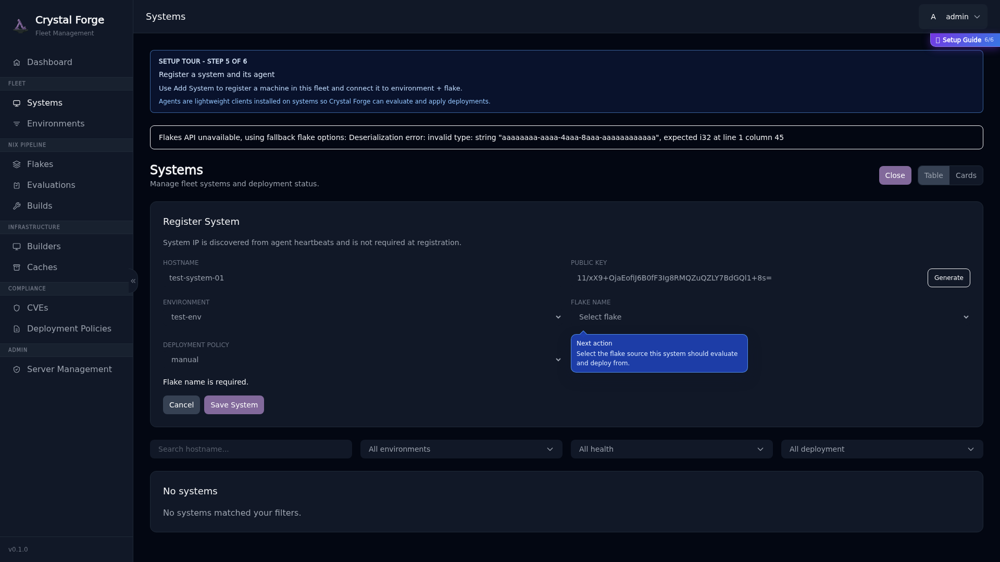

**Dismissed**: Hides completely (can be reopened from admin)

---

## Step 1: Create Environment

**Environments** in Crystal Forge are logical groupings for your NixOS systems. They represent deployment contexts like `production`, `staging`, or `development`. Each environment can have different deployment policies and binary cache configurations.

### Why Environments Matter

- **Deployment Control**: Assign deployment policies per environment (manual, auto, or pinned)
- **Cache Isolation**: Route builds to different binary caches based on environment
- **Access Control**: Future RBAC will scope permissions by environment
- **Compliance Tracking**: Monitor STIG compliance and CVE status per environment

### Guided Tour: Environments Page

Click the "Create environment" step in the coach panel. You'll be taken to the Environments page, where you'll see a callout guiding you to the "Add Environment" button.

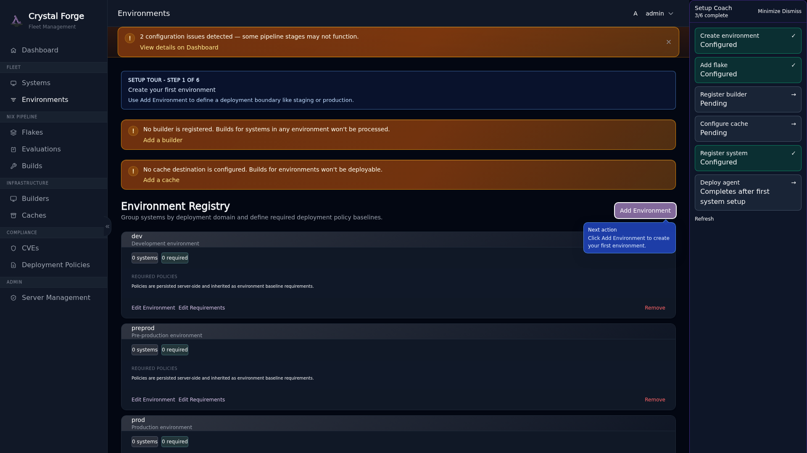

Click **Add Environment** to open the creation modal.

### Guided Tour: Create Environment Form

The form shows progressive field callouts and a **Required Policies** section with guidance.

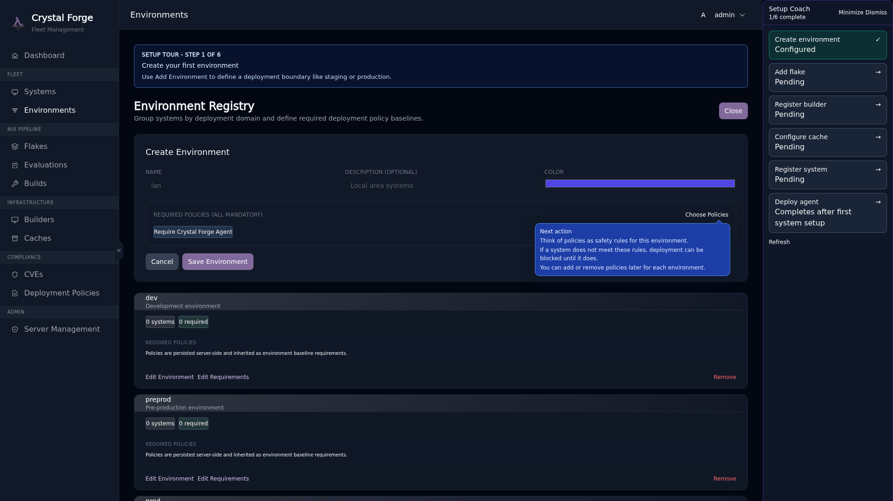

**Fill in:**

- **Name**: A short identifier (e.g., `production`, `staging`, `dev`)
- **Deployment Policy**:
  - `manual`: Admin must approve each deployment
  - `auto_latest`: Automatically deploy the latest evaluated commit
  - `pinned`: Deploy a specific commit/derivation
- **Deployment Strategy**:
  - `immediate_persist`: Activate and set as boot default (recommended)
  - `boot_only`: Queue for next boot (safe rollback option)
- **Required Policies**: Choose STIG controls that must be enabled on all systems in this environment

#### What Are Required Policies?

Required policies are **hard configuration requirements**. Systems in this environment **must** have these STIG controls enabled in their NixOS configuration. If a system's config doesn't include a required policy, Crystal Forge will block deployment to prevent compliance drift.

You can adjust required policies later per environment.

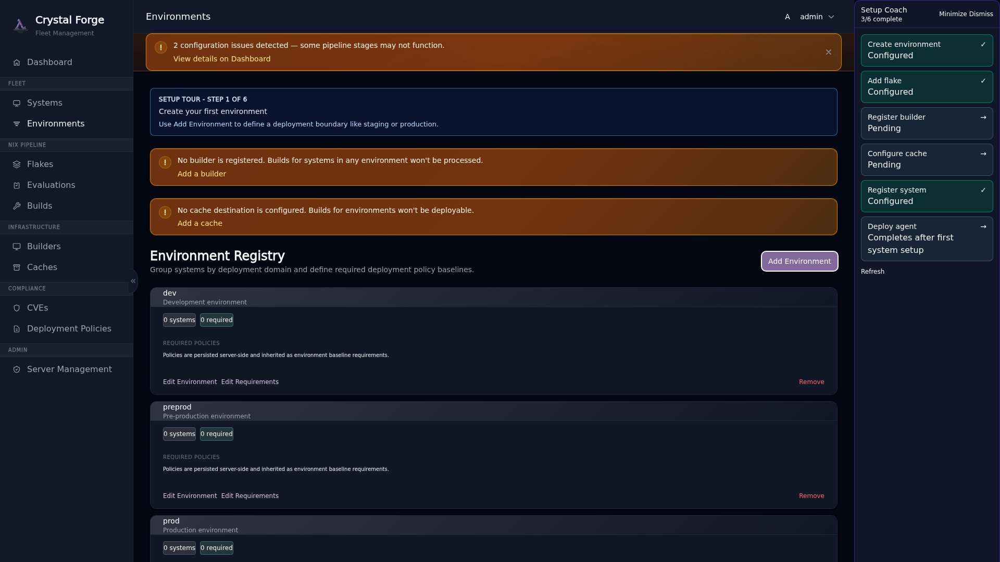

**Example environment configuration:**

```yaml
Name: production
Deployment Policy: manual
Deployment Strategy: immediate_persist
Required Policies:
  - Account Expiry
  - Login Banner
  - Password Complexity
```

After creating your first environment, the coach will mark **Step 1** complete.

---

## Step 2: Add Flake

**Flakes** in Crystal Forge represent Git repositories containing NixOS configurations. Crystal Forge monitors these repositories, evaluates commits, builds derivations, and tracks what's deployed to your systems.

### Why Flakes Matter

- **Source of Truth**: Your NixOS configurations as code
- **Evaluation**: Crystal Forge evaluates each commit to determine what needs to be built
- **CVE Scanning**: Every evaluated commit is scanned for known vulnerabilities
- **Deployment Tracking**: Know which commit is deployed on which system

### Guided Tour: Flakes Page

Click the "Add flake" step in the coach panel to navigate to the Flakes page.

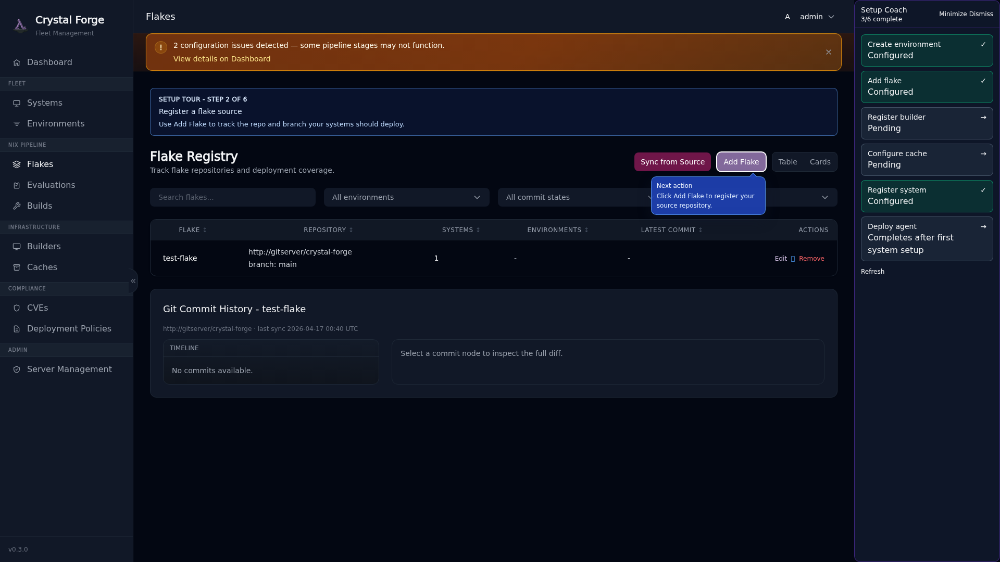

Click **Add Flake** to open the registration modal.

### Guided Tour: Add Flake Form

The form shows progressive field callouts guiding you through **Name → Repository → Branch**, plus **Build Scope** and **Credentials** for private repositories.


**Fill in:**

- **Name**: A friendly identifier for this flake (e.g., `infrastructure`, `web-servers`)
- **Repository URL**: Git URL in the format Crystal Forge expects
- **Branch**: Which branch to track (e.g., `main`, `production`)
- **Build Scope**: Choose whether to evaluate all `nixosConfigurations` or only Crystal Forge-managed systems
- **Credentials** (optional for public repos, required for private repos): Select auth type and provide secret material

#### Repository URL Formats

Crystal Forge supports:

- **SSH**: `git+ssh://git@gitlab.com/yourorg/nixos-configs`
- **HTTPS**: `https://github.com/yourorg/nixos-configs`
- **Local paths** (for testing): `git+file:///path/to/repo`

**Important**: The Crystal Forge server must have SSH key access (if using SSH) or network access (if using HTTPS) to clone the repository.

#### Branch Tracking Behavior

- **Auto-polling**: Crystal Forge periodically checks for new commits on the tracked branch
- **Evaluation**: New commits are evaluated automatically to determine derivations
- **Build Queue**: Derivations are queued for building based on your builder capacity

For private repositories, setting the branch explicitly (for example `main`) is recommended so onboarding is deterministic.

#### Private Repository Authentication

Crystal Forge supports three repository authentication modes:

- **PAT (personal access token)**
  - Use for HTTPS-based private repos on GitHub/GitLab.
  - GitHub recommended values:
    - Auth type: `pat`
    - Username: `x-access-token`
    - Secret: your classic/fine-grained PAT with repo read access
  - GitLab common values:
    - Auth type: `pat`
    - Username: `oauth2` (or your service user)
    - Secret: PAT with read access to the target project

- **SSH private key**
  - Use for `git+ssh://` style repository URLs.
  - Provide the private key in the Credentials section and optional SSH username (`git` in most hosted providers).

- **Username/password**
  - Use only when PAT/SSH is unavailable.
  - Provide repository username and password (or app password/token-style secret if your provider requires it).

Security notes:

- Secrets are stored encrypted at rest.
- Plaintext secrets are not returned in API responses.
- You can leave the secret field blank during edits to keep the existing stored secret unchanged.

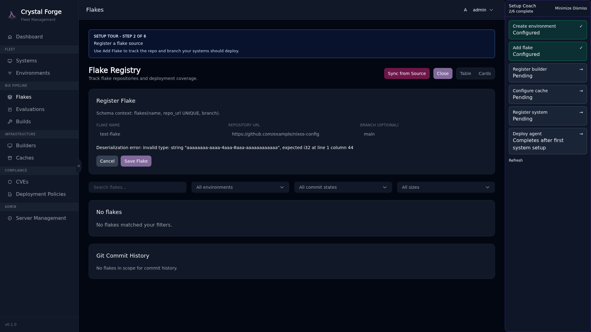

**Example flake configuration:**

```yaml
Name: infrastructure
Repository: git+ssh://git@gitlab.com/company/nixos-infrastructure
Branch: main
```

After adding your first flake, the coach marks **Step 2** complete.

---

## Step 3: Register Builder

**Builders** are worker nodes that evaluate NixOS flakes, build derivations, scan for CVEs, and push artifacts to binary caches. Builders can run on the same server as Crystal Forge or on dedicated build machines.

### Why Builders Matter

- **Flake Evaluation**: Builders run `nix eval` to determine what needs to be built from each commit
- **Build Execution**: Builds are isolated in systemd scopes with resource limits
- **CVE Scanning**: Each build is scanned with `vulnix` for known vulnerabilities
- **Cache Population**: Successful builds are pushed to your binary cache destinations

### Guided Tour: Builders Page

Click the "Register builder" step in the coach panel.

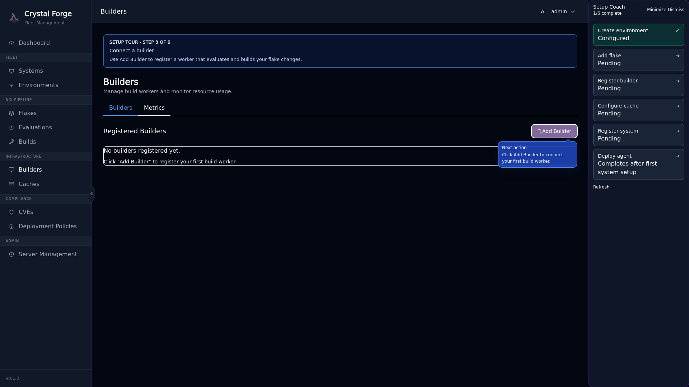

Click **Add Builder** to open the registration modal.

### Guided Tour: Add Builder Form

The form shows progressive guidance: **Name → Public Key → Resource Limits → Environment Assignment**.

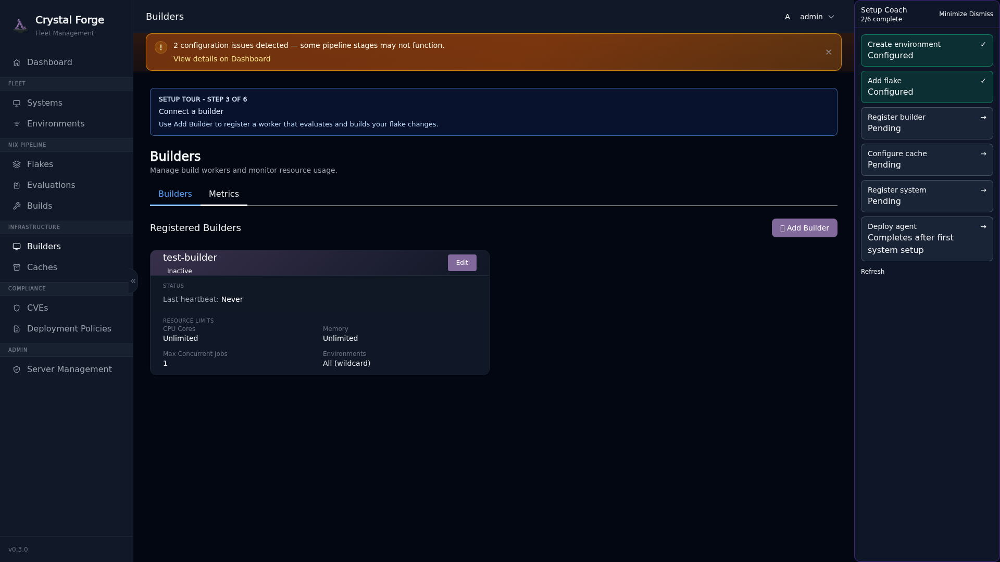

**Fill in:**

- **Name**: Identifier for this builder (e.g., `builder-1`, `build-prod`)
- **Public Key**: Ed25519 public key for cryptographic verification (the private key will be generated and shown once)
- **Max CPU Cores**: How many CPU cores this builder can use concurrently
- **Max Memory**: Memory limit for build processes (e.g., `8G`, `16G`)
- **Max Concurrent Derivations**: How many derivations to build in parallel
- **Environment Assignment**: Which environment(s) this builder serves

#### Resource Allocation Recommendations

**For a first-time setup on a single server:**

```yaml
Max CPU Cores: 4
Max Memory: 8G
Max Concurrent Derivations: 2
```

**Why conservative defaults?**
- Nix builds can be memory-intensive (especially large packages)
- Concurrent derivations multiply resource usage
- Leaving headroom prevents server overload

**For a dedicated build server:**

```yaml
Max CPU Cores: 16
Max Memory: 32G
Max Concurrent Derivations: 4
```

#### Resource Guidance Callout

The form includes an explicit warning callout about resource allocation:

> **Resource Configuration Guidance**
>
> Set conservative limits for first-time setup. Each concurrent derivation can consume significant CPU and memory. Start with `Max Concurrent Derivations: 2` and `Max Memory: 8G` and adjust based on observed build performance.

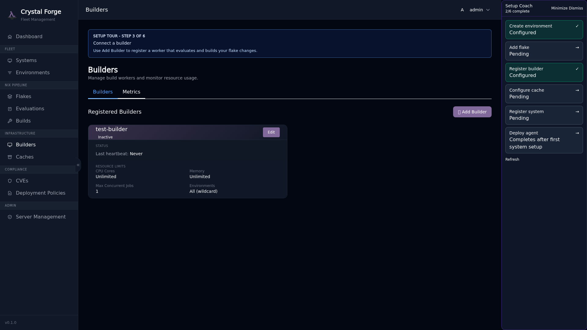

### Builder Activation Reminder

After creating your first builder, a modal appears with important next steps:

**"Builder Registered — Next Steps"**

To activate this builder, you need to:

1. **Enable the Crystal Forge builder module** in your NixOS configuration
2. **Apply the configuration** (`nixos-rebuild switch`)
3. **Verify the builder service is running** (`systemctl status crystal-forge-builder`)

The modal provides the exact NixOS configuration snippet you need.

### Enabling the Builder in NixOS Config

Add this to your server's NixOS configuration (or the dedicated builder server):

```nix
{
  services.crystal-forge = {
    enable = true;

    build = {
      enable = true;
      
      # Resource limits (match what you configured in the web UI)
      max_concurrent_derivations = 2;
      max_jobs = 4;
      cores_per_job = 4;
      systemd_memory_max = "8G";
      
      # Connect to the Crystal Forge server
      server_host = "crystal-forge.example.com";
      server_port = 3000;
      
      # Private key (generated by Crystal Forge, shown in the UI once)
      private_key = "/var/lib/crystal-forge/builder.key";
    };
  };
}
```

**Save the private key** shown in the web UI to `/var/lib/crystal-forge/builder.key` on the builder server:

```bash
sudo mkdir -p /var/lib/crystal-forge
sudo echo "YOUR_PRIVATE_KEY_HERE" > /var/lib/crystal-forge/builder.key
sudo chmod 600 /var/lib/crystal-forge/builder.key
sudo chown crystal-forge:crystal-forge /var/lib/crystal-forge/builder.key
```

Apply the configuration:

```bash
sudo nixos-rebuild switch
```

Verify the builder is running and connected:

```bash
sudo systemctl status crystal-forge-builder
```

After the builder service connects, the coach marks **Step 3** complete.

---

## Step 4: Configure Cache

**Cache Destinations** are binary caches where Crystal Forge pushes build artifacts. This speeds up deployments by allowing systems to download pre-built packages instead of building them locally.

### Why Cache Destinations Matter

- **Faster Deployments**: Systems pull from cache instead of rebuilding
- **Reduced Load**: Avoid redundant builds across your fleet
- **Compliance Artifacts**: Store verified builds with CVE scan results
- **Multi-Environment Support**: Route builds to different caches based on environment

### Guided Tour: Caches Page

Click the "Configure cache" step in the coach panel.

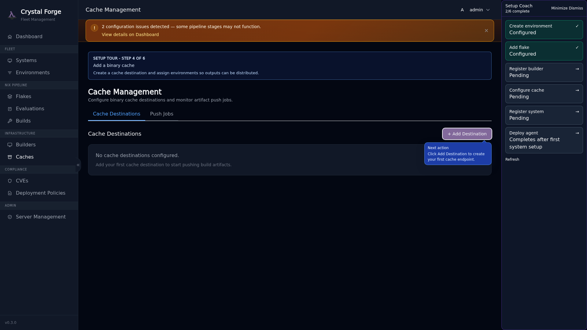

Click **Add Destination** to open the cache configuration modal.

### Guided Tour: Add Cache Destination Form

The form shows progressive guidance: **Name → Type → Endpoint → Environment Assignment**.

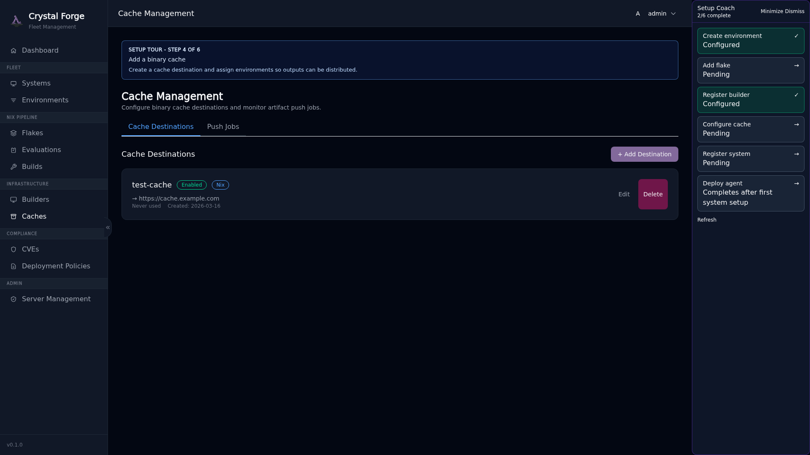

**Fill in:**

- **Name**: Identifier for this cache (e.g., `prod-cache`, `s3-cache`)
- **Type**: Backend type (`Nix`, `Http`, `S3`, `Attic`)
- **Endpoint**: URL or configuration for the cache backend
- **Environment Assignment**: Which environment(s) use this cache (optional; can be global)

#### Cache Type Guidance

The form includes a callout explaining each cache backend option:

> **Cache Type Options**
>
> - **Nix**: Standard Nix binary cache (local or SSH)
> - **Http**: HTTP-based binary cache (e.g., Cachix, custom nginx)
> - **S3**: Amazon S3 or S3-compatible storage (MinIO, Backblaze B2)
> - **Attic**: High-performance binary cache with chunking and deduplication

#### Recommended Cache Backend: Attic

**For production deployments, Attic is the recommended choice** due to its superior performance and reliability:

- **Chunk-based deduplication**: More efficient storage and transfer
- **No caching issues**: Unlike S3, Nix clients immediately see new artifacts
- **Better performance**: Optimized for Nix workloads
- **Self-hosted**: Full control over your infrastructure

**Why not S3 for production?**

While S3 works, it has nuanced issues that can cause problems in production:

- **Nix client caching**: Nix caches S3 responses aggressively and won't reinterrogate the S3 cache for updates by default
- **Cache invalidation**: Manual TTL configuration or cache clearing may be required to see new builds
- **Latency**: S3 API overhead compared to dedicated binary cache servers
- **Cost**: Frequent GET/LIST operations can add up at scale

S3 can still be used for archival or backup purposes, but **Attic is strongly recommended for active caching**.

#### Common Cache Configurations

**Attic (recommended for production):**

```yaml
Name: production-cache
Type: Attic
Endpoint: http://attic.example.com:8080/production
Environments: production
```

**Attic (staging/development):**

```yaml
Name: staging-cache
Type: Attic
Endpoint: http://attic.example.com:8080/staging
Environments: staging, development
```

**S3 (archival/backup use case):**

```yaml
Name: archive-cache
Type: S3
Endpoint: s3://my-archive-bucket?region=us-east-1
Environments: (none - global)
# Note: May experience Nix client caching issues for active use
```

**HTTP binary cache (third-party service):**

```yaml
Name: cachix-cache
Type: Http
Endpoint: https://mycache.cachix.org
Environments: (none - global)
```

**Local Nix cache (testing only):**

```yaml
Name: local-cache
Type: Nix
Endpoint: file:///var/cache/nix
Environments: development
```

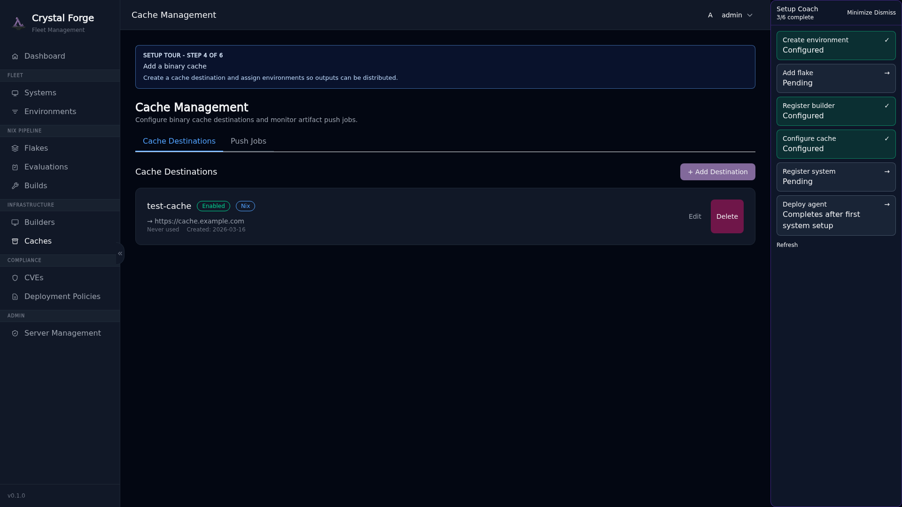

After creating your first cache destination, the coach marks **Step 4** complete.

---

## Step 5: Register System

**Systems** are the NixOS hosts you want to manage with Crystal Forge. Each system is cryptographically identified by an Ed25519 key pair and associated with an environment, flake, and deployment policy.

### Why Systems Matter

- **Fleet Tracking**: Monitor which configurations are deployed where
- **Deployment Control**: Apply updates based on policy (manual, auto, pinned)
- **Compliance Monitoring**: Track STIG controls and CVE exposure per system
- **Agent Telemetry**: Receive system fingerprints, heartbeats, and state changes

### Guided Tour: Systems Page

Click the "Register system" step in the coach panel.

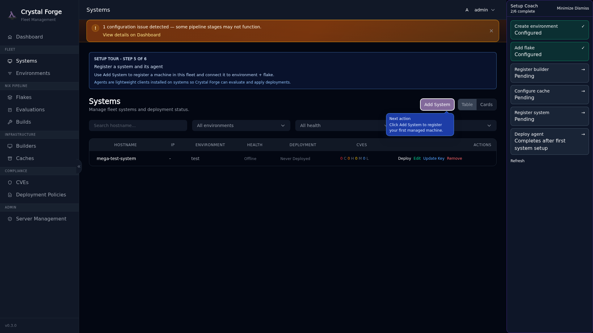

The callout explains what systems are and how the agent works:

> **Register Your First System**
>
> Systems represent NixOS hosts you want to manage with Crystal Forge. Each system runs the Crystal Forge agent, which:
> - Reports system state (hardware, software, network)
> - Receives deployment instructions
> - Executes NixOS activations
>
> Click **Add System** to begin.

Click **Add System** to open the registration modal.

### Guided Tour: Add System Form

The form shows progressive guidance: **Hostname → Public Key → Environment → Flake**.

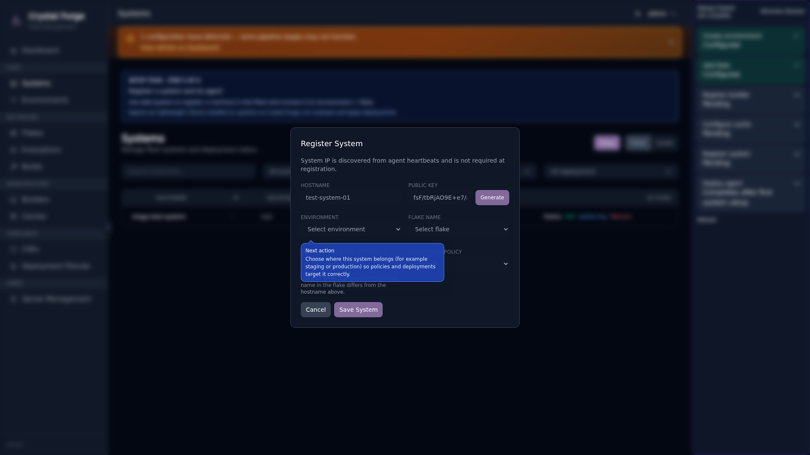

**Fill in:**

- **Hostname**: The system's hostname (e.g., `web-server-1`, `db-primary`)
- **Public Key**: Ed25519 public key for this system (you can generate a key pair in the UI)
- **Environment**: Which environment this system belongs to
- **Flake**: Which flake defines this system's configuration
- **Deployment Policy**: Optionally override the environment default

#### Generating a Key Pair

If you don't have an Ed25519 key pair for this system yet, click **Generate Key Pair** in the form. Crystal Forge will generate both keys and display them in a modal.

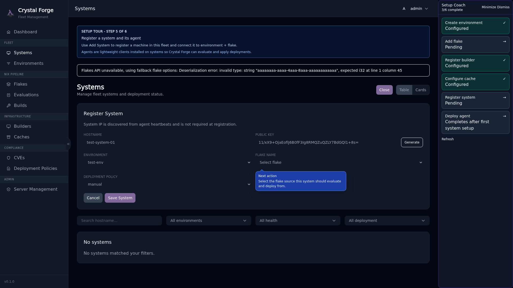

**Save the private key** — you'll need it on the target system. The public key is automatically filled into the form.

#### How Deployment Policies Work

Systems inherit the deployment policy from their environment, but you can override it per system:

- **manual**: An admin must explicitly approve deployments (safest for production)
- **auto_latest**: Automatically deploy the latest evaluated commit on the tracked branch
- **pinned**: Deploy a specific commit/derivation (useful for canary deployments)

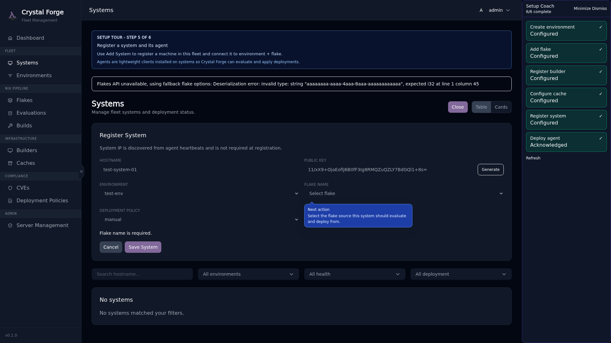

### System Creation Success

After creating your first system, the coach marks **Step 5** complete and you're ready for the final step: deploying the agent.

---

## Step 6: Deploy Agent

The **Crystal Forge Agent** runs on each managed NixOS system. It reports system state, receives deployment instructions, and executes NixOS activations. Without the agent running, Crystal Forge cannot monitor or deploy to the system.

### Agent Deployment Reminder

After creating your first system, a modal appears with explicit instructions:

**"System Registered — Enable the Agent"**

To start tracking this system, you must:

1. **Enable the Crystal Forge agent module** in the system's NixOS configuration
2. **Apply the configuration** on the target system (`nixos-rebuild switch`)
3. **Verify the agent service is running** (`systemctl status crystal-forge-agent`)


### Enabling the Agent in NixOS Config

On the **target system** (the NixOS host you want to manage), add this to its configuration:

```nix
{
  services.crystal-forge.client = {
    enable = true;
    
    # Crystal Forge server connection
    server_host = "crystal-forge.example.com";
    server_port = 3000;
    
    # Private key (the one you generated/saved during system registration)
    private_key = "/var/lib/crystal-forge/host.key";
  };
}
```

**Save the private key** to the target system:

```bash
# On the target system (e.g., web-server-1)
sudo mkdir -p /var/lib/crystal-forge
sudo echo "YOUR_PRIVATE_KEY_HERE" > /var/lib/crystal-forge/host.key
sudo chmod 600 /var/lib/crystal-forge/host.key
sudo chown crystal-forge:crystal-forge /var/lib/crystal-forge/host.key
```

### Apply and Rebuild the Target System

On the target system:

```bash
sudo nixos-rebuild switch
```

This will:
- Install the Crystal Forge agent service
- Start the agent
- Connect to the Crystal Forge server
- Begin sending telemetry (system fingerprints, heartbeats)

### Verify the Agent is Running

On the target system:

```bash
sudo systemctl status crystal-forge-agent
```

You should see:

```
● crystal-forge-agent.service - Crystal Forge Agent
   Active: active (running)
```

Check the logs for successful connection:

```bash
sudo journalctl -u crystal-forge-agent -f
```

Look for log entries indicating:
- Successful Ed25519 signature verification
- System fingerprint reported
- Heartbeat acknowledged by server

### What to Expect After Agent Connects

Once the agent connects, Crystal Forge will:

1. **Record System Fingerprint**: Hardware, OS version, network interfaces, security status
2. **Track Heartbeats**: Liveness signals every 60 seconds (configurable)
3. **Monitor State Changes**: Configuration drift, software updates, deployments
4. **Enable Deployments**: The system is now eligible to receive deployment instructions

In the Crystal Forge web UI:

- The **Dashboard** will show the system in the Fleet Health panel
- The **Systems** page will show connection status, deployed configuration, and health
- The **Builds** page will show which derivations are available for deployment

### Onboarding Complete!

After the agent connects and reports its first heartbeat, the coach automatically marks **Step 6** complete. All six setup steps are now configured.


The coach panel will automatically dismiss itself, but you can always reopen it from **Server Management**.

---

## After Onboarding

Congratulations! You've completed the Crystal Forge initial setup. Here's what to do next.

### Where to Go Next

**Dashboard**: View fleet health, build queue status, recent deployments, and CVE summary
- Route: `/dashboard`

**Systems**: Monitor all managed systems, filter by environment, view deployment status
- Route: `/systems`

**Builds**: See the build queue, completed builds, and CVE scan results
- Route: `/builds`

**Flakes**: Manage tracked repositories, view commit history, trigger evaluations
- Route: `/flakes`

### How to Reopen the Coach

If you dismissed the coach and want to see it again:

1. Open the **user menu** (top-right corner)
2. Click **Server Management**
3. Under "Onboarding," click **Relaunch Setup Coach**

The coach will reappear and show your current progress.

### Common First Tasks

**Trigger a Build Manually:**
1. Go to **Flakes**
2. Click on your flake
3. Click **Evaluate Latest Commit**

**Deploy to a System:**
1. Go to **Systems**
2. Click on the system
3. View available builds
4. Click **Deploy** next to the desired build

**View CVE Scan Results:**
1. Go to **Builds**
2. Click on a completed build
3. Scroll to **CVE Scan Results**
4. Review vulnerabilities and remediation steps

**Add Another System:**
1. Go to **Systems**
2. Click **Add System**
3. Follow the same process as Step 5

---

## Troubleshooting

### Coach Panel Not Appearing

**Symptom**: After logging in as admin, the coach panel doesn't show.

**Possible causes:**
- You're not logged in as an admin (only admins see the coach)
- The coach was previously dismissed and persisted that state
- Browser localStorage is disabled

**Solutions:**
1. Verify you're logged in as an admin (check user menu)
2. Go to **Server Management** → **Relaunch Setup Coach**
3. Clear browser localStorage: `localStorage.removeItem('cf.coach.dismissed')`
4. Refresh the page

### Steps Not Marking Complete

**Symptom**: You created an environment/flake/builder/cache/system, but the coach step is still showing as incomplete.

**Possible causes:**
- The backend hasn't refreshed progress yet (the coach polls every 8 seconds)
- The entity was created but doesn't meet completion criteria (e.g., cache not assigned to any environment)

**Solutions:**
1. Wait 10 seconds and check again (the coach auto-refreshes)
2. Click the **Refresh** button in the coach panel footer
3. Verify the entity was created successfully (check the relevant page: Environments, Flakes, etc.)
4. For the cache step: ensure at least one cache destination exists (even global/unassigned counts)

### Agent Not Connecting

**Symptom**: You enabled the agent on a target system, but it's not showing as connected in the web UI.

**Possible causes:**
- Agent service isn't running
- Network connectivity issue (firewall, wrong server host/port)
- Private key mismatch (public key in Crystal Forge doesn't match private key on system)
- Ed25519 signature verification failed

**Solutions:**

1. **Verify the agent service is running:**
   ```bash
   sudo systemctl status crystal-forge-agent
   ```
   If not running, check logs:
   ```bash
   sudo journalctl -u crystal-forge-agent -n 50
   ```

2. **Check network connectivity:**
   ```bash
   curl http://crystal-forge.example.com:3000/status
   ```
   If this fails, check firewall rules and DNS.

3. **Verify key pair match:**
   - Public key in Crystal Forge web UI (Systems page)
   - Private key on target system (`/var/lib/crystal-forge/host.key`)
   - Regenerate the key pair if needed and update both sides

4. **Check server logs for signature verification errors:**
   ```bash
   sudo journalctl -u crystal-forge-server -f
   ```
   Look for Ed25519 signature failures.

### Builder Not Activating

**Symptom**: You created a builder in the web UI and configured the NixOS module, but builds aren't running.

**Possible causes:**
- Builder service isn't running
- Private key mismatch
- Resource limits too restrictive (builder can't claim any work)

**Solutions:**

1. **Verify builder service:**
   ```bash
   sudo systemctl status crystal-forge-builder
   ```

2. **Check builder logs:**
   ```bash
   sudo journalctl -u crystal-forge-builder -f
   ```

3. **Verify resource configuration matches:**
   - Web UI: max_concurrent_derivations, max CPU, max memory
   - NixOS config: should match or be compatible

4. **Check for work in the build queue:**
   - Go to **Builds** in the web UI
   - If the queue is empty, trigger an evaluation from **Flakes**

### Common Configuration Mistakes

**Private key file permissions:**

If the agent or builder can't read the private key:

```bash
sudo chown crystal-forge:crystal-forge /var/lib/crystal-forge/*.key
sudo chmod 600 /var/lib/crystal-forge/*.key
```

**Wrong server host/port in agent config:**

Verify the agent can reach the server:

```bash
curl http://<server_host>:<server_port>/status
```

**Flake repository not accessible:**

Verify the Crystal Forge server has SSH/HTTPS access to the Git repository:

```bash
# On the Crystal Forge server
sudo -u crystal-forge git clone <repo_url>
```

If this fails, check SSH keys (for SSH URLs) or network access (for HTTPS).

**STIG control mismatch:**

If you configured required policies in an environment, but a system's flake doesn't enable those controls, Crystal Forge will block deployment. Check:

- Environment required policies (Environments page)
- System's flake configuration (does it enable those STIG modules?)

---

## Next Steps

You're now ready to use Crystal Forge! For advanced topics, see:

- **[STIG Compliance Modules](../README.md#stig-compliance-modules)**: Enable declarative security controls
- **[Deployment Strategies](../README.md#deployment-management)**: Understand immediate_persist vs. boot_only
- **[Binary Cache Integration](../README.md#build-coordination)**: Configure S3, Attic, or custom caches
- **[OIDC Authentication](../README.md#oidc-configuration-example)**: Connect to Keycloak, Authentik, or other identity providers

For questions, issues, or contributions, see [AGENTS.md](../AGENTS.md).

---

**Welcome to Crystal Forge. Happy monitoring!**
