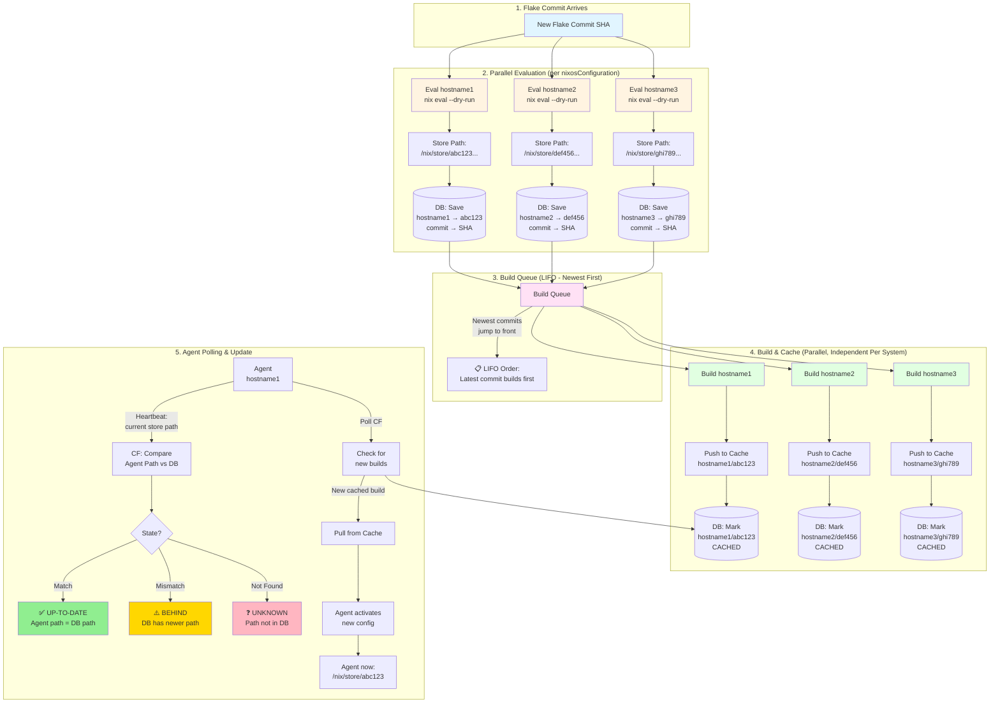

# Crystal Forge Store Path Flow

This diagram shows how Crystal Forge evaluates flake commits, tracks expected store paths per system, builds configurations in parallel, and keeps agents up-to-date.

## The Complete Flow

## Key Points for Dumb Interns

### Parallel Operations
- **Each nixosConfiguration (hostname1, hostname2, etc.) flows INDEPENDENTLY**
- hostname1 can be building while hostname2 is still evaluating
- hostname3 can be caching while hostname1 is queued
- NO waiting for all evals to finish before builds start

### LIFO Build Queue
- **Newest commit's configs jump to the FRONT of the queue**
- If commit A arrives, then commit B arrives:
  - Commit B's configs build BEFORE commit A's remaining configs
- Why? Because we want latest changes deployed fastest

### System States (How We Know What's Happening)

| State | Meaning | Agent Store Path | DB Store Path |
|-------|---------|------------------|---------------|
| ✅ **UP-TO-DATE** | Agent running latest | `/nix/store/abc123...` | `/nix/store/abc123...` (MATCH) |
| ⚠️ **BEHIND** | Agent running old config | `/nix/store/old111...` | `/nix/store/abc123...` (NEWER) |
| ❓ **UNKNOWN** | Agent path not tracked | `/nix/store/xyz999...` | NOT FOUND in DB |

### The Loop
1. **Commit arrives** → CF starts eval for each hostname
2. **Eval finishes** → Store path saved to DB immediately
3. **Queue entry** → System added to build queue (LIFO)
4. **Build starts** → Independent of other systems still evaluating
5. **Build done** → Push to cache, mark in DB as CACHED
6. **Agent polls** → Discovers new build available
7. **Agent pulls** → Downloads from cache, activates config
8. **Agent heartbeats** → Reports new store path, CF marks UP-TO-DATE

### Why This Design?
- **Parallel eval** = Fast feedback on which configs are changing
- **Independent pipeline** = No blocking, max throughput
- **LIFO queue** = Latest changes deploy first
- **Store path in DB** = Single source of truth for "what should be running"
- **Agent polling** = Agent pulls updates when ready (no push complexity)
