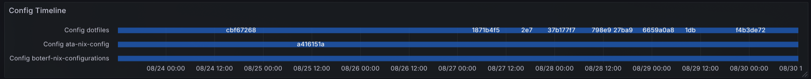

# Config Timeline View (`view_config_timeline`)

## Overview

`view_config_timeline` produces a **commit-centric timeline** intended for Grafana’s bar/row “config timeline” panel. Each row represents a flake; each bar segment corresponds to a commit at a specific timestamp and encodes how many systems are **currently** running that commit.



## What it Shows

- For every commit (within the recent window), show:
  - **`time`** — the commit timestamp (used as the X-axis).
  - **`Config`** — a compact, parseable label used by Grafana.
  - **`flake_name`** — the flake/repo the commit belongs to (used as series/row).

Counts are **live**: they’re recomputed from current system state, so if a system drifts to an _unknown_ derivation or reverts/advances to a different commit, the old commit’s count drops accordingly.

## Data Sources & Logic

This view combines:

- **Current deployment state per system** from `view_system_deployment_status`
  - Counts only systems with `deployment_status IN ('up_to_date','behind','ahead')`
  - Excludes `unknown` and `no_deployment`
- **Commit timeline & flake context** from `view_commit_deployment_timeline`
  - Supplies commit timestamps, hashes, and flake names
  - Limits history to recent activity (inherits its time window)

A `LEFT JOIN` keeps **all commits** in the output, even when **0 systems** are currently running them.

## Columns

| Column       | Type          | Description                                                                     |
| ------------ | ------------- | ------------------------------------------------------------------------------- |
| `time`       | `timestamptz` | Commit timestamp (X-axis).                                                      |
| `Config`     | `text`        | Parseable label used by Grafana. Format: `"<N> deployed (<short_hash>)§<idx>"`. |
| `flake_name` | `text`        | Flake/repository name (row/series key).                                         |

### `Config` String Format

`"<N> deployed (<short_hash>)§<idx>"`

- `<N>`: integer count of systems **currently** on this commit.
- `<short_hash>`: first 7–8 chars of `git_commit_hash` (for concise labels).
- `§<idx>`: zero-based rank of the commit **per flake by time desc** (handy for Grafana sorting/tracking).

## Time Scope & Ordering

- Inherits the **recent window** from `view_commit_deployment_timeline` (e.g., last 30 days).
- Results ordered by `time DESC` (newest commits first per flake).

## Typical Grafana Query

```sql
SELECT
  time,
  "Config",
  flake_name
FROM public.view_config_timeline
ORDER BY time DESC;
```

## Handy Parse Helpers (Postgres)

Extract current deployed count and short hash from `"Config"`:

```sql
SELECT
  time,
  split_part("Config", ' deployed (', 1)::int AS deployed_count,
  split_part(split_part("Config", ' deployed (', 2), ')§', 1) AS short_hash,
  split_part("Config", '§', 2)::int AS rank_idx,
  flake_name
FROM public.view_config_timeline
ORDER BY time DESC;
```

Filter to a single flake:

```sql
SELECT time, "Config"
FROM public.view_config_timeline
WHERE flake_name = 'dotfiles'
ORDER BY time DESC;
```

## Operational Notes

- **Live counts** reflect the fleet’s _current_ state; historical bars don’t “freeze” counts.
- Commits remain in the output with **`0 deployed`** when nothing currently runs them.
- If a system’s deployment becomes **`unknown`**, it stops contributing to any commit’s count.

## Performance Hints

Ensure common indices exist in base tables (examples):

- `commits(flake_id, commit_timestamp)`
- `system_states(hostname, timestamp)`
- `derivations(derivation_path)`, `derivations(commit_id)`

## Related Views

- Commit timeline & rollout details: `view_commit_deployment_timeline` &#x20;
- Per-system deployment status (source of counts): `view_system_deployment_status` &#x20;
- Heartbeat/availability (often used alongside): `view_system_heartbeat_status` &#x20;
- Build/evaluation health (context for deployability): `view_commit_build_status` &#x20;
